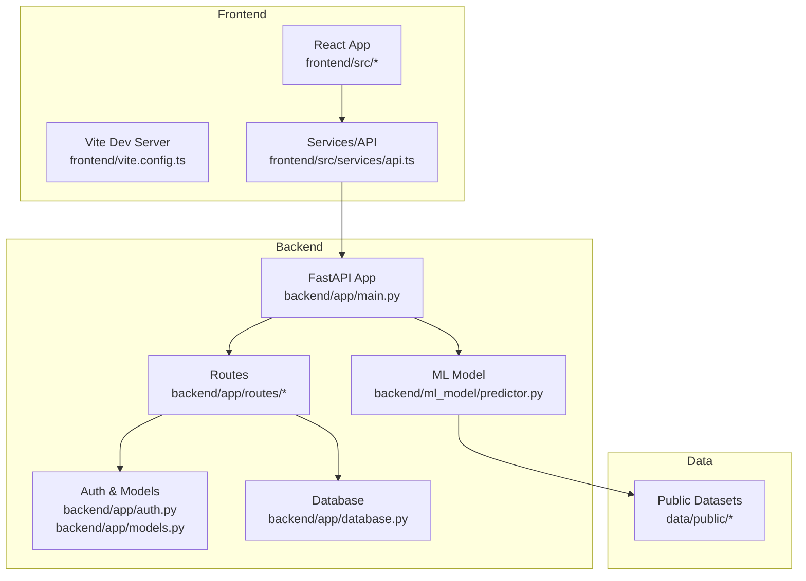
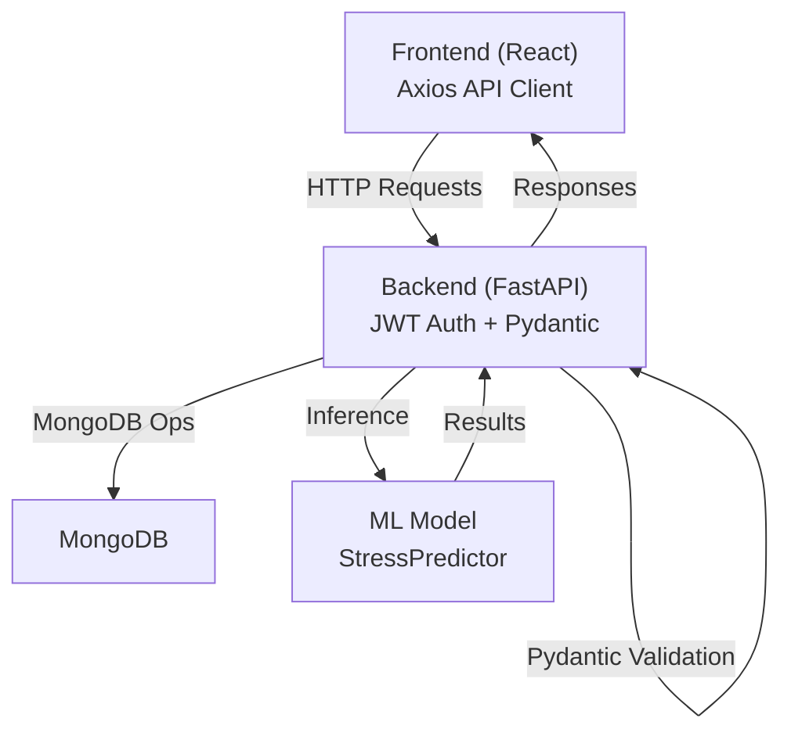
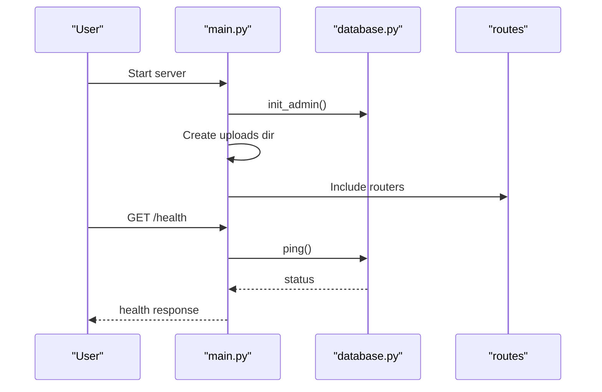
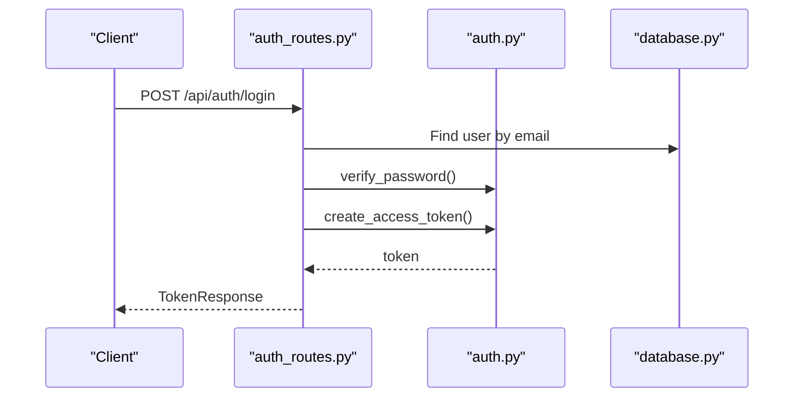
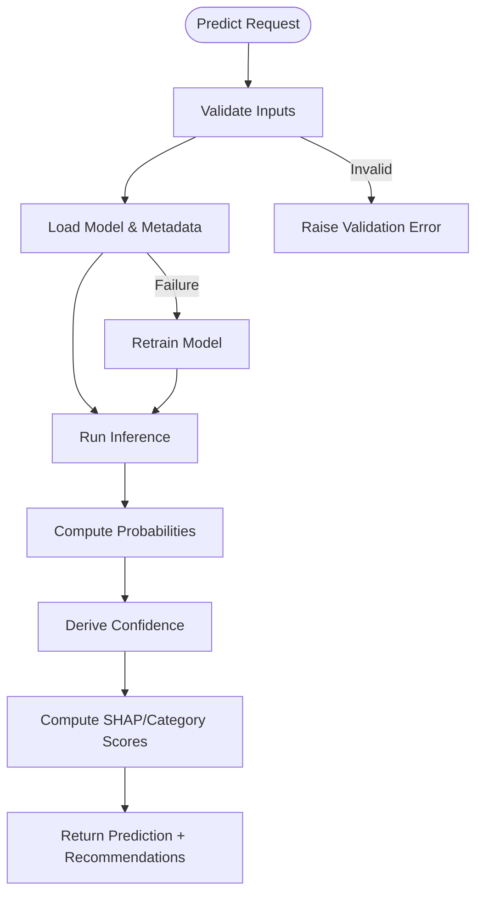
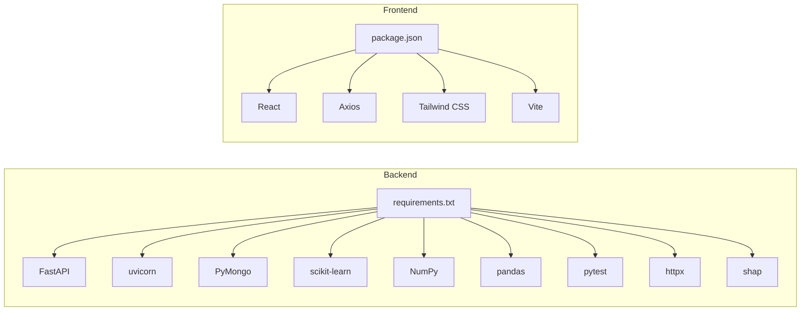

# Development Practices and Standards

<cite>
**Referenced Files in This Document**
- [README.md](file://README.md)
- [ARCHITECTURE_EXPLAINED.md](file://ARCHITECTURE_EXPLAINED.md)
- [backend/requirements.txt](file://backend/requirements.txt)
- [frontend/package.json](file://frontend/package.json)
- [start.sh](file://start.sh)
- [test.sh](file://test.sh)
- [backend/app/main.py](file://backend/app/main.py)
- [backend/app/config.py](file://backend/app/config.py)
- [backend/app/models.py](file://backend/app/models.py)
- [backend/app/auth.py](file://backend/app/auth.py)
- [backend/app/routes/auth_routes.py](file://backend/app/routes/auth_routes.py)
- [backend/app/database.py](file://backend/app/database.py)
- [backend/ml_model/predictor.py](file://backend/ml_model/predictor.py)
- [frontend/vite.config.ts](file://frontend/vite.config.ts)
- [frontend/tsconfig.json](file://frontend/tsconfig.json)
- [frontend/tailwind.config.js](file://frontend/tailwind.config.js)
- [frontend/src/services/api.ts](file://frontend/src/services/api.ts)
</cite>

## Table of Contents
1. [Introduction](#introduction)
2. [Project Structure](#project-structure)
3. [Core Components](#core-components)
4. [Architecture Overview](#architecture-overview)
5. [Detailed Component Analysis](#detailed-component-analysis)
6. [Dependency Analysis](#dependency-analysis)
7. [Performance Considerations](#performance-considerations)
8. [Troubleshooting Guide](#troubleshooting-guide)
9. [Conclusion](#conclusion)
10. [Appendices](#appendices)

## Introduction
This document consolidates development practices, coding standards, and operational procedures for the AI Stress Level Analyzer project. It explains the project’s structure, environment setup, backend and frontend build processes, testing strategies, logging and error handling, code quality practices, deployment procedures, contribution guidelines, and performance monitoring techniques. The content is derived from the repository’s source files and README to ensure accuracy and traceability.

## Project Structure
The project follows a clear separation of concerns:
- Backend: FastAPI application with route modules, authentication utilities, database abstraction, and machine learning model integration.
- Frontend: React + TypeScript application configured with Vite, Tailwind CSS, and Axios for API communication.
- ML Model: Python-based stress prediction pipeline with training, inference, and explainability components.
- Data: Public datasets for audio and questionnaire training.

**Diagram sources**
- [backend/app/main.py:52-80](file://backend/app/main.py#L52-L80)
- [backend/app/routes/auth_routes.py:32-37](file://backend/app/routes/auth_routes.py#L32-L37)
- [backend/app/auth.py:1-20](file://backend/app/auth.py#L1-L20)
- [backend/app/models.py:1-20](file://backend/app/models.py#L1-L20)
- [backend/app/database.py:26-55](file://backend/app/database.py#L26-L55)
- [backend/ml_model/predictor.py:32-46](file://backend/ml_model/predictor.py#L32-L46)
- [frontend/vite.config.ts:1-19](file://frontend/vite.config.ts#L1-L19)
- [frontend/src/services/api.ts:12-19](file://frontend/src/services/api.ts#L12-L19)

**Section sources**
- [README.md:698-761](file://README.md#L698-L761)
- [ARCHITECTURE_EXPLAINED.md:1-20](file://ARCHITECTURE_EXPLAINED.md#L1-L20)

## Core Components
- Backend entry point initializes FastAPI, loads environment variables, configures CORS, includes routers, and sets up database and upload directories.
- Authentication utilities implement JWT-based authentication, password hashing, and role-based access control.
- Pydantic models define request/response schemas for all endpoints.
- Database module manages connection pooling, index creation, and admin initialization.
- ML predictor encapsulates model loading, prediction, SHAP-based explainability, and safety retraining.
- Frontend API client centralizes HTTP configuration, token injection, and response error handling.

**Section sources**
- [backend/app/main.py:14-98](file://backend/app/main.py#L14-L98)
- [backend/app/auth.py:23-31](file://backend/app/auth.py#L23-L31)
- [backend/app/models.py:16-143](file://backend/app/models.py#L16-L143)
- [backend/app/database.py:30-55](file://backend/app/database.py#L30-L55)
- [backend/ml_model/predictor.py:81-99](file://backend/ml_model/predictor.py#L81-L99)
- [frontend/src/services/api.ts:12-22](file://frontend/src/services/api.ts#L12-L22)

## Architecture Overview
The system integrates a React frontend, FastAPI backend, MongoDB, and machine learning models. The frontend communicates with the backend via Axios, while the backend enforces JWT-based authentication, validates requests with Pydantic, and persists data in MongoDB. The ML model supports both questionnaire-based predictions and multimodal fusion.

**Diagram sources**
- [frontend/src/services/api.ts:12-19](file://frontend/src/services/api.ts#L12-L19)
- [backend/app/main.py:52-80](file://backend/app/main.py#L52-L80)
- [backend/app/auth.py:57-71](file://backend/app/auth.py#L57-L71)
- [backend/app/models.py:78-90](file://backend/app/models.py#L78-L90)
- [backend/app/database.py:164-302](file://backend/app/database.py#L164-L302)
- [backend/ml_model/predictor.py:119-144](file://backend/ml_model/predictor.py#L119-L144)

## Detailed Component Analysis

### Backend Application Initialization
- Loads environment variables before importing modules that depend on them.
- Configures CORS from environment variables with strict validation.
- Includes routers conditionally and initializes admin and upload directories on startup.
- Health check endpoint verifies database connectivity.

**Diagram sources**
- [backend/app/main.py:81-98](file://backend/app/main.py#L81-L98)
- [backend/app/database.py:307-339](file://backend/app/database.py#L307-L339)

**Section sources**
- [backend/app/main.py:14-98](file://backend/app/main.py#L14-L98)
- [backend/app/database.py:307-339](file://backend/app/database.py#L307-L339)

### Authentication and Authorization
- JWT secret and algorithm are loaded from environment variables.
- Password hashing uses bcrypt with a 72-byte truncation.
- Role-based access control validates tokens and checks user existence.
- Login flow verifies email/doctor/admin accounts and OTP/email verification status.

**Diagram sources**
- [backend/app/routes/auth_routes.py:377-439](file://backend/app/routes/auth_routes.py#L377-L439)
- [backend/app/auth.py:33-55](file://backend/app/auth.py#L33-L55)
- [backend/app/database.py:344-364](file://backend/app/database.py#L344-L364)

**Section sources**
- [backend/app/auth.py:23-31](file://backend/app/auth.py#L23-L31)
- [backend/app/routes/auth_routes.py:377-439](file://backend/app/routes/auth_routes.py#L377-L439)

### Data Models and Validation
- Pydantic models define request/response schemas for user registration, login, OTP verification, test submissions, appointments, and enhanced recommendation tracking.
- Strict field validation ensures data integrity and type safety.

**Section sources**
- [backend/app/models.py:16-143](file://backend/app/models.py#L16-L143)

### Database Abstraction and Indexing
- Connection pooling with maxPoolSize=50 and optimized timeouts.
- Background index creation for users, doctors, tests, appointments, progress tracking, achievements, OTPs, and medical records.
- Admin initialization and helper functions for analytics and storage.

**Section sources**
- [backend/app/database.py:30-55](file://backend/app/database.py#L30-L55)
- [backend/app/database.py:164-302](file://backend/app/database.py#L164-L302)
- [backend/app/database.py:307-339](file://backend/app/database.py#L307-L339)

### Machine Learning Prediction Pipeline
- StressPredictor loads models and metadata, validates inputs, and performs predictions with confidence and recommendations.
- SHAP-based explainability and category-level scoring are supported.
- Automatic retraining if model files are missing or corrupted.

**Diagram sources**
- [backend/ml_model/predictor.py:119-144](file://backend/ml_model/predictor.py#L119-L144)
- [backend/ml_model/predictor.py:187-256](file://backend/ml_model/predictor.py#L187-L256)

**Section sources**
- [backend/ml_model/predictor.py:81-99](file://backend/ml_model/predictor.py#L81-L99)
- [backend/ml_model/predictor.py:119-185](file://backend/ml_model/predictor.py#L119-L185)

### Frontend API Client and Proxy
- Axios client configured with base URL from environment variable and JSON headers.
- Interceptor injects Authorization: Bearer token and handles 401 responses by redirecting to login.
- Vite proxy forwards /api/* requests to the backend on port 8000.

**Section sources**
- [frontend/src/services/api.ts:12-22](file://frontend/src/services/api.ts#L12-L22)
- [frontend/src/services/api.ts:215-235](file://frontend/src/services/api.ts#L215-L235)
- [frontend/vite.config.ts:7-18](file://frontend/vite.config.ts#L7-L18)

### Configuration and Environment
- Backend settings are loaded via pydantic-settings with environment file support.
- Environment variables include JWT secrets, MongoDB URL, SMTP settings, optional SMS provider, and CORS origins.

**Section sources**
- [backend/app/config.py:3-22](file://backend/app/config.py#L3-L22)
- [README.md:445-478](file://README.md#L445-L478)

## Dependency Analysis
- Backend dependencies are declared in requirements.txt, including FastAPI, uvicorn, PyMongo, scikit-learn, NumPy, pandas, pytest, httpx, SHAP, and others.
- Frontend dependencies include React, React Router, Axios, Tailwind CSS, and Vite.

**Diagram sources**
- [backend/requirements.txt:1-22](file://backend/requirements.txt#L1-L22)
- [frontend/package.json:10-26](file://frontend/package.json#L10-L26)

**Section sources**
- [backend/requirements.txt:1-22](file://backend/requirements.txt#L1-L22)
- [frontend/package.json:10-26](file://frontend/package.json#L10-L26)

## Performance Considerations
- Backend database connection pooling with maxPoolSize=50 and optimized timeouts improves concurrency and responsiveness.
- Background index creation accelerates common queries for users, doctors, tests, appointments, progress tracking, achievements, OTPs, and medical records.
- Frontend uses Vite for fast builds and development server with proxying to reduce latency and simplify cross-origin handling.
- ML model is loaded once at startup and retrained automatically if corrupted, minimizing cold-start overhead.

**Section sources**
- [backend/app/database.py:30-55](file://backend/app/database.py#L30-L55)
- [backend/app/database.py:164-302](file://backend/app/database.py#L164-L302)
- [frontend/vite.config.ts:7-18](file://frontend/vite.config.ts#L7-L18)
- [backend/ml_model/predictor.py:81-99](file://backend/ml_model/predictor.py#L81-L99)

## Troubleshooting Guide
- MongoDB connection issues: verify service status and connectivity; the health endpoint pings the database.
- Backend port conflicts: adjust port in the main application entry point.
- Model not found: the predictor auto-reloads or retrains on startup; manual retraining is available.
- Frontend API connection: ensure backend is running, ALLOWED_ORIGINS includes frontend URL, and Vite proxy settings are correct.

**Section sources**
- [README.md:664-696](file://README.md#L664-L696)
- [backend/app/main.py:114-132](file://backend/app/main.py#L114-L132)
- [backend/ml_model/predictor.py:113-118](file://backend/ml_model/predictor.py#L113-L118)

## Conclusion
The project establishes a robust development foundation with clear separation of concerns, strong authentication and validation, efficient database operations, and a comprehensive ML pipeline. The provided scripts and configurations streamline setup, testing, and deployment, while the frontend and backend adhere to modern practices for reliability and maintainability.

## Appendices

### Development Environment Setup
- Backend: create and activate a virtual environment, install dependencies from requirements.txt, train the ML model, and start the server.
- Frontend: install dependencies from package.json and start the development server.
- Scripts: start.sh launches both backend and frontend; test.sh validates health, file presence, and database collections.

**Section sources**
- [README.md:396-442](file://README.md#L396-L442)
- [start.sh:17-71](file://start.sh#L17-L71)
- [test.sh:35-82](file://test.sh#L35-L82)

### Build Processes
- Backend: FastAPI serves as the API server; uvicorn is used for development and production deployments.
- Frontend: Vite compiles TypeScript/React and Tailwind CSS; the build targets the configured API URL via environment variable.

**Section sources**
- [backend/app/main.py:134-137](file://backend/app/main.py#L134-L137)
- [frontend/package.json:5-9](file://frontend/package.json#L5-L9)
- [frontend/vite.config.ts:1-19](file://frontend/vite.config.ts#L1-L19)

### Testing Strategies
- System tests: shell scripts validate MongoDB, backend API endpoints, frontend pages, critical files, and database collections.
- Backend testing: pytest and httpx are included for unit and integration tests.

**Section sources**
- [test.sh:16-33](file://test.sh#L16-L33)
- [backend/requirements.txt:16-18](file://backend/requirements.txt#L16-L18)

### Logging, Error Tracking, and Debugging
- Logging: basic logging is used in main.py and database.py for connection status and warnings.
- Error handling: centralized 401 handling in the frontend API interceptor; backend raises explicit HTTP exceptions for validation failures and unauthorized access.
- Debugging aids: health endpoint, startup logs, and environment-based configuration enable quick diagnostics.

**Section sources**
- [backend/app/main.py:20-20](file://backend/app/main.py#L20-L20)
- [backend/app/database.py:48-54](file://backend/app/database.py#L48-L54)
- [frontend/src/services/api.ts:224-235](file://frontend/src/services/api.ts#L224-L235)

### Code Quality Practices
- Backend: Pydantic models enforce schema validation; bcrypt ensures secure password hashing; environment-based secrets avoid hardcoding.
- Frontend: TypeScript strict mode and Tailwind CSS utility classes promote type safety and consistent styling.
- Tooling: Vite and Tailwind CLI are configured for build and styling.

**Section sources**
- [backend/app/models.py:16-47](file://backend/app/models.py#L16-L47)
- [backend/app/auth.py:33-43](file://backend/app/auth.py#L33-L43)
- [frontend/tsconfig.json:14-18](file://frontend/tsconfig.json#L14-L18)
- [frontend/tailwind.config.js:1-34](file://frontend/tailwind.config.js#L1-L34)

### Deployment Procedures
- Backend: configure environment variables (MONGODB_URL, JWT_SECRET_KEY, ADMIN_PASSWORD, GROQ_API_KEY, GROQ_CHAT_MODEL) and deploy to platforms supporting Python and FastAPI.
- Frontend: configure VITE_API_URL and deploy to static hosting platforms.

**Section sources**
- [README.md:644-661](file://README.md#L644-L661)

### Contribution Guidelines and Review Standards
- Environment variables: keep secrets in .env files and avoid committing sensitive data.
- Code organization: maintain feature-based separation in backend routes and frontend components/services.
- Pull requests: ensure tests pass locally, update documentation if behavior changes, and follow consistent naming conventions.

**Section sources**
- [README.md:445-478](file://README.md#L445-L478)
- [backend/app/routes/auth_routes.py:34-36](file://backend/app/routes/auth_routes.py#L34-L36)

### Performance Monitoring and Optimization
- Database: monitor index usage and query performance; leverage connection pooling and background indexing.
- API: use health checks and logging to track availability and errors.
- Frontend: optimize bundle size and caching via Vite and Tailwind; proxy reduces cross-origin overhead.

**Section sources**
- [backend/app/database.py:164-302](file://backend/app/database.py#L164-L302)
- [backend/app/main.py:114-132](file://backend/app/main.py#L114-L132)
- [frontend/vite.config.ts:7-18](file://frontend/vite.config.ts#L7-L18)