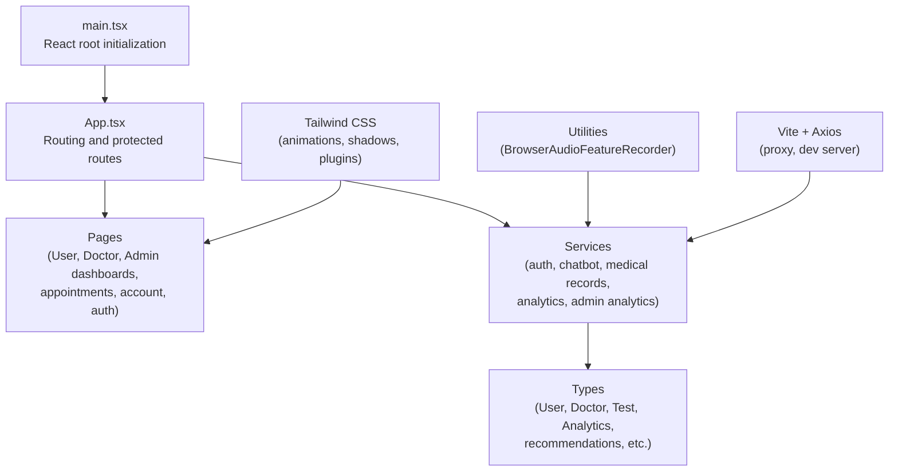
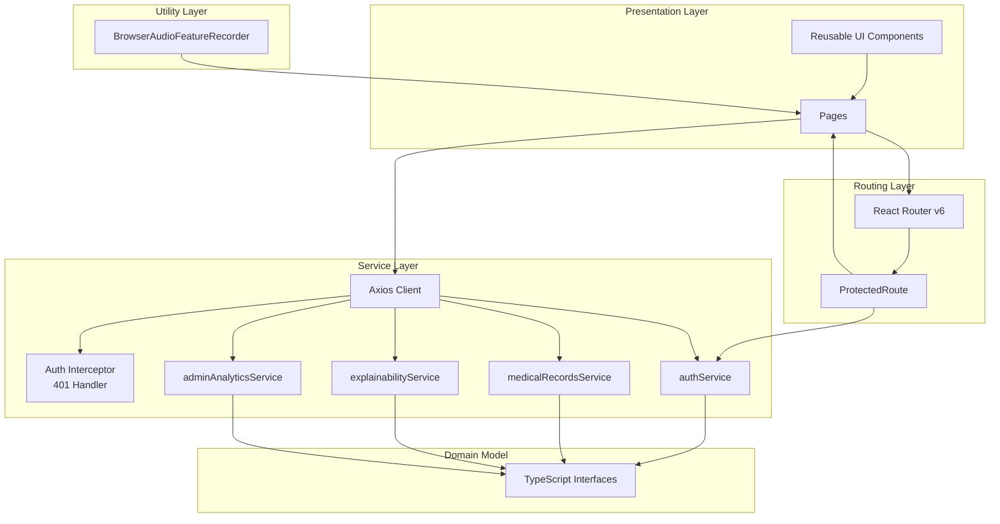
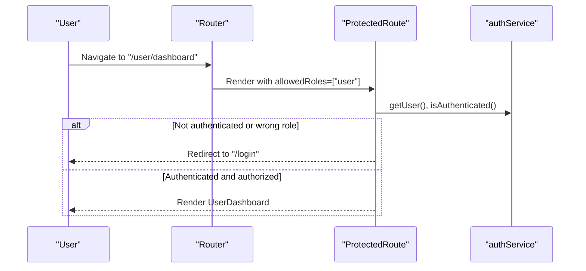
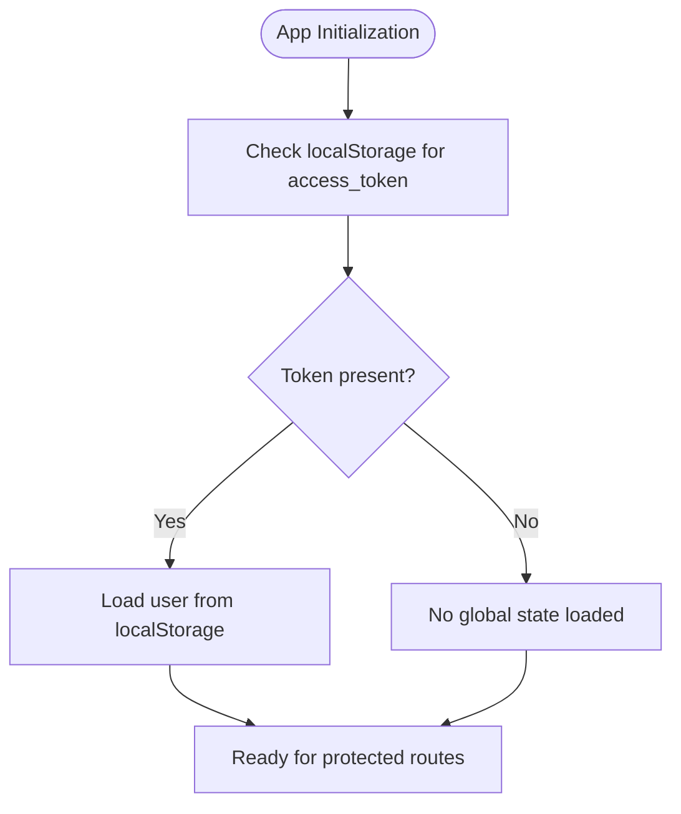
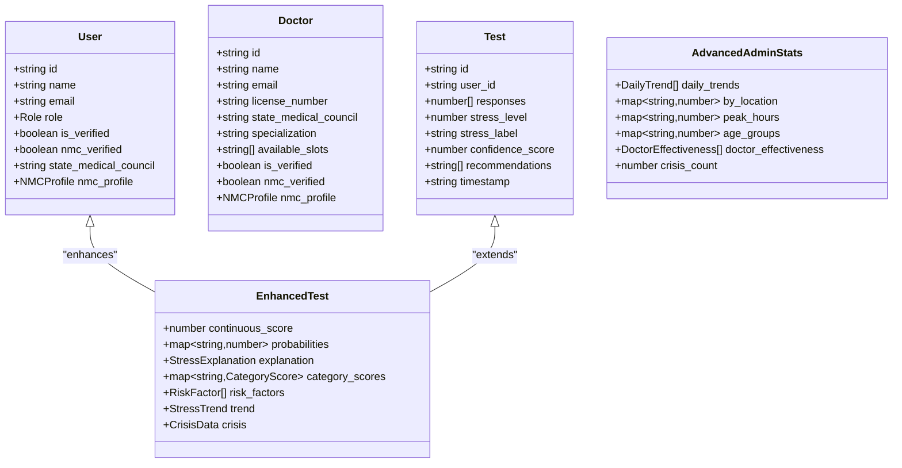
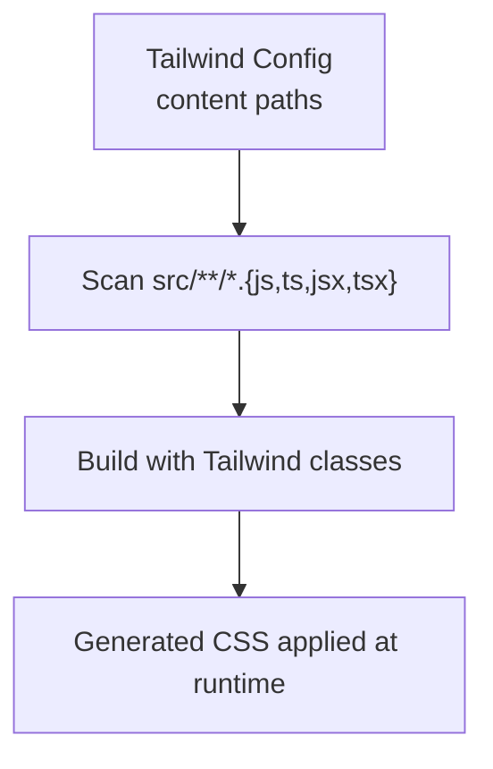
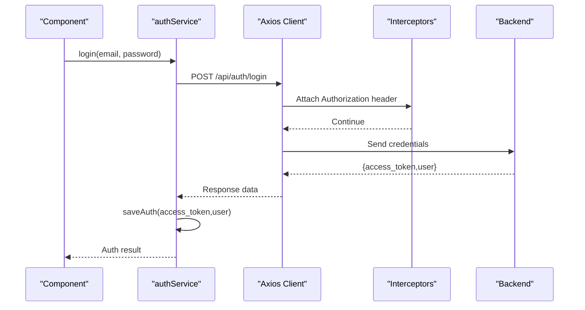
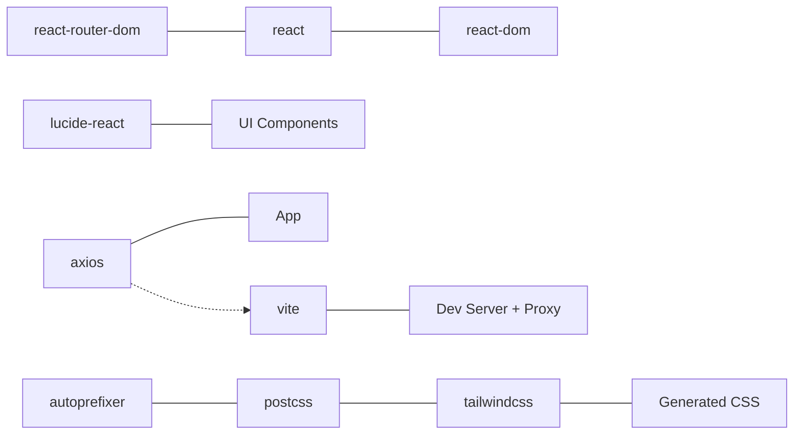

# Frontend Architecture and Components

<cite>
**Referenced Files in This Document**
- [main.tsx](file://frontend/src/main.tsx)
- [App.tsx](file://frontend/src/App.tsx)
- [api.ts](file://frontend/src/services/api.ts)
- [index.ts](file://frontend/src/types/index.ts)
- [audioFeatureRecorder.ts](file://frontend/src/utils/audioFeatureRecorder.ts)
- [package.json](file://frontend/package.json)
- [tsconfig.json](file://frontend/tsconfig.json)
- [tailwind.config.js](file://frontend/tailwind.config.js)
- [vite.config.ts](file://frontend/vite.config.ts)
- [index.html](file://frontend/index.html)
</cite>

## Table of Contents
1. [Introduction](#introduction)
2. [Project Structure](#project-structure)
3. [Core Components](#core-components)
4. [Architecture Overview](#architecture-overview)
5. [Detailed Component Analysis](#detailed-component-analysis)
6. [Dependency Analysis](#dependency-analysis)
7. [Performance Considerations](#performance-considerations)
8. [Troubleshooting Guide](#troubleshooting-guide)
9. [Conclusion](#conclusion)
10. [Appendices](#appendices)

## Introduction
This document describes the React TypeScript frontend architecture and component design patterns for the AI Stress Detector application. It covers the component hierarchy, routing and navigation, state management approaches, TypeScript type definitions, styling with Tailwind CSS, the service layer for API integration, component composition and reusability strategies, form handling and validation patterns, and testing and backend integration guidance.

## Project Structure
The frontend is organized into clear layers:
- Entry point initializes the React root and renders the App shell.
- App defines routing and protected routes.
- Services encapsulate HTTP clients and domain-specific API calls.
- Types define the TypeScript interfaces used across components and services.
- Utilities provide specialized runtime capabilities (e.g., audio feature extraction).
- Styles are configured via Tailwind CSS with custom animations and shadows.

**Diagram sources**
- [main.tsx:1-11](file://frontend/src/main.tsx#L1-L11)
- [App.tsx:1-88](file://frontend/src/App.tsx#L1-L88)
- [api.ts:1-439](file://frontend/src/services/api.ts#L1-L439)
- [index.ts:1-206](file://frontend/src/types/index.ts#L1-L206)
- [audioFeatureRecorder.ts:1-664](file://frontend/src/utils/audioFeatureRecorder.ts#L1-L664)
- [tailwind.config.js:1-34](file://frontend/tailwind.config.js#L1-L34)
- [vite.config.ts:1-19](file://frontend/vite.config.ts#L1-L19)

**Section sources**
- [main.tsx:1-11](file://frontend/src/main.tsx#L1-L11)
- [App.tsx:1-88](file://frontend/src/App.tsx#L1-L88)
- [package.json:1-27](file://frontend/package.json#L1-L27)
- [tsconfig.json:1-22](file://frontend/tsconfig.json#L1-L22)
- [tailwind.config.js:1-34](file://frontend/tailwind.config.js#L1-L34)
- [vite.config.ts:1-19](file://frontend/vite.config.ts#L1-L19)

## Core Components
- App shell with React Router v6 routes and a reusable ProtectedRoute wrapper for role-based access.
- Page components for Home, Login, Register, OTP verification, Forgot Password, User Dashboard, Doctor Dashboard, Admin Dashboard, Appointments, and Account Details.
- Service layer with:
  - Authentication service (register, login, OTP, token persistence, logout).
  - Chatbot messaging service.
  - Medical records service (list, stats, upload, update, delete, download).
  - Explainability and analytics services (explanations, reports, stress trends, user analytics, doctor match).
  - Admin analytics service returning normalized advanced statistics.
- Utility for browser audio feature extraction tailored for voice-based stress analysis.
- Strongly typed domain models via centralized TypeScript interfaces.

**Section sources**
- [App.tsx:1-88](file://frontend/src/App.tsx#L1-L88)
- [api.ts:237-347](file://frontend/src/services/api.ts#L237-L347)
- [api.ts:349-357](file://frontend/src/services/api.ts#L349-L357)
- [api.ts:359-396](file://frontend/src/services/api.ts#L359-L396)
- [api.ts:402-429](file://frontend/src/services/api.ts#L402-L429)
- [api.ts:431-436](file://frontend/src/services/api.ts#L431-L436)
- [index.ts:1-206](file://frontend/src/types/index.ts#L1-L206)
- [audioFeatureRecorder.ts:544-664](file://frontend/src/utils/audioFeatureRecorder.ts#L544-L664)

## Architecture Overview
The frontend follows a layered architecture:
- Presentation layer: React components organized by pages and reusable components.
- Routing layer: React Router v6 with route guards enforcing authentication and roles.
- Service layer: Axios-based HTTP client with interceptors for auth tokens and error handling.
- Domain model layer: Centralized TypeScript interfaces for all domain entities and analytics.
- Utility layer: Specialized audio feature extraction for voice analysis.

**Diagram sources**
- [App.tsx:15-28](file://frontend/src/App.tsx#L15-L28)
- [api.ts:215-235](file://frontend/src/services/api.ts#L215-L235)
- [api.ts:237-347](file://frontend/src/services/api.ts#L237-L347)
- [api.ts:359-396](file://frontend/src/services/api.ts#L359-L396)
- [api.ts:402-436](file://frontend/src/services/api.ts#L402-L436)
- [index.ts:1-206](file://frontend/src/types/index.ts#L1-L206)
- [audioFeatureRecorder.ts:544-664](file://frontend/src/utils/audioFeatureRecorder.ts#L544-L664)

## Detailed Component Analysis

### Routing and Navigation
- Uses React Router v6 with BrowserRouter and declarative Routes.
- ProtectedRoute enforces authentication and role checks, redirecting unauthenticated or unauthorized users appropriately.
- Public routes include Home, Login, Register, OTP verification, and Forgot Password.
- Role-gated routes include User Dashboard, Appointments, Account Details, Doctor Dashboard, and Admin Dashboard.

**Diagram sources**
- [App.tsx:15-28](file://frontend/src/App.tsx#L15-L28)
- [App.tsx:40-56](file://frontend/src/App.tsx#L40-L56)
- [api.ts:330-346](file://frontend/src/services/api.ts#L330-L346)

**Section sources**
- [App.tsx:1-88](file://frontend/src/App.tsx#L1-L88)

### State Management Approaches
- Local component state: React hooks (useState, useEffect) are used within pages and components for UI state and lifecycle management.
- Global session state: localStorage persists user profile and access token; authService centralizes retrieval and cleanup.
- No external global state library is used; the app relies on React hooks and local storage for cross-component sharing.

**Diagram sources**
- [api.ts:325-346](file://frontend/src/services/api.ts#L325-L346)

**Section sources**
- [api.ts:325-346](file://frontend/src/services/api.ts#L325-L346)

### TypeScript Type Definitions and Interfaces
Centralized interfaces define:
- Identity and roles: User, Doctor, NMCProfile.
- Authentication: AuthResponse.
- Tests and analytics: Test, EnhancedTest, StressExplanation, CategoryScore, RiskFactor, StressTrend, CrisisData, UserAnalytics, DoctorMatch.
- Admin analytics: AdvancedAdminStats with normalized fields.
- Chatbot messages and responses.
These types are consumed by services and components to ensure type-safe props and API payloads.

**Diagram sources**
- [index.ts:1-206](file://frontend/src/types/index.ts#L1-L206)

**Section sources**
- [index.ts:1-206](file://frontend/src/types/index.ts#L1-L206)

### Styling Approach with Tailwind CSS
- Tailwind is configured to scan index.html and all TypeScript/JSX/TS files under src.
- Custom animations (fadeIn, slideIn, float) and extended shadow (3xl) are defined for UI enhancements.
- Plugins array is empty, keeping styling straightforward and maintainable.

**Diagram sources**
- [tailwind.config.js:1-34](file://frontend/tailwind.config.js#L1-L34)

**Section sources**
- [tailwind.config.js:1-34](file://frontend/tailwind.config.js#L1-L34)

### Service Layer and API Integration
- Axios client configured with base URL from environment variable and JSON headers.
- Request interceptor attaches Authorization: Bearer token from authService.
- Response interceptor handles 401 by clearing local storage and redirecting to login.
- Service modules:
  - authService: register (user/doctor), OTP verify/resend, login, save/retrieve auth, logout, isAuthenticated.
  - chatbotService: send message with user_id and message.
  - medicalRecordsService: list/get stats/upload/update/delete/download.
  - explainabilityService: explanation, report download, stress trend, user analytics, doctor match.
  - adminAnalyticsService: advanced analytics with normalized statistics.

**Diagram sources**
- [api.ts:317-323](file://frontend/src/services/api.ts#L317-L323)
- [api.ts:325-328](file://frontend/src/services/api.ts#L325-L328)
- [api.ts:215-222](file://frontend/src/services/api.ts#L215-L222)
- [vite.config.ts:10-17](file://frontend/vite.config.ts#L10-L17)

**Section sources**
- [api.ts:12-19](file://frontend/src/services/api.ts#L12-L19)
- [api.ts:215-235](file://frontend/src/services/api.ts#L215-L235)
- [api.ts:237-347](file://frontend/src/services/api.ts#L237-L347)
- [api.ts:349-357](file://frontend/src/services/api.ts#L349-L357)
- [api.ts:359-396](file://frontend/src/services/api.ts#L359-L396)
- [api.ts:402-436](file://frontend/src/services/api.ts#L402-L436)
- [vite.config.ts:10-17](file://frontend/vite.config.ts#L10-L17)

### Component Composition Patterns and Reusability
- Reusable UI components exist under src/components and are designed for composition and reuse across pages.
- Prop drilling is minimized by:
  - Using React hooks for local state within components.
  - Leveraging authService for shared authentication state.
  - Passing data down as props and callbacks upward to avoid deep nesting.
- Composition patterns:
  - Higher-order components (HOCs) like ProtectedRoute encapsulate cross-cutting concerns.
  - Utility functions and services isolate side effects and data transformations.

[No sources needed since this section synthesizes patterns without analyzing specific files]

### Form Handling and Validation Patterns
- Authentication forms (login, register, OTP verification) are integrated with authService methods.
- Validation patterns:
  - Client-side checks for required fields and basic formats in forms.
  - Backend validation enforced by API responses; errors surfaced to users via toast/snackbar patterns.
- File uploads (e.g., medical documents) use FormData with multipart/form-data headers.

[No sources needed since this section provides general guidance]

### Testing Strategies
- Unit testing: Jest/Vitest with React Testing Library for component unit tests.
- Integration testing: Mock axios interceptors and services to test route guards and protected pages.
- E2E testing: Playwright/Cypress to simulate user flows (login, dashboard navigation, protected routes).
- Backend integration: Use Vite proxy to forward /api requests to the backend during development.

[No sources needed since this section provides general guidance]

## Dependency Analysis
- Runtime dependencies: React, React DOM, React Router DOM, Axios, Lucide React.
- Dev dependencies: TypeScript, Vite, Tailwind CSS, PostCSS, autoprefixer, React plugin.
- TypeScript strict mode enabled with strict diagnostics and unused checks.
- Vite proxies /api to backend on port 8000, aligning with backend deployment.

**Diagram sources**
- [package.json:10-26](file://frontend/package.json#L10-L26)
- [vite.config.ts:10-17](file://frontend/vite.config.ts#L10-L17)

**Section sources**
- [package.json:1-27](file://frontend/package.json#L1-L27)
- [tsconfig.json:2-18](file://frontend/tsconfig.json#L2-L18)
- [vite.config.ts:1-19](file://frontend/vite.config.ts#L1-L19)

## Performance Considerations
- Prefer lazy loading for heavy pages and components using React.lazy and Suspense.
- Memoize expensive computations in components using useMemo/useCallback.
- Optimize rendering by minimizing re-renders and avoiding unnecessary prop drilling.
- Use virtualization for long lists (e.g., appointment lists, medical records).
- Keep axios interceptors lightweight; avoid heavy synchronous work inside them.

[No sources needed since this section provides general guidance]

## Troubleshooting Guide
- Authentication failures:
  - 401 responses trigger automatic logout and redirect to login; verify token presence and expiration.
  - Ensure Authorization header is attached by the request interceptor.
- CORS/proxy issues:
  - Confirm Vite proxy forwards /api to http://localhost:8000.
- Environment variables:
  - Set VITE_API_URL to override backend URL in development.
- Tailwind not applying styles:
  - Verify content paths in tailwind.config.js include src/**/*.{js,ts,jsx,tsx}.
- Audio feature extraction:
  - Browser support for AudioContext and ScriptProcessorNode varies; handle unsupported environments gracefully.

**Section sources**
- [api.ts:224-235](file://frontend/src/services/api.ts#L224-L235)
- [api.ts:215-222](file://frontend/src/services/api.ts#L215-L222)
- [vite.config.ts:10-17](file://frontend/vite.config.ts#L10-L17)
- [tailwind.config.js:3-6](file://frontend/tailwind.config.js#L3-L6)
- [audioFeatureRecorder.ts:544-574](file://frontend/src/utils/audioFeatureRecorder.ts#L544-L574)

## Conclusion
The frontend employs a clean, layered architecture with React Router v6 for navigation, Axios-based services with robust interceptors, and strong TypeScript typing. Component composition emphasizes reusability and minimal prop drilling, while Tailwind CSS provides a scalable styling foundation. The design supports secure, role-based access, efficient API integration, and extensible patterns for future enhancements.

## Appendices
- Entry point and root rendering: [main.tsx:1-11](file://frontend/src/main.tsx#L1-L11)
- Application shell and routing: [App.tsx:1-88](file://frontend/src/App.tsx#L1-L88)
- Service definitions and interceptors: [api.ts:1-439](file://frontend/src/services/api.ts#L1-L439)
- Domain types: [index.ts:1-206](file://frontend/src/types/index.ts#L1-L206)
- Audio feature extraction utility: [audioFeatureRecorder.ts:1-664](file://frontend/src/utils/audioFeatureRecorder.ts#L1-L664)
- Tailwind configuration: [tailwind.config.js:1-34](file://frontend/tailwind.config.js#L1-L34)
- Vite configuration and proxy: [vite.config.ts:1-19](file://frontend/vite.config.ts#L1-L19)
- Package dependencies: [package.json:1-27](file://frontend/package.json#L1-L27)
- TypeScript compiler options: [tsconfig.json:1-22](file://frontend/tsconfig.json#L1-L22)
- HTML entry template: [index.html](file://frontend/index.html)