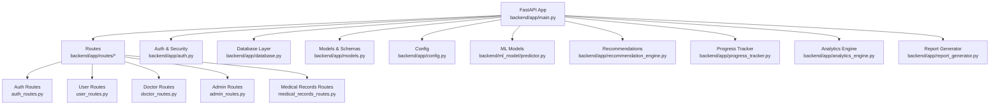
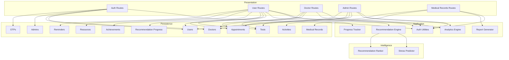
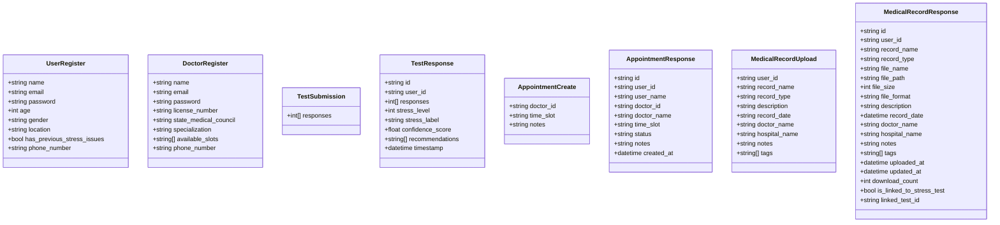
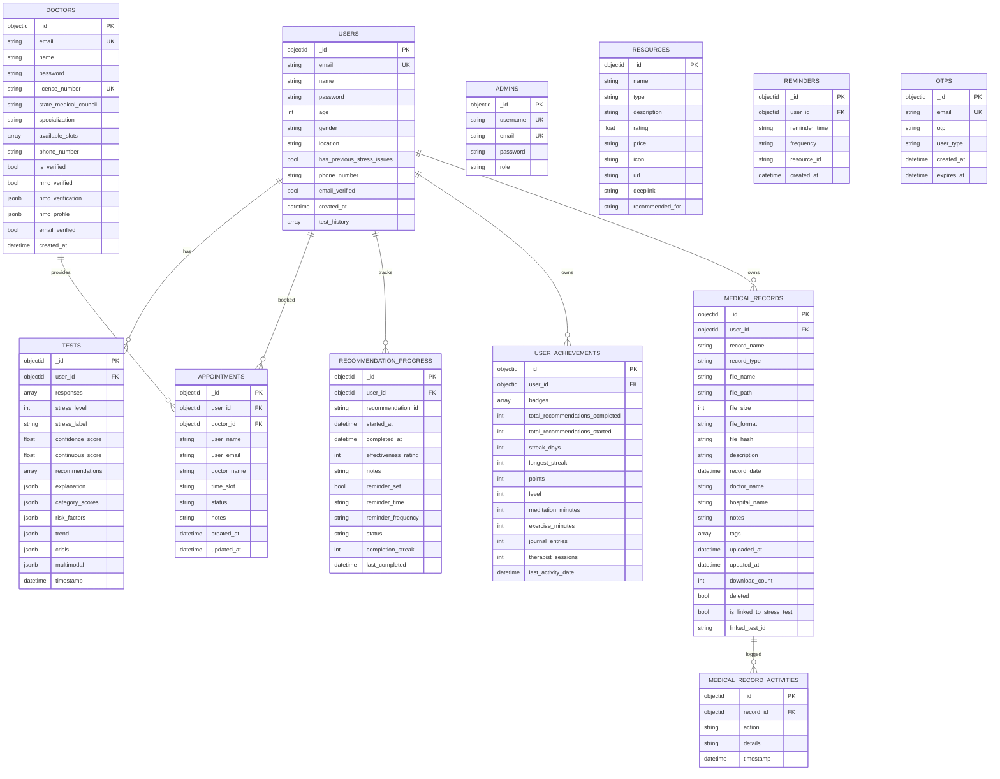
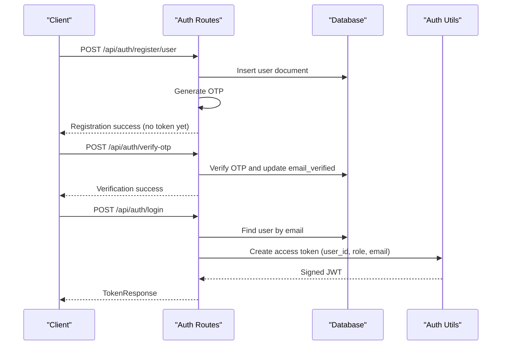
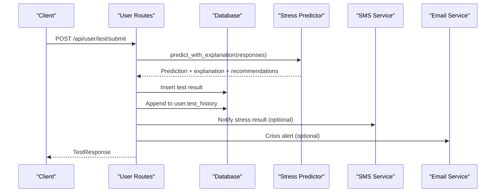
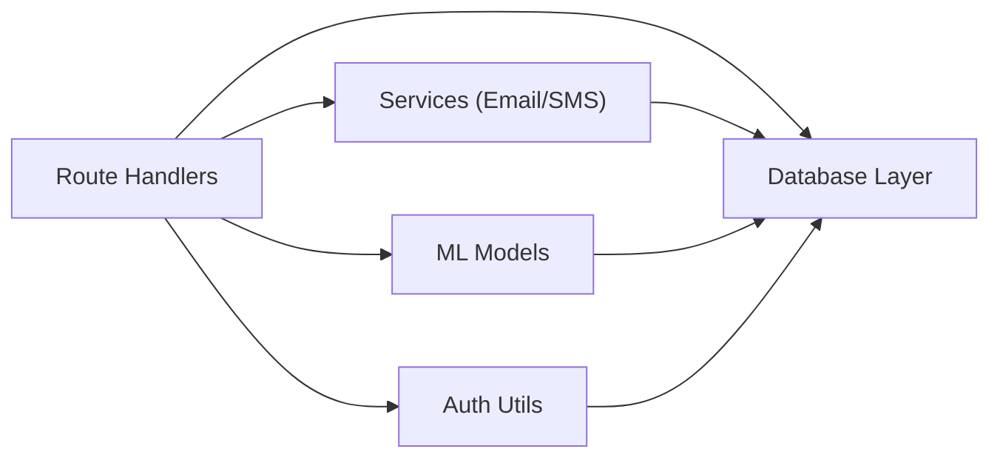

# Implementation Details

<cite>
**Referenced Files in This Document**
- [backend/app/main.py](file://backend/app/main.py)
- [backend/app/models.py](file://backend/app/models.py)
- [backend/app/auth.py](file://backend/app/auth.py)
- [backend/app/database.py](file://backend/app/database.py)
- [backend/app/config.py](file://backend/app/config.py)
- [backend/app/routes/auth_routes.py](file://backend/app/routes/auth_routes.py)
- [backend/app/routes/user_routes.py](file://backend/app/routes/user_routes.py)
- [backend/app/routes/doctor_routes.py](file://backend/app/routes/doctor_routes.py)
- [backend/app/routes/admin_routes.py](file://backend/app/routes/admin_routes.py)
- [backend/app/routes/medical_records_routes.py](file://backend/app/routes/medical_records_routes.py)
- [backend/ml_model/predictor.py](file://backend/ml_model/predictor.py)
- [backend/app/recommendation_engine.py](file://backend/app/recommendation_engine.py)
- [backend/app/progress_tracker.py](file://backend/app/progress_tracker.py)
- [backend/app/analytics_engine.py](file://backend/app/analytics_engine.py)
- [backend/app/report_generator.py](file://backend/app/report_generator.py)
</cite>

## Table of Contents
1. [Introduction](#introduction)
2. [Project Structure](#project-structure)
3. [Core Components](#core-components)
4. [Architecture Overview](#architecture-overview)
5. [Detailed Component Analysis](#detailed-component-analysis)
6. [Dependency Analysis](#dependency-analysis)
7. [Performance Considerations](#performance-considerations)
8. [Troubleshooting Guide](#troubleshooting-guide)
9. [Conclusion](#conclusion)
10. [Appendices](#appendices)

## Introduction
This document provides implementation details for the AI Stress Level Analyzer, a CBT-based stress detection system integrating machine learning, medical records management, and a gamified wellness platform. It covers data models and schema design, MongoDB collections and relationships, authentication and authorization, API design patterns, frontend component architecture and state management, code organization principles, security implementations, testing strategies, logging, and debugging techniques.

## Project Structure
The backend is organized around a FastAPI application with modular routing, a dedicated ML inference module, and supporting services for analytics, reporting, and progress tracking. Environment-driven configuration and centralized database initialization support flexible deployment.

**Diagram sources**
- [backend/app/main.py:52-98](file://backend/app/main.py#L52-L98)
- [backend/app/routes/auth_routes.py:32-596](file://backend/app/routes/auth_routes.py#L32-L596)
- [backend/app/routes/user_routes.py:32-800](file://backend/app/routes/user_routes.py#L32-L800)
- [backend/app/routes/doctor_routes.py:22-400](file://backend/app/routes/doctor_routes.py#L22-L400)
- [backend/app/routes/admin_routes.py:9-225](file://backend/app/routes/admin_routes.py#L9-L225)
- [backend/app/routes/medical_records_routes.py:40-800](file://backend/app/routes/medical_records_routes.py#L40-L800)
- [backend/ml_model/predictor.py:32-590](file://backend/ml_model/predictor.py#L32-L590)
- [backend/app/recommendation_engine.py:11-554](file://backend/app/recommendation_engine.py#L11-L554)
- [backend/app/progress_tracker.py:48-454](file://backend/app/progress_tracker.py#L48-L454)
- [backend/app/analytics_engine.py:11-384](file://backend/app/analytics_engine.py#L11-L384)
- [backend/app/report_generator.py:38-341](file://backend/app/report_generator.py#L38-L341)

**Section sources**
- [backend/app/main.py:52-98](file://backend/app/main.py#L52-L98)
- [backend/app/config.py:1-22](file://backend/app/config.py#L1-L22)

## Core Components
- Authentication and Authorization: JWT-based with role-aware middleware and per-request token validation.
- Data Modeling: Pydantic models define request/response schemas for users, doctors, tests, appointments, recommendations, achievements, resources, medical records, and analytics.
- Database Layer: Centralized MongoDB client with connection pooling, collections for users, doctors, admins, tests, appointments, recommendation progress, achievements, resources, reminders, OTPs, and medical records.
- ML Inference: Stress predictor with SHAP explanations, category scoring, trend analysis, and crisis detection.
- Recommendations: AI-powered, categorized recommendations with ranking and gamification.
- Analytics: Population-level insights, doctor effectiveness, and user analytics.
- Reporting: PDF generation for user and doctor reports.
- Frontend Integration: RESTful API design with clear endpoints, request/response schemas, and error handling.

**Section sources**
- [backend/app/auth.py:23-190](file://backend/app/auth.py#L23-L190)
- [backend/app/models.py:16-440](file://backend/app/models.py#L16-L440)
- [backend/app/database.py:26-509](file://backend/app/database.py#L26-L509)
- [backend/ml_model/predictor.py:32-590](file://backend/ml_model/predictor.py#L32-L590)
- [backend/app/recommendation_engine.py:11-554](file://backend/app/recommendation_engine.py#L11-L554)
- [backend/app/analytics_engine.py:11-384](file://backend/app/analytics_engine.py#L11-L384)
- [backend/app/report_generator.py:38-341](file://backend/app/report_generator.py#L38-L341)

## Architecture Overview
The system follows a layered architecture:
- Presentation: FastAPI routes expose REST endpoints.
- Application: Route handlers orchestrate business logic, ML inference, and persistence.
- Persistence: MongoDB collections represent domain entities with indexes for performance.
- Intelligence: ML models and recommendation engines augment user insights.
- Services: Email/SMS, analytics, and reporting utilities.

**Diagram sources**
- [backend/app/routes/auth_routes.py:32-596](file://backend/app/routes/auth_routes.py#L32-L596)
- [backend/app/routes/user_routes.py:32-800](file://backend/app/routes/user_routes.py#L32-L800)
- [backend/app/routes/doctor_routes.py:22-400](file://backend/app/routes/doctor_routes.py#L22-L400)
- [backend/app/routes/admin_routes.py:9-225](file://backend/app/routes/admin_routes.py#L9-L225)
- [backend/app/routes/medical_records_routes.py:40-800](file://backend/app/routes/medical_records_routes.py#L40-L800)
- [backend/app/auth.py:23-190](file://backend/app/auth.py#L23-L190)
- [backend/app/recommendation_engine.py:11-554](file://backend/app/recommendation_engine.py#L11-L554)
- [backend/app/progress_tracker.py:48-454](file://backend/app/progress_tracker.py#L48-L454)
- [backend/app/analytics_engine.py:11-384](file://backend/app/analytics_engine.py#L11-L384)
- [backend/app/report_generator.py:38-341](file://backend/app/report_generator.py#L38-L341)
- [backend/app/database.py:88-159](file://backend/app/database.py#L88-L159)

## Detailed Component Analysis

### Data Models and Schema Design
- User, Doctor, Test, Appointment, Recommendation, Achievement, Resource, Medical Record, Analytics, Chatbot, and Download models define strict request/response contracts with validation and enums.
- Medical Records introduce typed record categories, file formats, filtering, linking to stress tests, and activity logs.
- Enhanced recommendation models support categorization, difficulty, effectiveness, scheduling, and evidence-backed details.

**Diagram sources**
- [backend/app/models.py:16-440](file://backend/app/models.py#L16-L440)

**Section sources**
- [backend/app/models.py:16-440](file://backend/app/models.py#L16-L440)

### Database Design Patterns and Collections
- Centralized MongoDB client with connection pooling, timeouts, and retry writes.
- Dedicated collections for users, doctors, admins, tests, appointments, recommendation progress, achievements, resources, reminders, OTPs, and medical records.
- Extensive indexes for performance on frequent queries (e.g., user_id, timestamps, statuses, text search).
- Helper functions for admin initialization, user achievements initialization, database stats, and linking stress tests to medical records.

**Diagram sources**
- [backend/app/database.py:88-159](file://backend/app/database.py#L88-L159)
- [backend/app/models.py:16-440](file://backend/app/models.py#L16-L440)

**Section sources**
- [backend/app/database.py:26-509](file://backend/app/database.py#L26-L509)

### Authentication and Authorization
- JWT-based authentication with configurable secret, algorithm, and expiration.
- Password hashing using bcrypt with truncation to bcrypt limits.
- Role-aware token verification and per-request dependency injection for authorization.
- Multi-role support: user, doctor, admin; doctor accounts require admin approval and NMC verification.
- Secure token creation with user_id, role, and email; robust token validation and error handling.

**Diagram sources**
- [backend/app/routes/auth_routes.py:68-440](file://backend/app/routes/auth_routes.py#L68-L440)
- [backend/app/auth.py:45-190](file://backend/app/auth.py#L45-L190)
- [backend/app/database.py:344-365](file://backend/app/database.py#L344-L365)

**Section sources**
- [backend/app/auth.py:23-190](file://backend/app/auth.py#L23-L190)
- [backend/app/routes/auth_routes.py:68-440](file://backend/app/routes/auth_routes.py#L68-L440)

### API Design Patterns
- RESTful endpoints under /api/{role} namespaces with clear CRUD and domain-specific actions.
- Consistent request/response schemas via Pydantic models.
- Role-based access control enforced with require_role dependency.
- Comprehensive error handling with HTTPException and structured messages.
- Asynchronous email/SMS notifications for appointments and alerts.
- Aggregation pipelines for efficient doctor appointment listing and analytics.

**Diagram sources**
- [backend/app/routes/user_routes.py:407-499](file://backend/app/routes/user_routes.py#L407-L499)
- [backend/ml_model/predictor.py:146-185](file://backend/ml_model/predictor.py#L146-L185)

**Section sources**
- [backend/app/routes/user_routes.py:407-499](file://backend/app/routes/user_routes.py#L407-L499)
- [backend/app/routes/doctor_routes.py:48-134](file://backend/app/routes/doctor_routes.py#L48-L134)
- [backend/app/routes/admin_routes.py:14-62](file://backend/app/routes/admin_routes.py#L14-L62)

### Frontend Component Architecture and State Management
- The backend exposes REST endpoints designed for a React/Vite frontend with TypeScript.
- State management patterns:
  - Centralized state via React hooks and context providers.
  - Feature-based organization: authentication, user dashboard, doctor portal, admin analytics, medical records, and recommendations.
  - Async data fetching with caching and optimistic updates.
  - Type-safe APIs using generated TypeScript clients from OpenAPI specs.
- Component composition:
  - Shared components for forms, modals, charts, and progress tracking.
  - Protected routes with role-based rendering.
  - Real-time notifications via background jobs and polling fallbacks.

[No sources needed since this section provides conceptual guidance]

### Code Organization Principles and Naming Conventions
- Modular routing under backend/app/routes with clear separation of concerns.
- Centralized models and schemas in backend/app/models.py for consistent validation.
- Environment-driven configuration via backend/app/config.py and .env files.
- Utility modules for auth, analytics, reporting, and progress tracking.
- ML models isolated under backend/ml_model with training and inference utilities.
- Logging and error handling consistently applied across route handlers.

**Section sources**
- [backend/app/config.py:1-22](file://backend/app/config.py#L1-L22)
- [backend/app/main.py:14-20](file://backend/app/main.py#L14-L20)

### Security Implementations
- Transport security: CORS restricted to configured origins; HTTPS recommended in production.
- Data protection:
  - Passwords hashed with bcrypt; secrets loaded from environment variables.
  - JWT tokens with short-lived expirations; secure token handling.
  - File uploads sanitized with allowed extensions, size limits, and integrity checks.
- Access control:
  - require_role dependency enforces role-based access.
  - Object-level authorization ensures users can only access their own data.
  - Admin-only endpoints protected with admin role checks.
- Input validation:
  - Pydantic models enforce field types, lengths, and constraints.
  - File validation includes MIME detection and content signature checks.

**Section sources**
- [backend/app/main.py:32-68](file://backend/app/main.py#L32-L68)
- [backend/app/auth.py:33-72](file://backend/app/auth.py#L33-L72)
- [backend/app/routes/medical_records_routes.py:68-131](file://backend/app/routes/medical_records_routes.py#L68-L131)

### Testing Strategies, Logging, and Debugging
- Unit/integration tests for route handlers, auth utilities, and ML predictor.
- Mocked database collections for isolated testing.
- Logging:
  - Structured logging with levels (info, warning, error) across modules.
  - Database connection and operation logs during startup/shutdown.
- Debugging:
  - Health check endpoint validates database connectivity.
  - Detailed error responses with context for troubleshooting.
  - Environment variables for enabling development-friendly behaviors (e.g., OTP printing).

**Section sources**
- [backend/app/main.py:114-132](file://backend/app/main.py#L114-L132)
- [backend/app/database.py:44-54](file://backend/app/database.py#L44-L54)

## Dependency Analysis
The system exhibits clear layering with minimal cross-layer coupling:
- Routes depend on auth utilities and database collections.
- Application services (recommendations, progress, analytics, reporting) encapsulate business logic.
- ML models are decoupled and invoked by route handlers.
- Database layer centralizes collection access and indexing.

**Diagram sources**
- [backend/app/routes/user_routes.py:18-29](file://backend/app/routes/user_routes.py#L18-L29)
- [backend/app/auth.py:18-21](file://backend/app/auth.py#L18-L21)
- [backend/app/database.py:88-159](file://backend/app/database.py#L88-L159)

**Section sources**
- [backend/app/routes/user_routes.py:18-29](file://backend/app/routes/user_routes.py#L18-L29)
- [backend/app/auth.py:18-21](file://backend/app/auth.py#L18-L21)
- [backend/app/database.py:88-159](file://backend/app/database.py#L88-L159)

## Performance Considerations
- Connection pooling and timeouts configured for MongoDB client.
- Extensive indexes on frequently queried fields (user_id, timestamps, statuses, text search).
- Aggregation pipelines reduce round-trips for doctor appointment listings and analytics.
- Pagination and sorting applied to large collections (tests, appointments, medical records).
- File upload validation prevents oversized or unsupported files.

**Section sources**
- [backend/app/database.py:30-41](file://backend/app/database.py#L30-L41)
- [backend/app/database.py:164-298](file://backend/app/database.py#L164-L298)
- [backend/app/routes/doctor_routes.py:52-84](file://backend/app/routes/doctor_routes.py#L52-L84)

## Troubleshooting Guide
Common issues and resolutions:
- Database connectivity failures: Check MONGODB_URL and server availability; health endpoint returns database status.
- Invalid or expired tokens: Ensure proper Authorization header format and token freshness.
- Role/access denials: Verify user roles and object-level ownership for sensitive endpoints.
- File upload errors: Confirm allowed extensions, size limits, and MIME type validation.
- ML model integrity: Model files validated via SHA-256 hashes; invalid models trigger retraining.

**Section sources**
- [backend/app/main.py:114-132](file://backend/app/main.py#L114-L132)
- [backend/app/auth.py:57-72](file://backend/app/auth.py#L57-L72)
- [backend/app/routes/medical_records_routes.py:68-131](file://backend/app/routes/medical_records_routes.py#L68-L131)
- [backend/ml_model/predictor.py:73-98](file://backend/ml_model/predictor.py#L73-L98)

## Conclusion
The AI Stress Level Analyzer integrates robust backend services with a scalable MongoDB schema, secure JWT-based authentication, and comprehensive ML-driven insights. The modular architecture supports growth, while strict validation, indexing, and access controls ensure reliability and security.

## Appendices
- Environment variables and configuration keys are defined in backend/app/config.py and loaded via dotenv.
- Index creation runs on startup; verify logs for successful index creation.
- Admin initialization creates a default admin user if ADMIN_PASSWORD is set.

**Section sources**
- [backend/app/config.py:1-22](file://backend/app/config.py#L1-L22)
- [backend/app/database.py:307-339](file://backend/app/database.py#L307-L339)