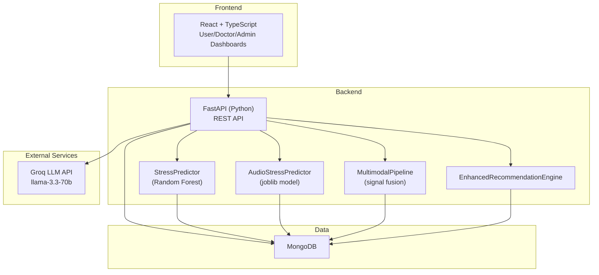
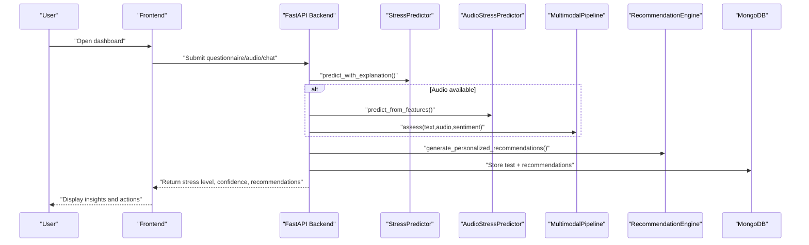
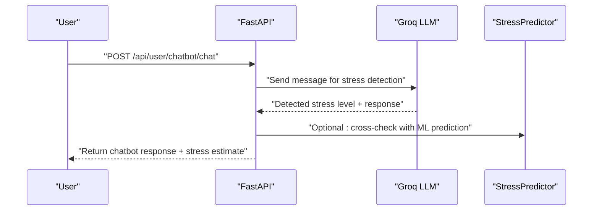
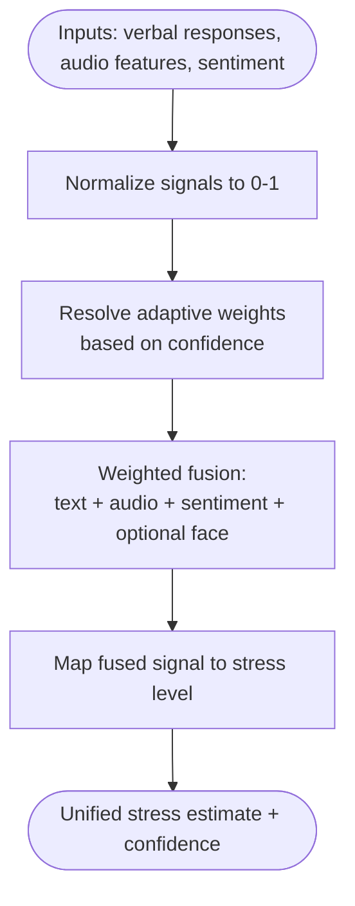
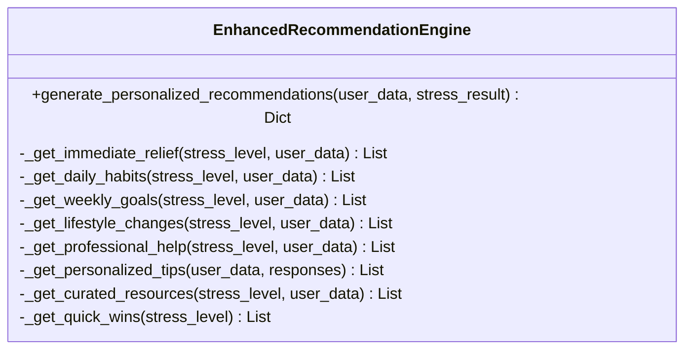
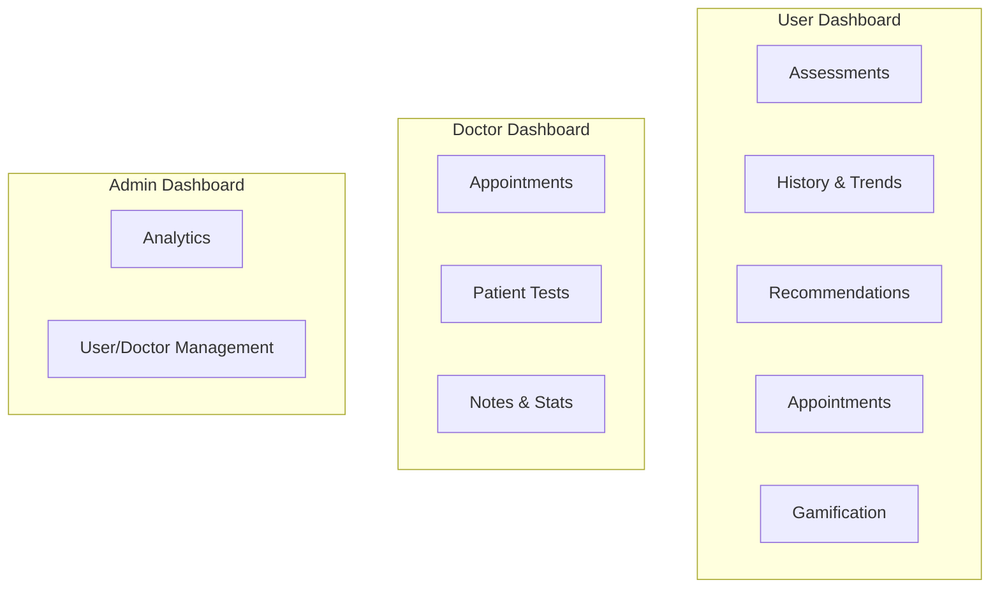
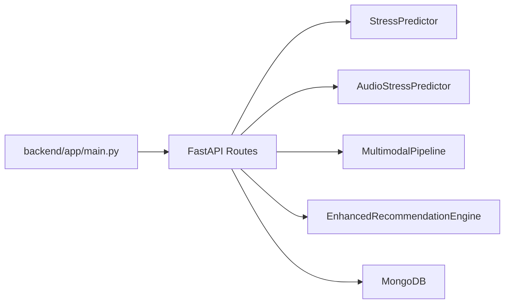

# Introduction

<cite>
**Referenced Files in This Document**
- [README.md](file://README.md)
- [ARCHITECTURE_EXPLAINED.md](file://ARCHITECTURE_EXPLAINED.md)
- [backend/app/main.py](file://backend/app/main.py)
- [backend/ml_model/predictor.py](file://backend/ml_model/predictor.py)
- [backend/ml_model/audio_stress_predictor.py](file://backend/ml_model/audio_stress_predictor.py)
- [backend/ml_model/multimodal_pipeline.py](file://backend/ml_model/multimodal_pipeline.py)
- [backend/app/models.py](file://backend/app/models.py)
- [backend/app/recommendation_engine.py](file://backend/app/recommendation_engine.py)
- [backend/app/routes/user_routes.py](file://backend/app/routes/user_routes.py)
- [backend/app/routes/doctor_routes.py](file://backend/app/routes/doctor_routes.py)
</cite>

## Table of Contents
1. [Introduction](#introduction)
2. [Project Structure](#project-structure)
3. [Core Components](#core-components)
4. [Architecture Overview](#architecture-overview)
5. [Detailed Component Analysis](#detailed-component-analysis)
6. [Dependency Analysis](#dependency-analysis)
7. [Performance Considerations](#performance-considerations)
8. [Troubleshooting Guide](#troubleshooting-guide)
9. [Conclusion](#conclusion)
10. [Appendices](#appendices)

## Introduction
The AI Stress Level Analyzer is a comprehensive, full-stack mental health platform that leverages machine learning and Cognitive Behavioral Therapy (CBT) principles to detect and manage stress. Its mission is to revolutionize mental healthcare accessibility by combining:
- AI-powered stress detection from text-based questionnaires
- Voice analysis for real-time stress insights
- AI chatbot counseling for 24/7 support
- Personalized recommendations and gamification to sustain engagement
- Healthcare workflows for seamless integration with doctors and administrators

The platform targets three primary audiences:
- Individuals seeking self-assessment and early intervention
- Healthcare professionals who need integrated tools to monitor and guide patients
- Researchers and developers interested in multimodal stress analytics and explainable AI

By unifying CBT-based questionnaires, voice biomarkers, and conversational AI, the application aims to increase mental health awareness, enable early intervention, and reduce barriers to care through an intuitive, scalable, and privacy-conscious solution.

## Project Structure
At a high level, the system consists of:
- A React frontend (TypeScript) for user and professional dashboards
- A FastAPI backend (Python) serving REST endpoints and orchestrating ML workflows
- A MongoDB database for persistent storage of users, tests, appointments, and records
- A machine learning stack including:
  - A Random Forest-based stress predictor for questionnaire responses
  - An audio stress classifier for voice recordings
  - A multimodal fusion pipeline combining text, audio, and sentiment signals
  - An AI chatbot powered by Groq’s LLM for real-time stress detection and counseling

**Diagram sources**
- [backend/app/main.py:52-80](file://backend/app/main.py#L52-L80)
- [backend/ml_model/predictor.py:32-46](file://backend/ml_model/predictor.py#L32-L46)
- [backend/ml_model/audio_stress_predictor.py:13-29](file://backend/ml_model/audio_stress_predictor.py#L13-L29)
- [backend/ml_model/multimodal_pipeline.py:11-31](file://backend/ml_model/multimodal_pipeline.py#L11-L31)
- [backend/app/recommendation_engine.py:11-18](file://backend/app/recommendation_engine.py#L11-L18)

**Section sources**
- [README.md:69-86](file://README.md#L69-L86)
- [ARCHITECTURE_EXPLAINED.md:24-36](file://ARCHITECTURE_EXPLAINED.md#L24-L36)
- [backend/app/main.py:52-80](file://backend/app/main.py#L52-L80)

## Core Components
- StressPredictor: Loads a trained Random Forest model and provides predictions, SHAP-based explanations, category-level scoring, risk factor identification, and trend analysis for stress history.
- AudioStressPredictor: Loads a trained audio model and predicts stress from extracted acoustic features, returning confidence and normalized stress scores.
- MultimodalPipeline: Fuses text, audio, and sentiment signals into a unified stress estimate with adaptive weighting and confidence calibration.
- EnhancedRecommendationEngine: Generates personalized, categorized recommendations (immediate, daily, weekly, lifestyle, professional) tailored to user profiles and stress results.
- FastAPI Routes: Expose endpoints for user testing, video-based assessment, recommendations, gamification, and doctor workflows, integrating ML and recommendation engines.
- Models and Analytics: Pydantic models define request/response contracts; analytics and notifications integrate with email/SMS services.

These components collectively enable accurate, explainable, and actionable stress insights while supporting healthcare workflows and user engagement.

**Section sources**
- [backend/ml_model/predictor.py:32-46](file://backend/ml_model/predictor.py#L32-L46)
- [backend/ml_model/audio_stress_predictor.py:13-29](file://backend/ml_model/audio_stress_predictor.py#L13-L29)
- [backend/ml_model/multimodal_pipeline.py:11-31](file://backend/ml_model/multimodal_pipeline.py#L11-L31)
- [backend/app/recommendation_engine.py:11-18](file://backend/app/recommendation_engine.py#L11-L18)
- [backend/app/models.py:78-90](file://backend/app/models.py#L78-L90)
- [backend/app/routes/user_routes.py:407-499](file://backend/app/routes/user_routes.py#L407-L499)

## Architecture Overview
The system architecture integrates user-facing dashboards with backend services and ML models, enabling:
- Secure authentication and role-based access control
- Real-time ML inference for questionnaire and voice-based assessments
- Multimodal fusion for robust stress estimation
- Personalized recommendations and gamification
- Healthcare workflows for appointments and doctor dashboards

**Diagram sources**
- [backend/app/routes/user_routes.py:407-499](file://backend/app/routes/user_routes.py#L407-L499)
- [backend/ml_model/predictor.py:119-144](file://backend/ml_model/predictor.py#L119-L144)
- [backend/ml_model/audio_stress_predictor.py:97-135](file://backend/ml_model/audio_stress_predictor.py#L97-L135)
- [backend/ml_model/multimodal_pipeline.py:74-179](file://backend/ml_model/multimodal_pipeline.py#L74-L179)
- [backend/app/recommendation_engine.py:17-58](file://backend/app/recommendation_engine.py#L17-L58)

**Section sources**
- [README.md:69-86](file://README.md#L69-L86)
- [ARCHITECTURE_EXPLAINED.md:38-66](file://ARCHITECTURE_EXPLAINED.md#L38-L66)

## Detailed Component Analysis

### AI Chatbot Counseling and Real-Time Stress Detection
- The AI chatbot uses Groq’s LLM to analyze conversational text and automatically detect stress indicators, returning a stress level estimate alongside empathetic, actionable responses.
- The chatbot complements structured questionnaires with free-form interaction, enabling continuous monitoring and support.

**Diagram sources**
- [backend/app/routes/user_routes.py:125-144](file://backend/app/routes/user_routes.py#L125-L144)
- [backend/app/routes/user_routes.py:308-400](file://backend/app/routes/user_routes.py#L308-L400)

**Section sources**
- [README.md:321-329](file://README.md#L321-L329)
- [ARCHITECTURE_EXPLAINED.md:12-18](file://ARCHITECTURE_EXPLAINED.md#L12-L18)

### Multimodal Fusion Pipeline
- The multimodal pipeline normalizes inputs (text, audio, sentiment), assigns adaptive weights based on confidence, and fuses signals into a unified stress estimate.
- It supports fallbacks when audio or LLM signals are unavailable and adjusts weights dynamically to ensure robustness.

**Diagram sources**
- [backend/ml_model/multimodal_pipeline.py:74-179](file://backend/ml_model/multimodal_pipeline.py#L74-L179)

**Section sources**
- [ARCHITECTURE_EXPLAINED.md:487-515](file://ARCHITECTURE_EXPLAINED.md#L487-L515)

### Enhanced Recommendation Engine
- Provides personalized, categorized recommendations aligned with stress levels and user profiles.
- Includes immediate relief, daily habits, weekly goals, lifestyle changes, professional support, and curated resources.
- Recommendations are ranked using a neural ranking module to improve relevance and engagement.

**Diagram sources**
- [backend/app/recommendation_engine.py:11-58](file://backend/app/recommendation_engine.py#L11-L58)

**Section sources**
- [README.md:552-586](file://README.md#L552-L586)
- [backend/app/recommendation_engine.py:17-58](file://backend/app/recommendation_engine.py#L17-L58)

### Healthcare Workflows and Dashboards
- User dashboard: self-assessment, history, recommendations, appointments, and gamification.
- Doctor dashboard: appointment management, patient test history, and communication tools.
- Admin dashboard: analytics, user and doctor management, and system oversight.

**Diagram sources**
- [README.md:38-66](file://README.md#L38-L66)
- [backend/app/routes/doctor_routes.py:48-134](file://backend/app/routes/doctor_routes.py#L48-L134)

**Section sources**
- [README.md:38-66](file://README.md#L38-L66)
- [backend/app/routes/doctor_routes.py:48-134](file://backend/app/routes/doctor_routes.py#L48-L134)

## Dependency Analysis
- Backend entrypoint initializes routes, middleware, and database connections, ensuring CORS and health checks are configured.
- ML components are loaded at startup and reused across requests for low-latency inference.
- Endpoints orchestrate ML models, recommendation engine, and persistence, while enforcing role-based access control.

**Diagram sources**
- [backend/app/main.py:52-80](file://backend/app/main.py#L52-L80)
- [backend/app/routes/user_routes.py:19-28](file://backend/app/routes/user_routes.py#L19-L28)

**Section sources**
- [backend/app/main.py:52-80](file://backend/app/main.py#L52-L80)
- [backend/app/routes/user_routes.py:19-28](file://backend/app/routes/user_routes.py#L19-L28)

## Performance Considerations
- Model loading and caching: ML models are loaded once at startup and reused, minimizing latency for repeated predictions.
- Asynchronous notifications: Email and SMS updates are handled asynchronously to avoid blocking API responses.
- Database optimization: Aggregation pipelines reduce round-trips and improve performance for doctor dashboards.
- Adaptive fusion: The multimodal pipeline dynamically adjusts weights based on signal reliability, improving robustness without sacrificing speed.

[No sources needed since this section provides general guidance]

## Troubleshooting Guide
- Model availability: If the stress model file is missing or corrupted, the system auto-reloads or retrains from the dataset on startup.
- Audio model readiness: Audio predictor checks for model freshness and reloads if files change.
- Health checks: The backend exposes a health endpoint to verify database connectivity and feature availability.
- CORS and environment: Ensure ALLOWED_ORIGINS and environment variables are configured correctly for frontend-backend communication.

**Section sources**
- [backend/ml_model/predictor.py:81-98](file://backend/ml_model/predictor.py#L81-L98)
- [backend/ml_model/audio_stress_predictor.py:58-69](file://backend/ml_model/audio_stress_predictor.py#L58-L69)
- [backend/app/main.py:114-132](file://backend/app/main.py#L114-L132)
- [README.md:664-695](file://README.md#L664-L695)

## Conclusion
The AI Stress Level Analyzer advances mental healthcare by combining CBT-based assessments, voice analysis, and AI chatbot counseling into a unified, explainable, and actionable platform. Its multimodal approach, personalized recommendations, and healthcare workflows position it to improve early detection, engagement, and outcomes—particularly for underserved populations seeking accessible, low-barrier mental health support.

[No sources needed since this section summarizes without analyzing specific files]

## Appendices
- Educational objectives: Promote mental health literacy, demonstrate AI explainability, and showcase practical applications of multimodal analytics.
- Impact: Increase awareness, enable early intervention, and support healthcare providers with data-driven insights and streamlined workflows.

[No sources needed since this section provides general guidance]