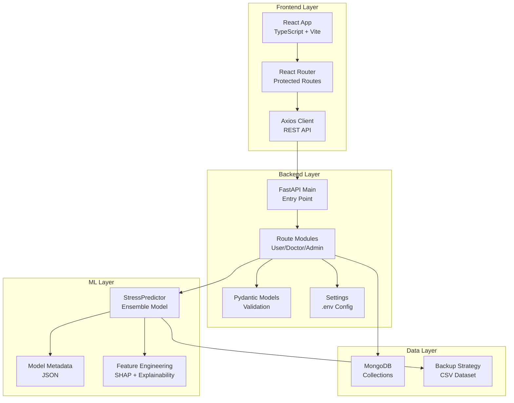
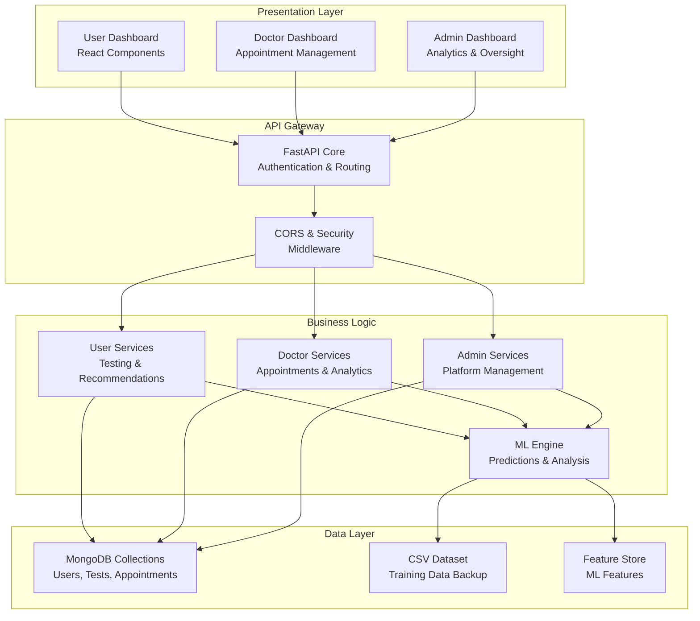
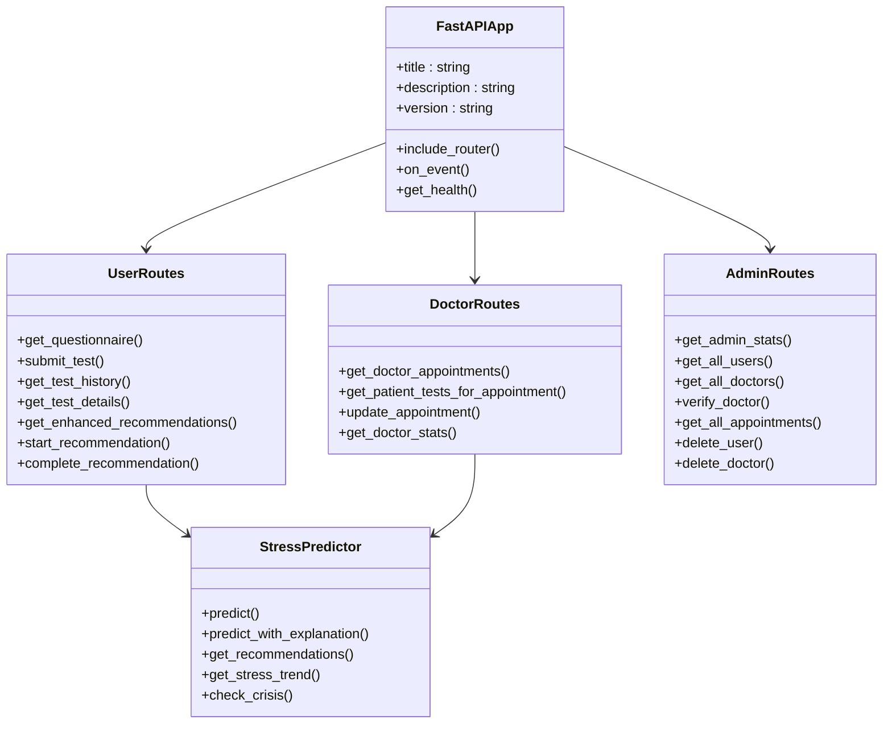
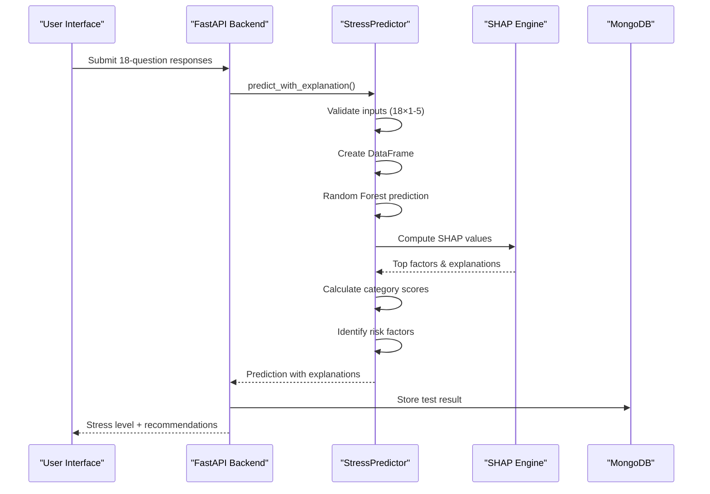
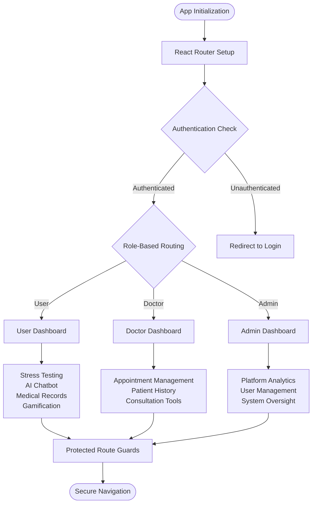
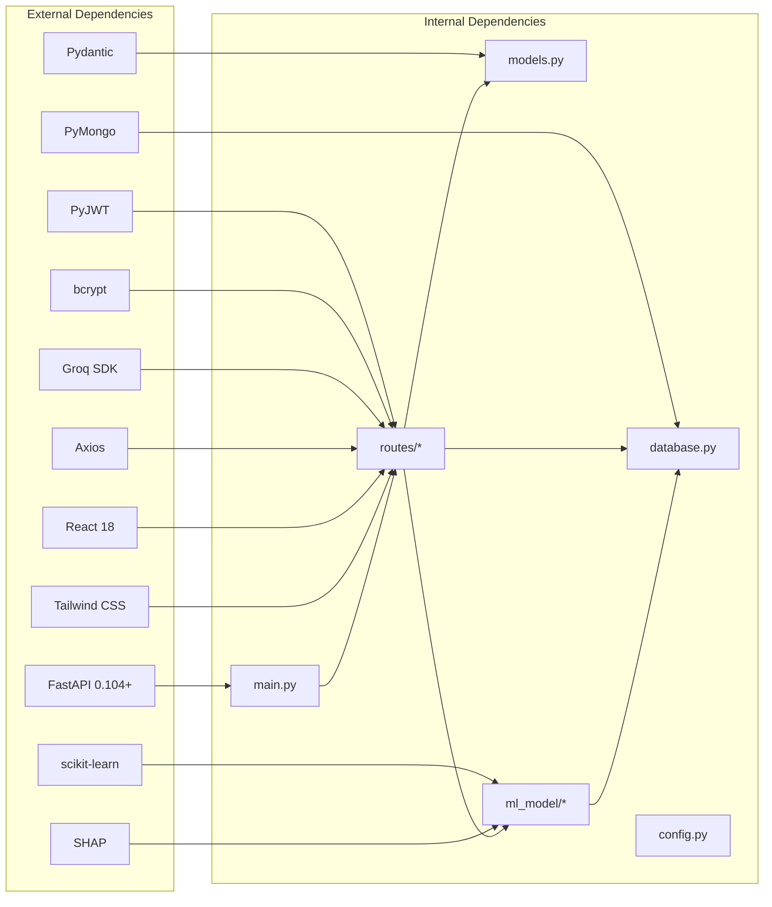

# Project Overview

<cite>
**Referenced Files in This Document**
- [README.md](file://README.md)
- [ARCHITECTURE_EXPLAINED.md](file://ARCHITECTURE_EXPLAINED.md)
- [backend/app/main.py](file://backend/app/main.py)
- [backend/app/models.py](file://backend/app/models.py)
- [backend/app/config.py](file://backend/app/config.py)
- [backend/app/routes/user_routes.py](file://backend/app/routes/user_routes.py)
- [backend/app/routes/doctor_routes.py](file://backend/app/routes/doctor_routes.py)
- [backend/app/routes/admin_routes.py](file://backend/app/routes/admin_routes.py)
- [backend/ml_model/predictor.py](file://backend/ml_model/predictor.py)
- [backend/ml_model/stress_model_meta.json](file://backend/ml_model/stress_model_meta.json)
- [backend/ml_model/VOICE_STRESS_TRAINING.md](file://backend/ml_model/VOICE_STRESS_TRAINING.md)
- [frontend/src/App.tsx](file://frontend/src/App.tsx)
- [frontend/package.json](file://frontend/package.json)
</cite>

## Table of Contents
1. [Introduction](#introduction)
2. [Project Structure](#project-structure)
3. [Core Components](#core-components)
4. [Architecture Overview](#architecture-overview)
5. [Detailed Component Analysis](#detailed-component-analysis)
6. [Dependency Analysis](#dependency-analysis)
7. [Performance Considerations](#performance-considerations)
8. [Troubleshooting Guide](#troubleshooting-guide)
9. [Conclusion](#conclusion)
10. [Appendices](#appendices)

## Introduction
The AI Stress Level Analyzer is a comprehensive full-stack mental health application that combines Cognitive Behavioral Therapy (CBT) principles with machine learning to deliver AI-powered stress detection and personalized care pathways. The system offers a three-dashboard ecosystem: User, Doctor, and Admin, each tailored to specific roles and responsibilities in mental wellness management.

The application serves dual audiences: mental health professionals seeking efficient diagnostic tools and individuals seeking accessible, privacy-preserving stress assessment and management. Built on modern technologies, it emphasizes explainability, safety, and scalability while maintaining strict adherence to healthcare data protection standards.

## Project Structure
The project follows a clear separation of concerns with distinct backend and frontend layers, complemented by a sophisticated machine learning module for stress prediction and analysis.

**Diagram sources**
- [backend/app/main.py:52-80](file://backend/app/main.py#L52-L80)
- [backend/app/models.py:7-440](file://backend/app/models.py#L7-L440)
- [backend/app/config.py:3-22](file://backend/app/config.py#L3-L22)
- [backend/ml_model/predictor.py:32-118](file://backend/ml_model/predictor.py#L32-L118)

**Section sources**
- [README.md:698-761](file://README.md#L698-L761)
- [frontend/src/App.tsx:30-88](file://frontend/src/App.tsx#L30-L88)

## Core Components
The application comprises several interconnected components that work together to deliver a seamless mental health experience:

### Three-Dashboard System
The system provides role-specific dashboards with distinct functionalities:

**User Dashboard**: Comprehensive self-assessment and management tools including stress testing, AI chatbot, medical records, appointments, and gamification elements.

**Doctor Dashboard**: Clinical workflow management with patient appointment scheduling, stress history review, and consultation coordination.

**Admin Dashboard**: Platform oversight with analytics, user management, doctor verification, and system statistics.

### Machine Learning Integration
The core ML engine utilizes a Random Forest ensemble classifier trained on 100,000 synthetic samples to predict stress levels with 89.56% accuracy. The system provides SHAP-based explainability and continuous learning capabilities.

### Full-Stack Architecture
Built with FastAPI backend and React frontend, the application ensures real-time responsiveness and scalable performance across all three dashboard types.

**Section sources**
- [README.md:40-66](file://README.md#L40-L66)
- [README.md:119-205](file://README.md#L119-L205)
- [backend/ml_model/stress_model_meta.json:1-31](file://backend/ml_model/stress_model_meta.json#L1-L31)

## Architecture Overview
The system employs a modern microservice-style architecture with clear separation between presentation, business logic, and data layers.

**Diagram sources**
- [backend/app/main.py:52-80](file://backend/app/main.py#L52-L80)
- [backend/app/routes/user_routes.py:32-36](file://backend/app/routes/user_routes.py#L32-L36)
- [backend/app/routes/doctor_routes.py:22-22](file://backend/app/routes/doctor_routes.py#L22-L22)
- [backend/app/routes/admin_routes.py:9-9](file://backend/app/routes/admin_routes.py#L9-L9)

The architecture emphasizes:
- **Role-based access control** with JWT authentication
- **Asynchronous processing** for non-blocking operations
- **Modular design** enabling independent scaling
- **Data persistence** with MongoDB collections
- **Explainable AI** through SHAP integration

**Section sources**
- [README.md:69-86](file://README.md#L69-L86)
- [backend/app/main.py:32-68](file://backend/app/main.py#L32-L68)

## Detailed Component Analysis

### Backend Core Architecture
The FastAPI backend serves as the central orchestrator, managing authentication, routing, and business logic across all three dashboard types.

**Diagram sources**
- [backend/app/main.py:52-80](file://backend/app/main.py#L52-L80)
- [backend/app/routes/user_routes.py:32-36](file://backend/app/routes/user_routes.py#L32-L36)
- [backend/app/routes/doctor_routes.py:22-22](file://backend/app/routes/doctor_routes.py#L22-L22)
- [backend/app/routes/admin_routes.py:9-9](file://backend/app/routes/admin_routes.py#L9-L9)
- [backend/ml_model/predictor.py:32-118](file://backend/ml_model/predictor.py#L32-L118)

**Section sources**
- [backend/app/main.py:1-137](file://backend/app/main.py#L1-L137)
- [backend/app/routes/user_routes.py:1-800](file://backend/app/routes/user_routes.py#L1-L800)
- [backend/app/routes/doctor_routes.py:1-400](file://backend/app/routes/doctor_routes.py#L1-L400)
- [backend/app/routes/admin_routes.py:1-225](file://backend/app/routes/admin_routes.py#L1-L225)

### Machine Learning Pipeline
The ML engine provides robust stress prediction with explainability and continuous learning capabilities.

**Diagram sources**
- [backend/app/routes/user_routes.py:407-499](file://backend/app/routes/user_routes.py#L407-L499)
- [backend/ml_model/predictor.py:146-185](file://backend/ml_model/predictor.py#L146-L185)

The ML pipeline includes:
- **Input validation** ensuring data integrity
- **Ensemble prediction** using Random Forest with SHAP explainability
- **Risk factor identification** for clinical insights
- **Continuous monitoring** through trend analysis
- **Crisis detection** for emergency response

**Section sources**
- [backend/ml_model/predictor.py:119-185](file://backend/ml_model/predictor.py#L119-L185)
- [backend/ml_model/stress_model_meta.json:1-31](file://backend/ml_model/stress_model_meta.json#L1-L31)

### Frontend Dashboard Implementation
The React frontend provides role-specific interfaces with responsive design and intuitive navigation.

**Diagram sources**
- [frontend/src/App.tsx:16-28](file://frontend/src/App.tsx#L16-L28)
- [frontend/src/App.tsx:40-82](file://frontend/src/App.tsx#L40-L82)

**Section sources**
- [frontend/src/App.tsx:1-88](file://frontend/src/App.tsx#L1-L88)
- [frontend/package.json:10-26](file://frontend/package.json#L10-L26)

## Dependency Analysis
The system maintains loose coupling between components while ensuring cohesive functionality across all three dashboard types.

**Diagram sources**
- [README.md:90-116](file://README.md#L90-L116)
- [backend/app/main.py:14-18](file://backend/app/main.py#L14-L18)
- [backend/app/models.py:7-11](file://backend/app/models.py#L7-L11)

Key dependency characteristics:
- **Backend**: Python-centric with modern async capabilities
- **Frontend**: React-based with TypeScript for type safety
- **ML**: scikit-learn ensemble with SHAP explainability
- **Database**: MongoDB for flexible document storage
- **Communication**: REST API with JSON payloads

**Section sources**
- [README.md:90-116](file://README.md#L90-L116)
- [backend/app/config.py:3-22](file://backend/app/config.py#L3-L22)

## Performance Considerations
The system is designed for optimal performance across all three dashboard types:

### Backend Performance Optimizations
- **Async processing** for non-blocking operations
- **Connection pooling** for database efficiency
- **Model caching** to avoid repeated loading
- **Aggregation pipelines** for complex queries
- **CORS optimization** for cross-origin requests

### Frontend Performance Strategies
- **Lazy loading** for dashboard components
- **Efficient state management** with React hooks
- **Optimized API calls** with caching strategies
- **Responsive design** for mobile accessibility

### ML Performance Features
- **Pre-trained model loading** at startup
- **Batch processing** for multiple predictions
- **Memory-efficient data structures**
- **Graceful degradation** when models unavailable

**Section sources**
- [backend/app/main.py:81-98](file://backend/app/main.py#L81-L98)
- [backend/app/routes/doctor_routes.py:48-134](file://backend/app/routes/doctor_routes.py#L48-L134)
- [backend/ml_model/predictor.py:81-98](file://backend/ml_model/predictor.py#L81-L98)

## Troubleshooting Guide

### Common Backend Issues
**Database Connection Problems**
- Verify MongoDB is running locally or configured correctly
- Check connection string in environment variables
- Ensure required collections are created automatically

**Port Conflicts**
- Modify port in main.py if 8000 is unavailable
- Check for conflicting applications
- Verify firewall settings

**Model Loading Failures**
- Ensure stress_model.pkl exists in ml_model directory
- Check model integrity with SHA256 hashes
- Verify training dataset availability

### Frontend Troubleshooting
**API Connection Issues**
- Confirm backend is running on expected port
- Verify ALLOWED_ORIGINS includes frontend URLs
- Check CORS configuration in environment variables

**Authentication Problems**
- Verify JWT tokens are properly stored
- Check token expiration settings
- Ensure role-based access controls are functioning

### ML Model Issues
**Prediction Errors**
- Validate input format (18 integers, 1-5 range)
- Check model file integrity
- Review training dataset completeness

**Performance Degradation**
- Monitor model loading times
- Check for memory leaks
- Verify feature engineering pipeline

**Section sources**
- [README.md:664-696](file://README.md#L664-L696)
- [backend/app/main.py:114-132](file://backend/app/main.py#L114-L132)

## Conclusion
The AI Stress Level Analyzer represents a comprehensive solution for mental health assessment and management, combining cutting-edge machine learning with practical healthcare workflows. The three-dashboard architecture ensures appropriate care delivery across different stakeholder roles while maintaining strict security and privacy standards.

Key strengths include:
- **Explainable AI** through SHAP integration
- **Role-based security** with JWT authentication
- **Scalable architecture** supporting growth
- **Comprehensive functionality** covering assessment, treatment, and monitoring
- **Educational value** for both users and healthcare professionals

The system provides a solid foundation for mental health technology innovation, with clear pathways for expansion including voice stress detection, advanced analytics, and expanded therapeutic interventions.

## Appendices

### Technology Stack Details
**Backend Technologies**
- Python 3.10+ with FastAPI for async web services
- MongoDB for flexible document storage
- scikit-learn for machine learning models
- PyJWT for secure authentication
- Pydantic for data validation

**Frontend Technologies**
- React 18 with TypeScript for type safety
- Vite for fast development builds
- Tailwind CSS for utility-first styling
- Axios for HTTP client operations
- React Router for navigation

**Machine Learning Components**
- Random Forest ensemble classifier
- SHAP for explainable AI
- Feature importance analysis
- Continuous learning pipeline

### API Endpoint Overview
The system provides comprehensive REST API coverage for all three dashboard types:

**Authentication Endpoints**
- User registration and verification
- Doctor registration with license validation
- JWT-based login and logout

**User Functionalities**
- CBT questionnaire administration
- Stress prediction with explanations
- Medical record management
- Appointment booking and management
- AI chatbot integration

**Doctor Operations**
- Patient appointment management
- Stress history review
- Consultation coordination
- Performance analytics

**Administrative Functions**
- Platform statistics and analytics
- User and doctor management
- System oversight and reporting

**Section sources**
- [README.md:506-548](file://README.md#L506-L548)
- [backend/app/models.py:16-440](file://backend/app/models.py#L16-L440)