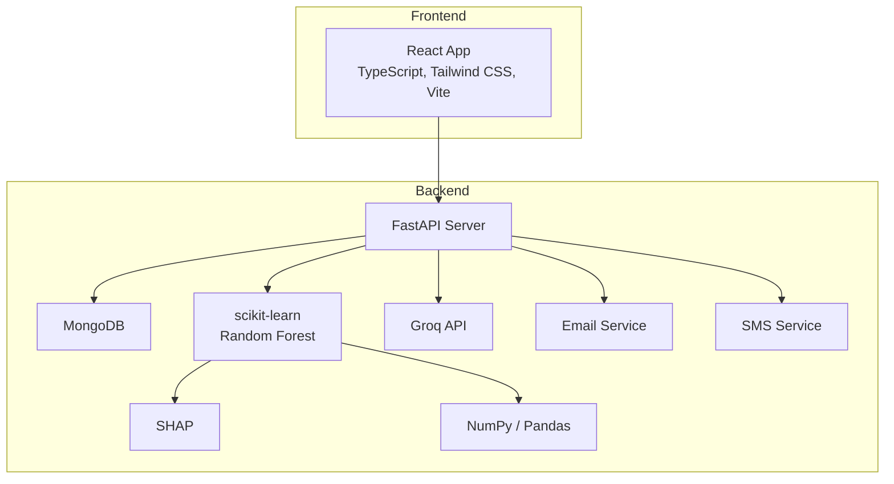
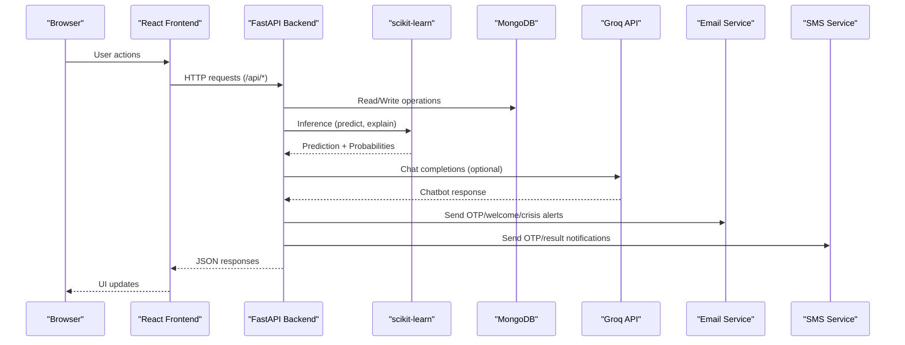
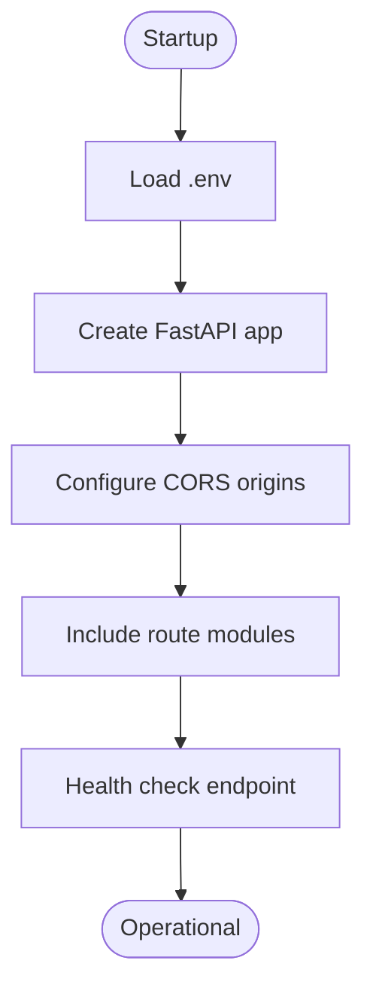
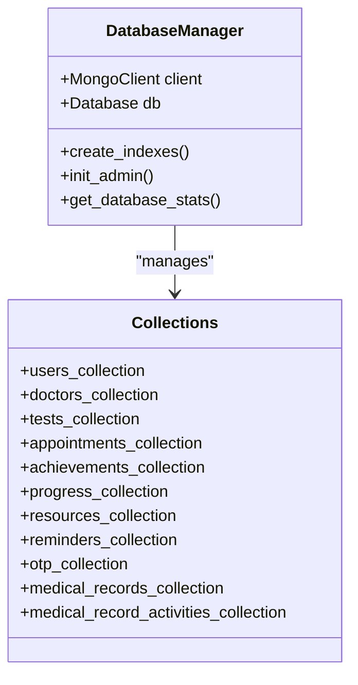
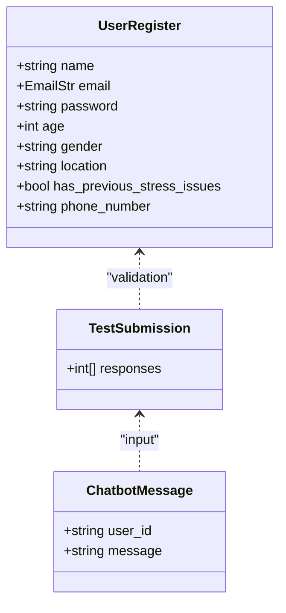
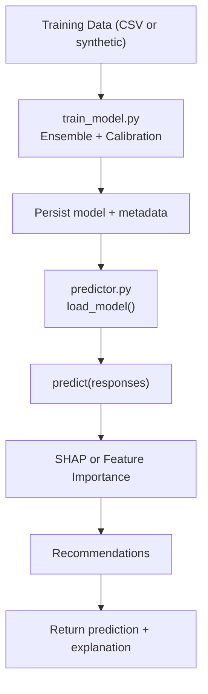
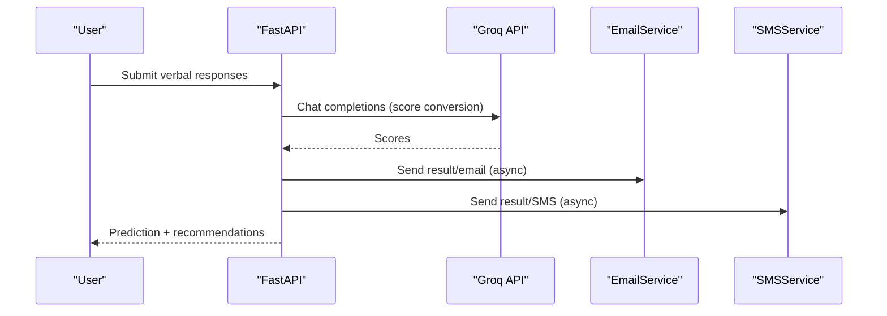
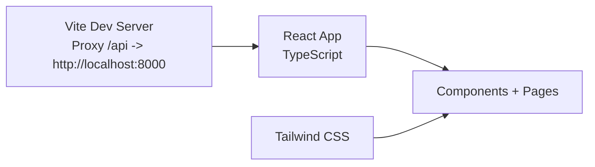
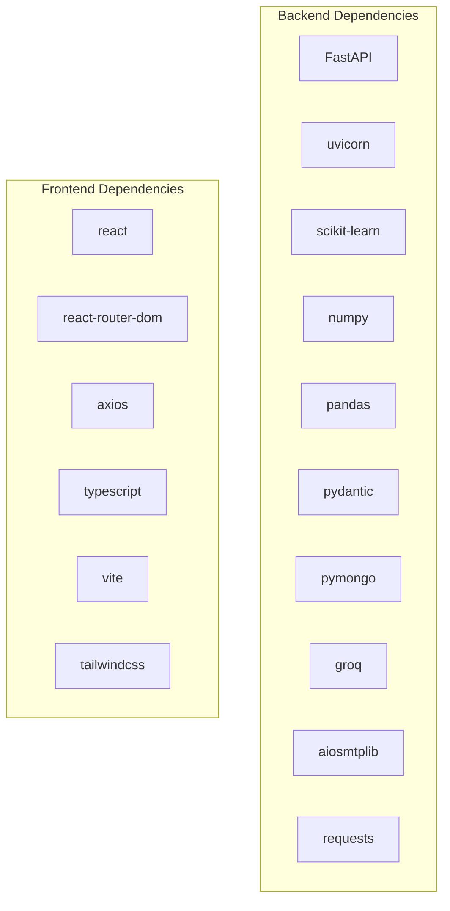

# Technology Stack

<cite>
**Referenced Files in This Document**
- [requirements.txt](file://backend/requirements.txt)
- [package.json](file://frontend/package.json)
- [main.py](file://backend/app/main.py)
- [models.py](file://backend/app/models.py)
- [predictor.py](file://backend/ml_model/predictor.py)
- [train_model.py](file://backend/ml_model/train_model.py)
- [user_routes.py](file://backend/app/routes/user_routes.py)
- [email_service.py](file://backend/app/email_service.py)
- [sms_service.py](file://backend/app/sms_service.py)
- [config.py](file://backend/app/config.py)
- [database.py](file://backend/app/database.py)
- [App.tsx](file://frontend/src/App.tsx)
- [tailwind.config.js](file://frontend/tailwind.config.js)
- [vite.config.ts](file://frontend/vite.config.ts)
- [README.md](file://README.md)
</cite>

## Table of Contents
1. [Introduction](#introduction)
2. [Project Structure](#project-structure)
3. [Core Components](#core-components)
4. [Architecture Overview](#architecture-overview)
5. [Detailed Component Analysis](#detailed-component-analysis)
6. [Dependency Analysis](#dependency-analysis)
7. [Performance Considerations](#performance-considerations)
8. [Troubleshooting Guide](#troubleshooting-guide)
9. [Conclusion](#conclusion)

## Introduction
This document provides a comprehensive technology stack overview for the AI Stress Level Analyzer. It explains backend and frontend technology choices, the machine learning stack, and external service integrations. It also covers version compatibility, dependency management, and the rationale behind each technology selection for healthcare applications.

## Project Structure
The project follows a clear separation of concerns:
- Backend: FastAPI application with Pydantic models, MongoDB via PyMongo, scikit-learn ML pipeline, and external integrations (Groq, email/SMS).
- Frontend: React 18 with TypeScript, Vite for build tooling, and Tailwind CSS for styling.
- ML: Random Forest ensemble model with SHAP explainability, NumPy/Pandas for data processing, and training/inference orchestration.

**Diagram sources**
- [main.py:52-80](file://backend/app/main.py#L52-L80)
- [database.py:26-46](file://backend/app/database.py#L26-L46)
- [predictor.py:32-98](file://backend/ml_model/predictor.py#L32-L98)
- [user_routes.py:125-144](file://backend/app/routes/user_routes.py#L125-L144)
- [email_service.py:17-26](file://backend/app/email_service.py#L17-L26)
- [sms_service.py:29-58](file://backend/app/sms_service.py#L29-L58)
- [App.tsx:1-88](file://frontend/src/App.tsx#L1-L88)
- [vite.config.ts:5-18](file://frontend/vite.config.ts#L5-L18)

**Section sources**
- [README.md:69-86](file://README.md#L69-L86)
- [main.py:52-80](file://backend/app/main.py#L52-L80)
- [database.py:26-46](file://backend/app/database.py#L26-L46)
- [predictor.py:32-98](file://backend/ml_model/predictor.py#L32-L98)
- [user_routes.py:125-144](file://backend/app/routes/user_routes.py#L125-L144)
- [email_service.py:17-26](file://backend/app/email_service.py#L17-L26)
- [sms_service.py:29-58](file://backend/app/sms_service.py#L29-L58)
- [App.tsx:1-88](file://frontend/src/App.tsx#L1-L88)
- [vite.config.ts:5-18](file://frontend/vite.config.ts#L5-L18)

## Core Components
- Backend web framework: FastAPI for async REST APIs, CORS configuration, and health checks.
- Database: MongoDB with connection pooling and extensive indexing for performance.
- Data validation: Pydantic models for request/response validation and settings.
- Machine learning: scikit-learn Random Forest ensemble with SHAP explainability; NumPy/Pandas for processing.
- External services: Groq AI for chatbot, email/SMS services for notifications.
- Frontend: React 18 with TypeScript, Vite for dev/build, Tailwind CSS for styling.

**Section sources**
- [main.py:52-80](file://backend/app/main.py#L52-L80)
- [database.py:26-46](file://backend/app/database.py#L26-L46)
- [models.py:7-11](file://backend/app/models.py#L7-L11)
- [predictor.py:32-98](file://backend/ml_model/predictor.py#L32-L98)
- [train_model.py:79-112](file://backend/ml_model/train_model.py#L79-L112)
- [email_service.py:17-26](file://backend/app/email_service.py#L17-L26)
- [sms_service.py:29-58](file://backend/app/sms_service.py#L29-L58)
- [package.json:10-26](file://frontend/package.json#L10-L26)
- [tailwind.config.js:1-34](file://frontend/tailwind.config.js#L1-L34)
- [vite.config.ts:5-18](file://frontend/vite.config.ts#L5-L18)

## Architecture Overview
The system integrates a React frontend with a FastAPI backend. The backend persists data in MongoDB and performs ML inference using scikit-learn. SHAP explains predictions, while Groq powers the AI chatbot. Notifications are delivered via email and SMS.

**Diagram sources**
- [user_routes.py:407-499](file://backend/app/routes/user_routes.py#L407-L499)
- [predictor.py:119-144](file://backend/ml_model/predictor.py#L119-L144)
- [email_service.py:171-229](file://backend/app/email_service.py#L171-L229)
- [sms_service.py:135-151](file://backend/app/sms_service.py#L135-L151)
- [database.py:88-153](file://backend/app/database.py#L88-L153)

**Section sources**
- [README.md:69-86](file://README.md#L69-L86)
- [user_routes.py:407-499](file://backend/app/routes/user_routes.py#L407-L499)
- [predictor.py:119-144](file://backend/ml_model/predictor.py#L119-L144)
- [email_service.py:171-229](file://backend/app/email_service.py#L171-L229)
- [sms_service.py:135-151](file://backend/app/sms_service.py#L135-L151)
- [database.py:88-153](file://backend/app/database.py#L88-L153)

## Detailed Component Analysis

### Backend Web Framework (FastAPI)
- Initializes FastAPI app with CORS, environment-driven origins, and health checks.
- Includes routers for auth, user, doctor, admin, and optional medical records.
- Uses Uvicorn for local development and production deployments.

**Diagram sources**
- [main.py:14-98](file://backend/app/main.py#L14-L98)

**Section sources**
- [main.py:52-80](file://backend/app/main.py#L52-L80)
- [main.py:114-132](file://backend/app/main.py#L114-L132)

### Database Layer (MongoDB with PyMongo)
- Connection pooling (maxPoolSize=50), timeouts, and retry writes.
- Extensive indexes on frequently queried fields and compound indexes for performance.
- Graceful degradation when DB is unavailable.

**Diagram sources**
- [database.py:26-46](file://backend/app/database.py#L26-L46)
- [database.py:88-153](file://backend/app/database.py#L88-L153)
- [database.py:164-297](file://backend/app/database.py#L164-L297)

**Section sources**
- [database.py:26-46](file://backend/app/database.py#L26-L46)
- [database.py:164-297](file://backend/app/database.py#L164-L297)

### Data Validation (Pydantic)
- Strongly typed models for user/doctor registration, authentication, test submissions, recommendations, and chatbot interactions.
- Validators enforce constraints (e.g., age, gender, OTP length).

**Diagram sources**
- [models.py:16-31](file://backend/app/models.py#L16-L31)
- [models.py:78-89](file://backend/app/models.py#L78-L89)
- [models.py:422-432](file://backend/app/models.py#L422-L432)

**Section sources**
- [models.py:7-11](file://backend/app/models.py#L7-L11)
- [models.py:16-31](file://backend/app/models.py#L16-L31)
- [models.py:78-89](file://backend/app/models.py#L78-L89)
- [models.py:422-432](file://backend/app/models.py#L422-L432)

### Machine Learning Stack
- Training: Random Forest + Gradient Boosting + Logistic Regression ensemble with calibration; saved as pickle with metadata.
- Inference: StressPredictor loads model and SHAP-compatible tree; computes SHAP values or feature importances; generates recommendations and trend analysis.
- Explainability: SHAP TreeExplainer with fallback to model feature importances.

**Diagram sources**
- [train_model.py:79-112](file://backend/ml_model/train_model.py#L79-L112)
- [train_model.py:147-184](file://backend/ml_model/train_model.py#L147-L184)
- [predictor.py:81-98](file://backend/ml_model/predictor.py#L81-L98)
- [predictor.py:119-144](file://backend/ml_model/predictor.py#L119-L144)
- [predictor.py:187-233](file://backend/ml_model/predictor.py#L187-L233)

**Section sources**
- [train_model.py:79-112](file://backend/ml_model/train_model.py#L79-L112)
- [train_model.py:147-184](file://backend/ml_model/train_model.py#L147-L184)
- [predictor.py:81-98](file://backend/ml_model/predictor.py#L81-L98)
- [predictor.py:119-144](file://backend/ml_model/predictor.py#L119-L144)
- [predictor.py:187-233](file://backend/ml_model/predictor.py#L187-L233)

### External Services Integration
- Groq AI API: Converts verbal responses to numeric scores; chatbot stress detection; configurable model candidates.
- Email: OTP verification, welcome, appointment confirmations, crisis alerts; async delivery.
- SMS: OTP and result notifications via Fast2SMS; async delivery with number normalization.

**Diagram sources**
- [user_routes.py:234-286](file://backend/app/routes/user_routes.py#L234-L286)
- [email_service.py:171-229](file://backend/app/email_service.py#L171-L229)
- [sms_service.py:135-151](file://backend/app/sms_service.py#L135-L151)

**Section sources**
- [user_routes.py:125-144](file://backend/app/routes/user_routes.py#L125-L144)
- [user_routes.py:234-286](file://backend/app/routes/user_routes.py#L234-L286)
- [email_service.py:17-26](file://backend/app/email_service.py#L17-L26)
- [sms_service.py:29-58](file://backend/app/sms_service.py#L29-L58)

### Frontend Technologies
- React 18 with TypeScript for type safety and modern hooks.
- Vite for fast dev server and optimized builds with proxy to backend.
- Tailwind CSS for utility-first styling and animations.

**Diagram sources**
- [vite.config.ts:5-18](file://frontend/vite.config.ts#L5-L18)
- [App.tsx:1-88](file://frontend/src/App.tsx#L1-L88)
- [tailwind.config.js:1-34](file://frontend/tailwind.config.js#L1-L34)

**Section sources**
- [package.json:10-26](file://frontend/package.json#L10-L26)
- [vite.config.ts:5-18](file://frontend/vite.config.ts#L5-L18)
- [App.tsx:1-88](file://frontend/src/App.tsx#L1-L88)
- [tailwind.config.js:1-34](file://frontend/tailwind.config.js#L1-L34)

## Dependency Analysis
- Backend dependencies pinned via requirements.txt; includes FastAPI, uvicorn, scikit-learn, NumPy, pandas, Pydantic, MongoDB driver, Groq SDK, email/SMS libraries.
- Frontend dependencies via package.json; includes React, React Router, Axios, Tailwind CSS, Vite, TypeScript.

**Diagram sources**
- [requirements.txt:1-22](file://backend/requirements.txt#L1-L22)
- [package.json:10-26](file://frontend/package.json#L10-L26)

**Section sources**
- [requirements.txt:1-22](file://backend/requirements.txt#L1-L22)
- [package.json:10-26](file://frontend/package.json#L10-L26)

## Performance Considerations
- Backend
  - MongoDB connection pooling and timeouts improve concurrency and resilience.
  - Extensive indexes on user, doctor, test, appointment, and medical records collections optimize query performance.
  - Async email/SMS delivery prevents blocking API responses.
- ML
  - Calibrated ensemble improves probability reliability; SHAP fallback ensures explainability even if SHAP module is unavailable.
  - Auto-retraining on startup safeguards against missing model files.
- Frontend
  - Vite’s dev server and proxy streamline development; Tailwind utilities enable efficient styling without heavy runtime overhead.

[No sources needed since this section provides general guidance]

## Troubleshooting Guide
- Database connectivity issues: Verify MONGODB_URL and that MongoDB is running; check connection pool settings and timeouts.
- Model integrity: If stress_model.pkl is missing or corrupted, the predictor auto-retrains; manual retraining is also supported.
- Frontend-backend communication: Confirm ALLOWED_ORIGINS includes frontend URLs and Vite proxy targets the backend port.
- Email/SMS configuration: Ensure environment variables are set for sender credentials and provider keys; verify async delivery logs.

**Section sources**
- [database.py:26-46](file://backend/app/database.py#L26-L46)
- [predictor.py:81-98](file://backend/ml_model/predictor.py#L81-L98)
- [README.md:664-695](file://README.md#L664-L695)
- [email_service.py:17-26](file://backend/app/email_service.py#L17-L26)
- [sms_service.py:40-58](file://backend/app/sms_service.py#L40-L58)

## Conclusion
The AI Stress Level Analyzer leverages a robust, scalable stack tailored for healthcare applications: FastAPI for reliable backend APIs, MongoDB for flexible data persistence, scikit-learn with SHAP for accurate and interpretable ML, and React with Vite/Tailwind for a responsive frontend. External services (Groq, email, SMS) enhance user experience and accessibility. The documented version compatibility and dependency management strategies ensure maintainability and reproducibility across environments.