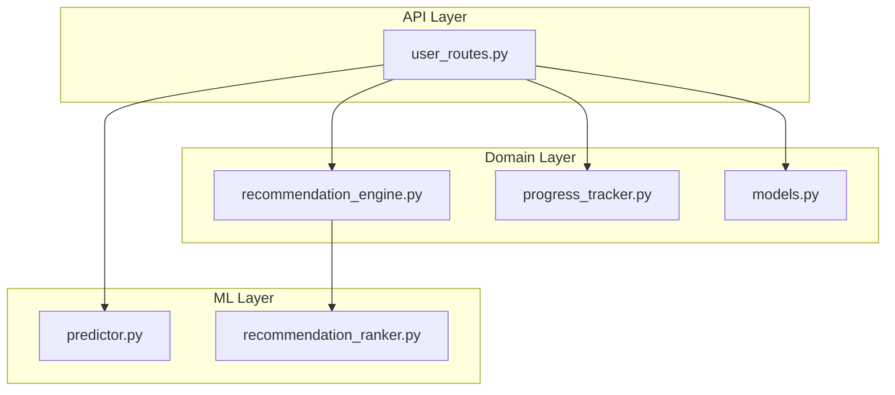
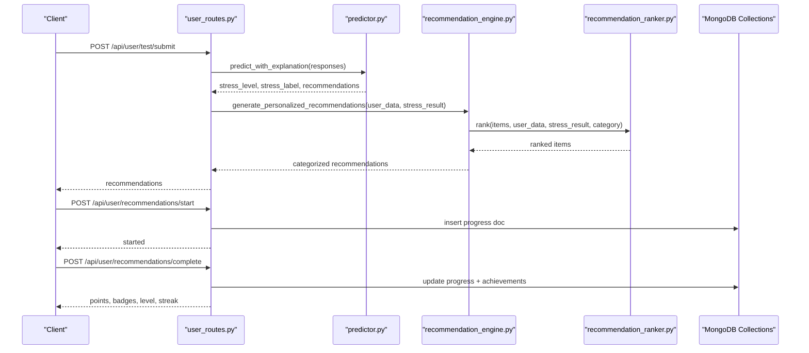
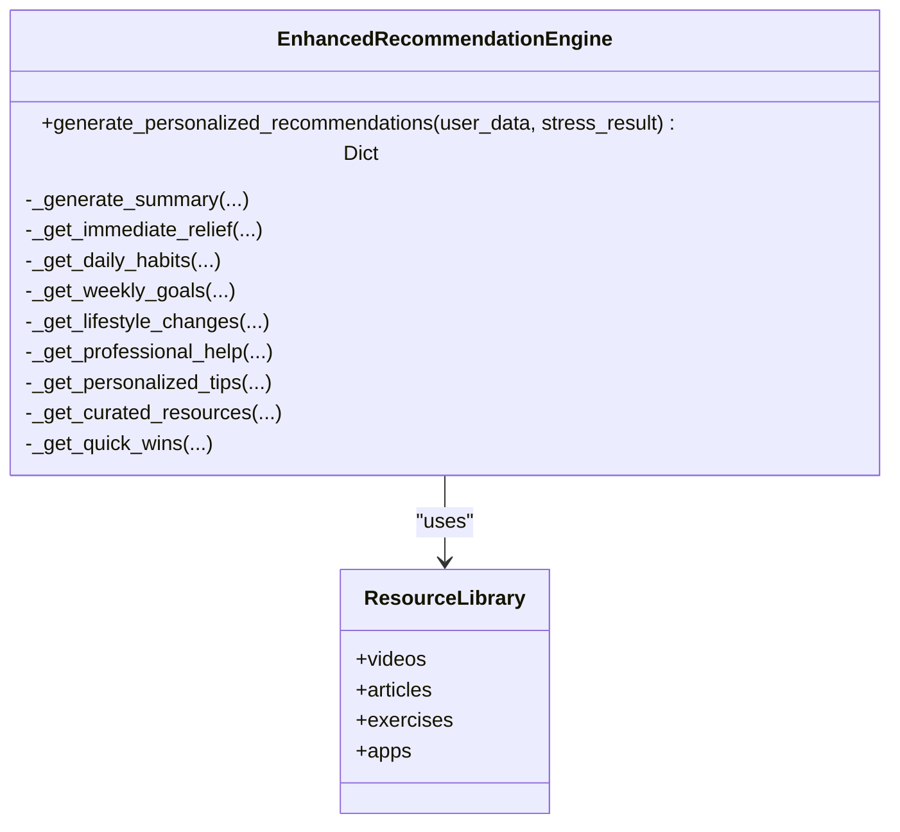
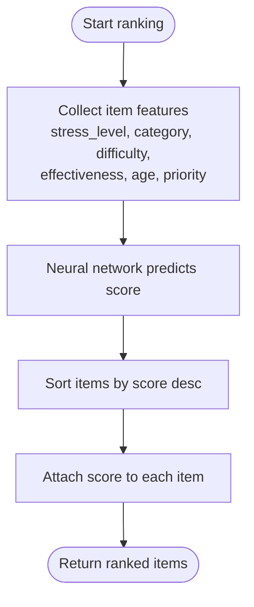
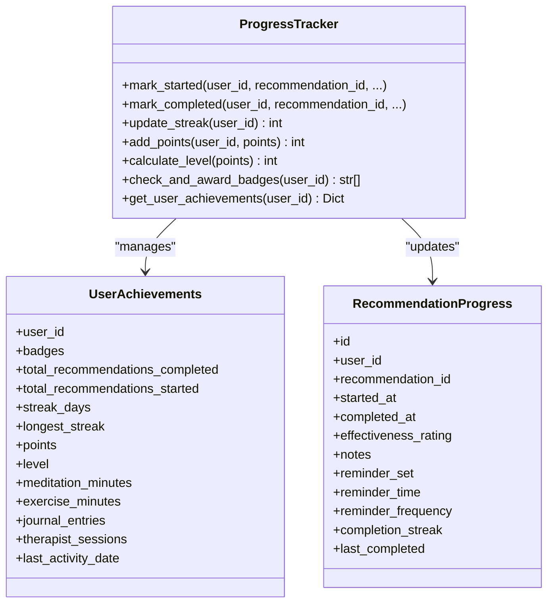
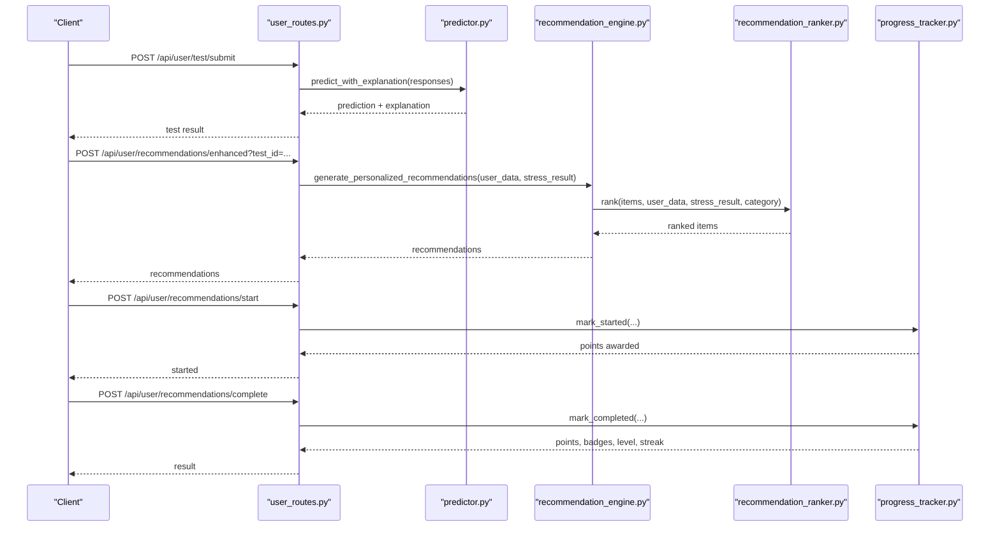
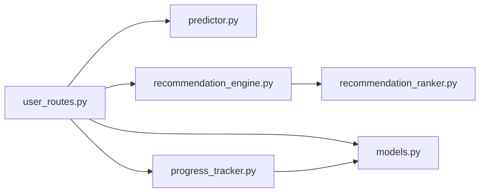

# Recommendation Engine

<cite>
**Referenced Files in This Document**
- [recommendation_engine.py](file://backend/app/recommendation_engine.py)
- [recommendation_ranker.py](file://backend/ml_model/recommendation_ranker.py)
- [progress_tracker.py](file://backend/app/progress_tracker.py)
- [models.py](file://backend/app/models.py)
- [user_routes.py](file://backend/app/routes/user_routes.py)
- [predictor.py](file://backend/ml_model/predictor.py)
</cite>

## Table of Contents
1. [Introduction](#introduction)
2. [Project Structure](#project-structure)
3. [Core Components](#core-components)
4. [Architecture Overview](#architecture-overview)
5. [Detailed Component Analysis](#detailed-component-analysis)
6. [Dependency Analysis](#dependency-analysis)
7. [Performance Considerations](#performance-considerations)
8. [Troubleshooting Guide](#troubleshooting-guide)
9. [Conclusion](#conclusion)

## Introduction
This document describes the AI Stress Level Analyzer’s recommendation engine, focusing on how personalized recommendations are generated from stress predictions, how they are categorized and ranked, and how progress and gamification integrate with the system. It covers:
- Personalized recommendation algorithms and categorization (immediate relief, daily habits, weekly goals, lifestyle changes, professional help)
- Recommendation ranking mechanism powered by a neural network
- Progress tracking, gamification (points, badges, streaks, levels)
- Integration between stress predictions and recommendation generation
- Achievement system and milestone tracking
- Enhanced recommendation features and resource curation
- Personalization algorithms, user preference handling, and recommendation effectiveness measurement

## Project Structure
The recommendation engine spans backend Python modules:
- A recommendation generator that builds categorized recommendations
- A neural-network-based ranker that reorders recommendations by personalization
- A progress tracker that manages gamification and achievement systems
- API endpoints that orchestrate prediction, recommendation generation, and progress updates

**Diagram sources**
- [user_routes.py:575-647](file://backend/app/routes/user_routes.py#L575-L647)
- [predictor.py:146-185](file://backend/ml_model/predictor.py#L146-L185)
- [recommendation_engine.py:17-58](file://backend/app/recommendation_engine.py#L17-L58)
- [recommendation_ranker.py:70-104](file://backend/ml_model/recommendation_ranker.py#L70-L104)
- [progress_tracker.py:48-134](file://backend/app/progress_tracker.py#L48-L134)

**Section sources**
- [user_routes.py:575-647](file://backend/app/routes/user_routes.py#L575-L647)
- [recommendation_engine.py:11-16](file://backend/app/recommendation_engine.py#L11-L16)
- [recommendation_ranker.py:9-108](file://backend/ml_model/recommendation_ranker.py#L9-L108)
- [progress_tracker.py:48-134](file://backend/app/progress_tracker.py#L48-L134)
- [models.py:148-271](file://backend/app/models.py#L148-L271)

## Core Components
- EnhancedRecommendationEngine: Generates categorized recommendations and integrates the neural-ranker for personalization.
- RecommendationNNRanker: Neural network that learns to rank recommendations based on features like stress level, category, difficulty, effectiveness, age, and priority.
- ProgressTracker: Manages user progress, points, badges, streaks, levels, and achievement milestones.
- Pydantic models: Define recommendation, progress, and achievement data structures used across the system.
- API endpoints: Orchestrate stress prediction, recommendation generation, and progress tracking.

Key responsibilities:
- Recommendation generation: Build lists for immediate, daily, weekly, lifestyle, professional, and personalized tips; curate external resources and quick wins.
- Ranking: Apply a synthetic-data-trained neural network to reorder recommendations by personalization.
- Gamification: Award points, badges, and levels; track streaks and milestones.
- Integration: Tie stress predictions to recommendation generation and progress tracking.

**Section sources**
- [recommendation_engine.py:11-58](file://backend/app/recommendation_engine.py#L11-L58)
- [recommendation_ranker.py:9-108](file://backend/ml_model/recommendation_ranker.py#L9-L108)
- [progress_tracker.py:48-134](file://backend/app/progress_tracker.py#L48-L134)
- [models.py:148-271](file://backend/app/models.py#L148-L271)

## Architecture Overview
The recommendation pipeline starts with a stress prediction, then generates categorized recommendations, re-ranks them using a neural network, and finally exposes endpoints to track progress and award achievements.

**Diagram sources**
- [user_routes.py:407-499](file://backend/app/routes/user_routes.py#L407-L499)
- [user_routes.py:575-647](file://backend/app/routes/user_routes.py#L575-L647)
- [user_routes.py:649-702](file://backend/app/routes/user_routes.py#L649-L702)
- [predictor.py:146-185](file://backend/ml_model/predictor.py#L146-L185)
- [recommendation_engine.py:17-58](file://backend/app/recommendation_engine.py#L17-L58)
- [recommendation_ranker.py:70-104](file://backend/ml_model/recommendation_ranker.py#L70-L104)
- [progress_tracker.py:135-235](file://backend/app/progress_tracker.py#L135-L235)

## Detailed Component Analysis

### Recommendation Generation and Categorization
The EnhancedRecommendationEngine builds recommendations across categories:
- Immediate relief: 0–5 minute techniques (e.g., breathing, grounding, guided meditation)
- Daily habits: 15–30 minute routines (e.g., morning mindfulness, exercise, journaling, wind-down routine)
- Weekly goals: 1–2 hour weekly activities (e.g., support groups, therapy, nature therapy)
- Lifestyle changes: Long-term programs (e.g., 12-week exercise, nutrition, mindfulness course)
- Professional help: Urgent and non-urgent professional support options
- Personalized tips: Demographic and response-based tips (e.g., student, senior, sleep issues, social withdrawal)
- Curated resources: External apps and platforms
- Quick wins: 30 seconds to 1 minute techniques

Personalization features embedded in items:
- Difficulty (easy/medium/hard)
- Effectiveness (0–100)
- Priority (1–4)
- Schedule and frequency
- Evidence and ratings for external resources

**Diagram sources**
- [recommendation_engine.py:11-58](file://backend/app/recommendation_engine.py#L11-L58)
- [recommendation_engine.py:518-551](file://backend/app/recommendation_engine.py#L518-L551)

**Section sources**
- [recommendation_engine.py:17-58](file://backend/app/recommendation_engine.py#L17-L58)
- [recommendation_engine.py:80-515](file://backend/app/recommendation_engine.py#L80-L515)

### Recommendation Ranking Mechanism
The RecommendationNNRanker trains a neural network on synthetic feature combinations to learn a ranking score. It takes:
- stress_level
- category
- difficulty
- effectiveness
- age
- priority

It outputs a normalized score per item, sorts descending, and attaches the score to each item.

**Diagram sources**
- [recommendation_ranker.py:70-104](file://backend/ml_model/recommendation_ranker.py#L70-L104)

**Section sources**
- [recommendation_ranker.py:9-108](file://backend/ml_model/recommendation_ranker.py#L9-L108)

### Progress Tracking and Gamification
The ProgressTracker manages:
- Individual recommendation progress (started, completed, reminders, notes)
- Achievements (badges, points, level, streaks)
- Milestones (recommendations completed, meditation minutes, exercise minutes, journal entries, therapy sessions)
- Leaderboard and level thresholds

Points and badges:
- Points for starting, completing, rating, adding notes, setting reminders, activity minutes, therapy sessions
- Badges for milestones (first step, getting started, week warrior, month master, stress crusher, zen master, fitness fan, journal enthusiast, therapy champion, perfectionist)
- Levels with increasing thresholds

Streak tracking:
- Maintains current and longest streaks
- Awards bonus points for maintaining streaks

**Diagram sources**
- [progress_tracker.py:48-134](file://backend/app/progress_tracker.py#L48-L134)
- [progress_tracker.py:16-46](file://backend/app/progress_tracker.py#L16-L46)

**Section sources**
- [progress_tracker.py:48-134](file://backend/app/progress_tracker.py#L48-L134)
- [progress_tracker.py:135-235](file://backend/app/progress_tracker.py#L135-L235)
- [progress_tracker.py:237-274](file://backend/app/progress_tracker.py#L237-L274)
- [progress_tracker.py:276-290](file://backend/app/progress_tracker.py#L276-L290)
- [progress_tracker.py:292-316](file://backend/app/progress_tracker.py#L292-L316)
- [progress_tracker.py:318-344](file://backend/app/progress_tracker.py#L318-L344)
- [progress_tracker.py:375-397](file://backend/app/progress_tracker.py#L375-L397)
- [models.py:16-47](file://backend/app/models.py#L16-L47)
- [models.py:148-204](file://backend/app/models.py#L148-L204)
- [models.py:209-245](file://backend/app/models.py#L209-L245)

### Integration Between Stress Predictions and Recommendations
The API orchestrates:
- Stress prediction via predictor.predict_with_explanation
- Enhanced recommendation generation via EnhancedRecommendationEngine
- Progress tracking via ProgressTracker endpoints

Endpoints:
- Submit test and get prediction with explanations
- Generate enhanced recommendations using test_id and user profile
- Start/complete recommendations and track progress
- Retrieve achievements and leaderboard

**Diagram sources**
- [user_routes.py:407-499](file://backend/app/routes/user_routes.py#L407-L499)
- [user_routes.py:575-647](file://backend/app/routes/user_routes.py#L575-L647)
- [user_routes.py:649-702](file://backend/app/routes/user_routes.py#L649-L702)
- [predictor.py:146-185](file://backend/ml_model/predictor.py#L146-L185)
- [recommendation_engine.py:17-58](file://backend/app/recommendation_engine.py#L17-L58)
- [recommendation_ranker.py:70-104](file://backend/ml_model/recommendation_ranker.py#L70-L104)
- [progress_tracker.py:135-235](file://backend/app/progress_tracker.py#L135-L235)

**Section sources**
- [user_routes.py:407-499](file://backend/app/routes/user_routes.py#L407-L499)
- [user_routes.py:575-647](file://backend/app/routes/user_routes.py#L575-L647)
- [user_routes.py:649-702](file://backend/app/routes/user_routes.py#L649-L702)
- [predictor.py:146-185](file://backend/ml_model/predictor.py#L146-L185)
- [recommendation_engine.py:17-58](file://backend/app/recommendation_engine.py#L17-L58)
- [recommendation_ranker.py:70-104](file://backend/ml_model/recommendation_ranker.py#L70-L104)
- [progress_tracker.py:135-235](file://backend/app/progress_tracker.py#L135-L235)

### Achievement System and Milestone Tracking
Badges and levels:
- Badges include First Step, Getting Started, Week Warrior, Month Master, Stress Crusher, Zen Master, Fitness Fan, Journal Enthusiast, Therapy Champion, Perfectionist
- Levels increase with cumulative points; each level has a minimum point threshold
- Milestones track total completed recommendations, meditation minutes, exercise minutes, journal entries, and therapy sessions

Points system:
- Starting a recommendation: partial points
- Completing a recommendation: base points plus bonuses for ratings and notes
- Activity minutes: meditation and exercise minutes contribute points
- Journal entries and therapy sessions: dedicated point values
- Maintaining streaks: bonus points proportional to streak length

Leaderboard:
- Top users by points with calculated levels

**Section sources**
- [progress_tracker.py:52-103](file://backend/app/progress_tracker.py#L52-L103)
- [progress_tracker.py:106-129](file://backend/app/progress_tracker.py#L106-L129)
- [progress_tracker.py:120-129](file://backend/app/progress_tracker.py#L120-L129)
- [progress_tracker.py:318-344](file://backend/app/progress_tracker.py#L318-L344)
- [progress_tracker.py:435-454](file://backend/app/progress_tracker.py#L435-L454)

### Enhanced Recommendation Features and Resource Curation
- Curated external resources: apps and therapy platforms with ratings, pricing, and deep links
- Quick wins: short, high-impact techniques for immediate relief
- Evidence-backed recommendations: mindfulness course includes study references
- Demographic and response-based personalization: tips tailored to age, gender, and questionnaire responses

**Section sources**
- [recommendation_engine.py:453-489](file://backend/app/recommendation_engine.py#L453-L489)
- [recommendation_engine.py:491-515](file://backend/app/recommendation_engine.py#L491-L515)
- [recommendation_engine.py:305-322](file://backend/app/recommendation_engine.py#L305-L322)
- [recommendation_engine.py:394-451](file://backend/app/recommendation_engine.py#L394-L451)

### Personalization Algorithms and User Preference Handling
- Neural-ranker features: stress_level, category, difficulty, effectiveness, age, priority
- Synthetic training data: grid-based combinations across stress levels, categories, difficulties, effectiveness, ages, and priorities
- Ranking logic: weighted combination of effectiveness, priority, stress_level, category-specific boosts, difficulty adjustments, and age-related constraints
- Response-based personalization: sleep issues, social withdrawal, and other symptom clusters inform targeted tips

**Section sources**
- [recommendation_ranker.py:15-68](file://backend/ml_model/recommendation_ranker.py#L15-L68)
- [recommendation_ranker.py:70-104](file://backend/ml_model/recommendation_ranker.py#L70-L104)
- [recommendation_engine.py:387-451](file://backend/app/recommendation_engine.py#L387-L451)

### Recommendation Effectiveness Measurement
- Item-level effectiveness: 0–100 scale embedded in recommendations
- User feedback: effectiveness ratings and notes recorded during completion
- Progress tracking: completion streaks and activity minutes reflect sustained engagement
- Analytics endpoints: trend analysis and doctor matching leverage historical data

**Section sources**
- [recommendation_engine.py:14-16](file://backend/app/recommendation_engine.py#L14-L16)
- [progress_tracker.py:167-235](file://backend/app/progress_tracker.py#L167-L235)
- [user_routes.py:1263-1276](file://backend/app/routes/user_routes.py#L1263-L1276)
- [user_routes.py:1297-1316](file://backend/app/routes/user_routes.py#L1297-L1316)

## Dependency Analysis
- user_routes depends on predictor for stress predictions, recommendation_engine for recommendations, and progress_tracker for gamification.
- recommendation_engine depends on recommendation_ranker for personalization.
- progress_tracker persists achievements and progress to MongoDB collections.
- models define the data contracts used across endpoints and services.

**Diagram sources**
- [user_routes.py:19-28](file://backend/app/routes/user_routes.py#L19-L28)
- [recommendation_engine.py](file://backend/app/recommendation_engine.py#L9)
- [recommendation_ranker.py](file://backend/ml_model/recommendation_ranker.py#L107)
- [progress_tracker.py:131-134](file://backend/app/progress_tracker.py#L131-L134)
- [models.py:148-271](file://backend/app/models.py#L148-L271)

**Section sources**
- [user_routes.py:19-28](file://backend/app/routes/user_routes.py#L19-L28)
- [recommendation_engine.py](file://backend/app/recommendation_engine.py#L9)
- [recommendation_ranker.py](file://backend/ml_model/recommendation_ranker.py#L107)
- [progress_tracker.py:131-134](file://backend/app/progress_tracker.py#L131-L134)
- [models.py:148-271](file://backend/app/models.py#L148-L271)

## Performance Considerations
- Neural-ranker inference is lightweight and operates on small feature vectors; typical latency is minimal.
- Recommendation generation is deterministic and relies on predefined templates; performance is bounded by list sizes.
- Gamification updates involve database writes; batching updates and using upserts helps reduce overhead.
- API endpoints validate IDs and enforce authorization to prevent unnecessary processing.

## Troubleshooting Guide
Common issues and resolutions:
- Invalid test ID or user ID: Ensure ObjectId validation passes before processing.
- Authorization errors: Endpoints enforce object-level authorization; verify current user matches resource owner.
- Model loading failures: StressPredictor handles model integrity checks and automatic retraining; check model hash and file presence.
- Neural-ranker training: The ranker trains on synthetic data; if training anomalies occur, verify feature keys and data types.
- Progress updates: Database operations wrap exceptions; inspect logs for write failures and retry logic.

**Section sources**
- [user_routes.py:588-594](file://backend/app/routes/user_routes.py#L588-L594)
- [user_routes.py:606-611](file://backend/app/routes/user_routes.py#L606-L611)
- [predictor.py:81-98](file://backend/ml_model/predictor.py#L81-L98)
- [recommendation_ranker.py:15-68](file://backend/ml_model/recommendation_ranker.py#L15-L68)
- [progress_tracker.py:418-433](file://backend/app/progress_tracker.py#L418-L433)

## Conclusion
The AI Stress Level Analyzer’s recommendation engine combines robust stress prediction with a highly personalized, categorized recommendation system. A neural-ranker tailors recommendations to individual profiles, while a comprehensive gamification layer encourages sustained engagement through points, badges, streaks, and levels. The system integrates seamlessly with the API, enabling users to receive actionable insights, track progress, and achieve meaningful milestones in stress management.