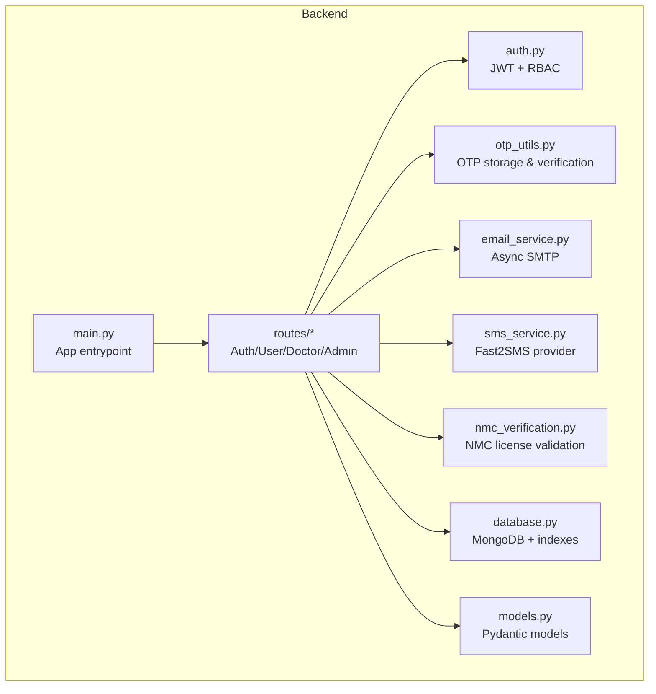
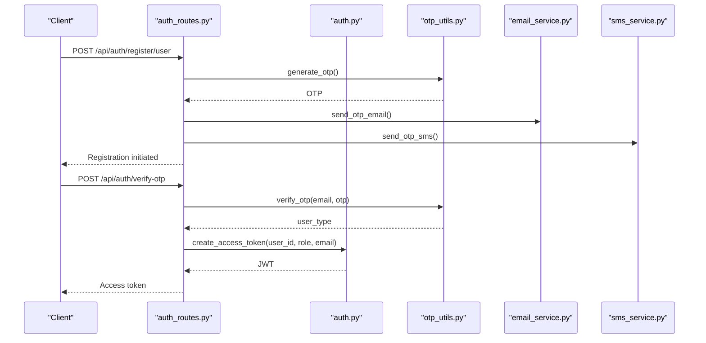
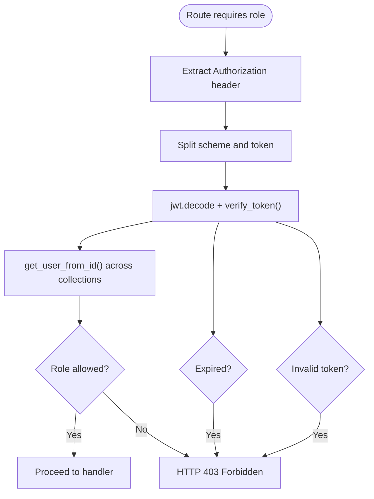
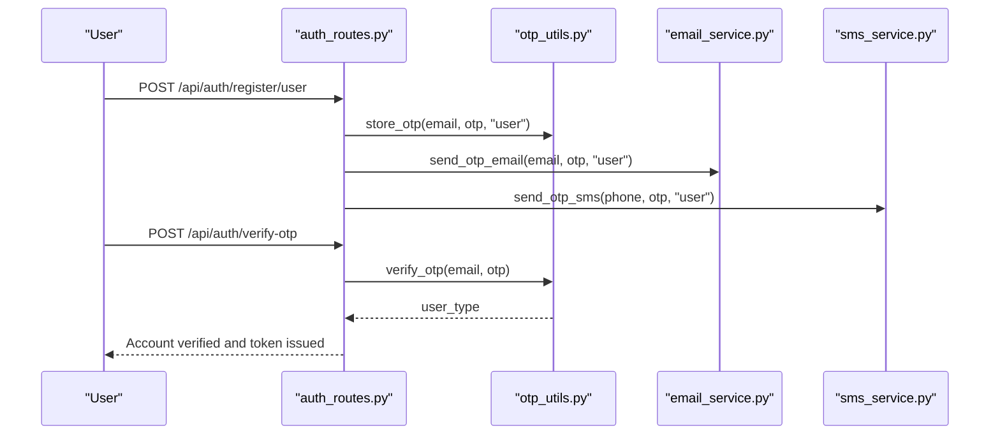
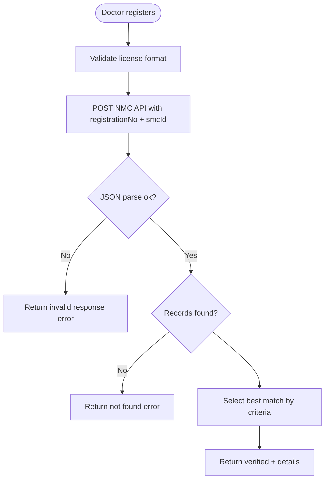
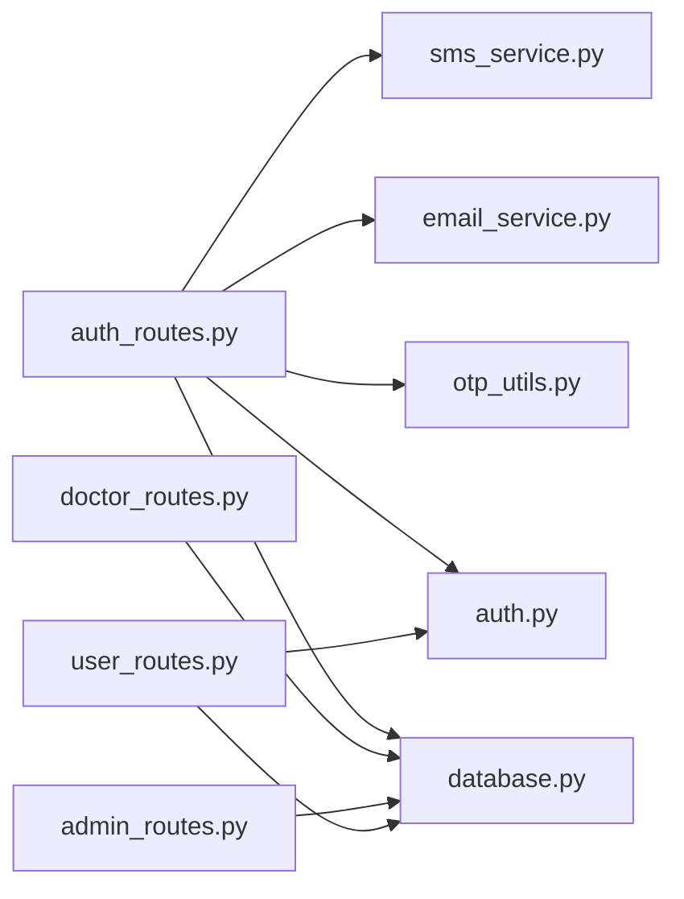

# Security and Compliance

<cite>
**Referenced Files in This Document**
- [auth.py](file://backend/app/auth.py)
- [auth_routes.py](file://backend/app/routes/auth_routes.py)
- [otp_utils.py](file://backend/app/otp_utils.py)
- [email_service.py](file://backend/app/email_service.py)
- [sms_service.py](file://backend/app/sms_service.py)
- [nmc_verification.py](file://backend/app/nmc_verification.py)
- [database.py](file://backend/app/database.py)
- [main.py](file://backend/app/main.py)
- [models.py](file://backend/app/models.py)
- [admin_routes.py](file://backend/app/routes/admin_routes.py)
- [doctor_routes.py](file://backend/app/routes/doctor_routes.py)
- [user_routes.py](file://backend/app/routes/user_routes.py)
</cite>

## Table of Contents
1. [Introduction](#introduction)
2. [Project Structure](#project-structure)
3. [Core Components](#core-components)
4. [Architecture Overview](#architecture-overview)
5. [Detailed Component Analysis](#detailed-component-analysis)
6. [Dependency Analysis](#dependency-analysis)
7. [Performance Considerations](#performance-considerations)
8. [Troubleshooting Guide](#troubleshooting-guide)
9. [Conclusion](#conclusion)
10. [Appendices](#appendices)

## Introduction
This document provides comprehensive security and compliance guidance for the AI Stress Level Analyzer. It covers authentication and authorization (including JWT, role-based access control, and admin workflows), data protection and privacy controls, secure communications, medical compliance considerations (HIPAA-aligned practices), audit and retention policies, email OTP verification, NMC license validation, input validation, and operational security practices for secure deployment and incident response.

## Project Structure
The backend is a FastAPI application with modular routing and centralized security utilities. Authentication and authorization logic resides in a dedicated module, while routes enforce role-based access and implement workflows for registration, login, OTP verification, password reset, and doctor NMC verification. Supporting services handle asynchronous email and SMS notifications. Database access is centralized with connection pooling and index management.

**Diagram sources**
- [main.py:52-80](file://backend/app/main.py#L52-L80)
- [auth.py:98-151](file://backend/app/auth.py#L98-L151)
- [otp_utils.py:15-37](file://backend/app/otp_utils.py#L15-L37)
- [email_service.py:17-26](file://backend/app/email_service.py#L17-L26)
- [sms_service.py:29-58](file://backend/app/sms_service.py#L29-L58)
- [nmc_verification.py:10-25](file://backend/app/nmc_verification.py#L10-L25)
- [database.py:26-55](file://backend/app/database.py#L26-L55)
- [models.py:16-136](file://backend/app/models.py#L16-L136)

**Section sources**
- [main.py:52-80](file://backend/app/main.py#L52-L80)
- [auth.py:98-151](file://backend/app/auth.py#L98-L151)
- [otp_utils.py:15-37](file://backend/app/otp_utils.py#L15-L37)
- [email_service.py:17-26](file://backend/app/email_service.py#L17-L26)
- [sms_service.py:29-58](file://backend/app/sms_service.py#L29-L58)
- [nmc_verification.py:10-25](file://backend/app/nmc_verification.py#L10-L25)
- [database.py:26-55](file://backend/app/database.py#L26-L55)
- [models.py:16-136](file://backend/app/models.py#L16-L136)

## Core Components
- Authentication and Authorization
  - JWT-based access tokens with configurable expiration and algorithm.
  - Role-based access control enforced via dependency injection in routes.
  - Password hashing with bcrypt and secure token verification.
- OTP and Multi-Factor Verification
  - 6-digit OTP generation with expiration and attempt limits.
  - Email and SMS OTP delivery via asynchronous services.
- Medical License Validation
  - NMC (Indian Medical Council) verification for doctors using official API.
- Data Protection and Privacy
  - Password hashing, constant-time OTP comparison, and secure storage.
  - Database connection pooling and TTL-based OTP cleanup.
- Secure Communication
  - CORS restricted to configured origins.
  - TLS-enabled SMTP for email delivery.
- Audit and Retention
  - Indexes for efficient querying and analytics.
  - Optional audit logs via separate activities collection.

**Section sources**
- [auth.py:45-71](file://backend/app/auth.py#L45-L71)
- [auth.py:98-151](file://backend/app/auth.py#L98-L151)
- [otp_utils.py:38-91](file://backend/app/otp_utils.py#L38-L91)
- [email_service.py:27-56](file://backend/app/email_service.py#L27-L56)
- [sms_service.py:80-128](file://backend/app/sms_service.py#L80-L128)
- [nmc_verification.py:147-215](file://backend/app/nmc_verification.py#L147-L215)
- [database.py:30-41](file://backend/app/database.py#L30-L41)
- [database.py:164-302](file://backend/app/database.py#L164-L302)
- [main.py:32-68](file://backend/app/main.py#L32-L68)

## Architecture Overview
The system enforces authentication at the route level using a JWT dependency. The dependency validates the Authorization header, decodes the token, checks user existence, and enforces role-based permissions. OTP flows are integrated into registration and password reset workflows. Doctor registration triggers NMC verification prior to account activation. Notifications are delivered asynchronously via email and SMS.

**Diagram sources**
- [auth_routes.py:68-132](file://backend/app/routes/auth_routes.py#L68-L132)
- [auth_routes.py:236-304](file://backend/app/routes/auth_routes.py#L236-L304)
- [auth.py:45-55](file://backend/app/auth.py#L45-L55)
- [otp_utils.py:38-91](file://backend/app/otp_utils.py#L38-L91)
- [email_service.py:119-165](file://backend/app/email_service.py#L119-L165)
- [sms_service.py:135-141](file://backend/app/sms_service.py#L135-L141)

**Section sources**
- [auth_routes.py:68-132](file://backend/app/routes/auth_routes.py#L68-L132)
- [auth_routes.py:236-304](file://backend/app/routes/auth_routes.py#L236-L304)
- [auth.py:45-55](file://backend/app/auth.py#L45-L55)
- [otp_utils.py:38-91](file://backend/app/otp_utils.py#L38-L91)
- [email_service.py:119-165](file://backend/app/email_service.py#L119-L165)
- [sms_service.py:135-141](file://backend/app/sms_service.py#L135-L141)

## Detailed Component Analysis

### Authentication and Authorization (JWT + RBAC)
- JWT Creation and Validation
  - Access tokens include user_id, role, email, issued-at, and expiration timestamps.
  - Tokens are validated with constant-time signature verification and expiration enforcement.
- Role-Based Access Control
  - Routes use a dependency that extracts the Bearer token from the Authorization header, validates it, and checks the user’s role against allowed roles.
  - Users are resolved across users, doctors, and admin collections.
- Password Security
  - Passwords are hashed using bcrypt with a 72-byte truncation limit and verified using constant-time comparison.

**Diagram sources**
- [auth.py:98-151](file://backend/app/auth.py#L98-L151)
- [auth.py:57-71](file://backend/app/auth.py#L57-L71)
- [auth.py:73-96](file://backend/app/auth.py#L73-L96)

**Section sources**
- [auth.py:45-71](file://backend/app/auth.py#L45-L71)
- [auth.py:98-151](file://backend/app/auth.py#L98-L151)
- [auth.py:73-96](file://backend/app/auth.py#L73-L96)

### Email OTP Verification System
- OTP Generation and Storage
  - OTPs are 6-digit numeric codes with configurable expiration (minutes).
  - OTPs are stored with attempt counters and verified without consuming until the final step.
- Delivery Channels
  - OTP emails are sent asynchronously with HTML templates.
  - Optional SMS delivery via Fast2SMS with number normalization.
- Verification Flow
  - Registration and login require verified email (except admin).
  - Password reset uses a two-phase OTP verification with consumption of verified OTP.

**Diagram sources**
- [auth_routes.py:68-132](file://backend/app/routes/auth_routes.py#L68-L132)
- [auth_routes.py:236-304](file://backend/app/routes/auth_routes.py#L236-L304)
- [otp_utils.py:42-91](file://backend/app/otp_utils.py#L42-L91)
- [email_service.py:119-165](file://backend/app/email_service.py#L119-L165)
- [sms_service.py:135-141](file://backend/app/sms_service.py#L135-L141)

**Section sources**
- [otp_utils.py:38-91](file://backend/app/otp_utils.py#L38-L91)
- [email_service.py:119-165](file://backend/app/email_service.py#L119-L165)
- [sms_service.py:135-141](file://backend/app/sms_service.py#L135-L141)
- [auth_routes.py:68-132](file://backend/app/routes/auth_routes.py#L68-L132)
- [auth_routes.py:236-304](file://backend/app/routes/auth_routes.py#L236-L304)

### NMC License Validation for Doctors
- Validation Workflow
  - Doctor registration triggers NMC verification using the official API with registration number and state medical council.
  - Matching logic selects the best record by exact match, exact match across councils, or partial match within the same council.
- Error Handling
  - Graceful handling for service unavailability, invalid responses, and “not found” scenarios.
- Post-Validation
  - Verified profiles are stored with metadata for admin approval and subsequent login gating.

**Diagram sources**
- [auth_routes.py:134-234](file://backend/app/routes/auth_routes.py#L134-L234)
- [nmc_verification.py:147-215](file://backend/app/nmc_verification.py#L147-L215)

**Section sources**
- [auth_routes.py:134-234](file://backend/app/routes/auth_routes.py#L134-L234)
- [nmc_verification.py:147-215](file://backend/app/nmc_verification.py#L147-L215)

### Data Encryption Strategies and Privacy Controls
- Password Hashing
  - bcrypt with salt; passwords truncated to 72 bytes per bcrypt limitation.
- Token Integrity
  - HS256 JWT with configurable secret and algorithm; expiration enforced.
- Transport Security
  - SMTP TLS enabled for outbound emails.
- Data-at-Rest
  - MongoDB connection pooling and indexes; no explicit field-level encryption implemented in the reviewed code.
- Data Minimization and Deletion
  - Tests and appointments are retained per analytics and user history needs; deletion endpoints exist for administrative purging.

**Section sources**
- [auth.py:33-43](file://backend/app/auth.py#L33-L43)
- [auth.py:45-55](file://backend/app/auth.py#L45-L55)
- [email_service.py:38-41](file://backend/app/email_service.py#L38-L41)
- [database.py:30-41](file://backend/app/database.py#L30-L41)

### Secure Communication Protocols
- CORS Configuration
  - Origins are loaded from environment variables and sanitized; defaults to localhost origins.
- TLS and SMTP
  - STARTTLS is used for SMTP transport.
- Environment Variables
  - Secrets for JWT, SMTP, SMS, and admin credentials are loaded from .env.

**Section sources**
- [main.py:32-68](file://backend/app/main.py#L32-L68)
- [email_service.py:38-41](file://backend/app/email_service.py#L38-L41)
- [main.py:14-15](file://backend/app/main.py#L14-L15)

### Medical Compliance Considerations (HIPAA-aligned Practices)
Note: The repository does not implement explicit HIPAA-compliant controls such as on-demand encryption keys, granular access auditing, or formal breach notification workflows. The following are aligned practices derived from the codebase and recommended mitigations:
- Access Logging and Auditing
  - Maintain activity logs for sensitive actions (e.g., user deletions, doctor verification) using a dedicated activities collection.
- Data Retention and Deletion
  - Implement documented retention periods and secure deletion procedures for user data upon request.
- Minimum Necessary Access
  - Enforce RBAC at route boundaries; restrict admin-only endpoints.
- Breach Response
  - Define incident response procedures for unauthorized access, credential compromise, or data exposure.
- Vendor Security
  - Ensure third-party providers (NMC API, email/SMS) meet minimum security standards; monitor availability and integrity.

[No sources needed since this section provides general guidance aligned with the codebase]

### Input Validation Mechanisms
- Pydantic Models
  - Strong typing and validators for user/doctor registration, OTP verification, password changes, and profile updates.
- Route-Level Validation
  - ObjectId validation, role checks, and authorization per-object ownership for tests, recommendations, and achievements.
- OTP Constraints
  - Fixed-length OTPs, attempt limits, and expiration enforcement.

**Section sources**
- [models.py:16-136](file://backend/app/models.py#L16-L136)
- [user_routes.py:501-532](file://backend/app/routes/user_routes.py#L501-L532)
- [user_routes.py:534-569](file://backend/app/routes/user_routes.py#L534-L569)
- [otp_utils.py:93-120](file://backend/app/otp_utils.py#L93-L120)

### Security Best Practices and Vulnerability Mitigation
- Secrets Management
  - Store JWT secret, SMTP credentials, SMS API keys, and admin password in environment variables.
- Rate Limiting and Brute Force Protection
  - OTP attempt limits and expiration mitigate brute-force attacks.
- Secure Defaults
  - Restrict CORS to known origins; disable SMS/emails if credentials are missing.
- Least Privilege
  - Admin-only endpoints guarded by require_role; user access restricted to their own data.
- Database Hardening
  - Connection pooling and TTL-based cleanup for OTPs; indexes optimized for performance and analytics.

**Section sources**
- [otp_utils.py:73-82](file://backend/app/otp_utils.py#L73-L82)
- [main.py:32-68](file://backend/app/main.py#L32-L68)
- [database.py:164-302](file://backend/app/database.py#L164-L302)

### Compliance Monitoring
- Health Checks
  - Database connectivity health endpoint included.
- Analytics and Stats
  - Admin endpoints expose platform statistics; consider adding audit logs for sensitive operations.
- Retention Policies
  - Implement policy for automatic deletion of old tests/appointments; document retention periods.

**Section sources**
- [main.py:114-132](file://backend/app/main.py#L114-L132)
- [admin_routes.py:14-62](file://backend/app/routes/admin_routes.py#L14-L62)

### Secure Deployment Guidelines
- Environment Configuration
  - Set ALLOWED_ORIGINS, JWT_SECRET_KEY, SMTP_* variables, and SMS provider settings.
  - Configure MONGODB_URL and ensure network-level access control.
- Production Hardening
  - Run behind HTTPS/TLS termination; enable request rate limiting; monitor logs and alerts.
- Backup and Recovery
  - Regular MongoDB backups; test restoration procedures; retain audit logs per policy.

[No sources needed since this section provides general guidance]

### Security Incident Response
- Detection
  - Monitor failed login attempts, OTP abuse, and unauthorized access patterns.
- Containment
  - Rotate secrets, revoke compromised tokens, and temporarily disable affected accounts.
- Investigation
  - Review logs, database indexes, and activity trails; correlate events across services.
- Recovery
  - Restore from backups, re-validate configurations, and re-enable services.

[No sources needed since this section provides general guidance]

## Dependency Analysis
The authentication and authorization stack depends on:
- JWT decoding/validation and role extraction.
- OTP storage and verification with expiration and attempt limits.
- Asynchronous email and SMS delivery.
- MongoDB collections for users, doctors, admins, tests, appointments, and OTPs.

**Diagram sources**
- [auth_routes.py:10-25](file://backend/app/routes/auth_routes.py#L10-L25)
- [auth.py:16-18](file://backend/app/auth.py#L16-L18)
- [otp_utils.py:8-27](file://backend/app/otp_utils.py#L8-L27)
- [email_service.py:3-11](file://backend/app/email_service.py#L3-L11)
- [sms_service.py:16-26](file://backend/app/sms_service.py#L16-L26)
- [database.py:15-24](file://backend/app/database.py#L15-L24)
- [doctor_routes.py:12-21](file://backend/app/routes/doctor_routes.py#L12-L21)
- [admin_routes.py:1-8](file://backend/app/routes/admin_routes.py#L1-L8)
- [user_routes.py:1-28](file://backend/app/routes/user_routes.py#L1-L28)

**Section sources**
- [auth_routes.py:10-25](file://backend/app/routes/auth_routes.py#L10-L25)
- [auth.py:16-18](file://backend/app/auth.py#L16-L18)
- [otp_utils.py:8-27](file://backend/app/otp_utils.py#L8-L27)
- [email_service.py:3-11](file://backend/app/email_service.py#L3-L11)
- [sms_service.py:16-26](file://backend/app/sms_service.py#L16-L26)
- [database.py:15-24](file://backend/app/database.py#L15-L24)
- [doctor_routes.py:12-21](file://backend/app/routes/doctor_routes.py#L12-L21)
- [admin_routes.py:1-8](file://backend/app/routes/admin_routes.py#L1-L8)
- [user_routes.py:1-28](file://backend/app/routes/user_routes.py#L1-L28)

## Performance Considerations
- Connection Pooling
  - MongoDB client configured with maxPoolSize and timeouts for concurrency.
- Indexes
  - Extensive indexes created for users, doctors, tests, appointments, progress tracking, and medical records to optimize queries.
- Asynchronous Operations
  - Email and SMS delivery are non-blocking to reduce latency.

**Section sources**
- [database.py:30-41](file://backend/app/database.py#L30-L41)
- [database.py:164-302](file://backend/app/database.py#L164-L302)
- [email_service.py:58-66](file://backend/app/email_service.py#L58-L66)
- [sms_service.py:129-133](file://backend/app/sms_service.py#L129-L133)

## Troubleshooting Guide
- Authentication Failures
  - Missing or malformed Authorization header; invalid token or expired token; user not found after login.
- OTP Issues
  - Expired or invalid OTP; exceeded attempt limits; storage failures.
- Email/SMS Delivery
  - Missing credentials; provider misconfiguration; network timeouts.
- Database Connectivity
  - Server selection timeout; connection closed; indexes not created.

**Section sources**
- [auth.py:103-150](file://backend/app/auth.py#L103-L150)
- [otp_utils.py:61-91](file://backend/app/otp_utils.py#L61-L91)
- [email_service.py:27-56](file://backend/app/email_service.py#L27-L56)
- [sms_service.py:40-58](file://backend/app/sms_service.py#L40-L58)
- [database.py:48-54](file://backend/app/database.py#L48-L54)

## Conclusion
The AI Stress Level Analyzer implements robust authentication and authorization using JWT and RBAC, secure OTP workflows with asynchronous notifications, and NMC license validation for doctors. The backend employs connection pooling, indexes, and environment-driven configuration to support secure and performant operations. To align with HIPAA and other regulatory frameworks, deployers should implement additional controls such as encryption at rest, comprehensive audit logging, formal retention and deletion policies, and incident response procedures.

## Appendices
- Recommended Enhancements
  - Implement field-level encryption for PHI.
  - Add granular audit logs for all sensitive operations.
  - Enforce explicit consent and data minimization.
  - Establish formal data retention and deletion policies with automated cleanup.

[No sources needed since this section provides general guidance]