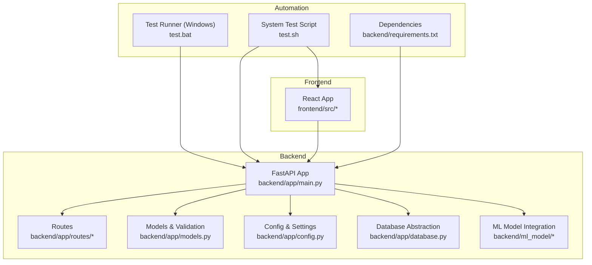
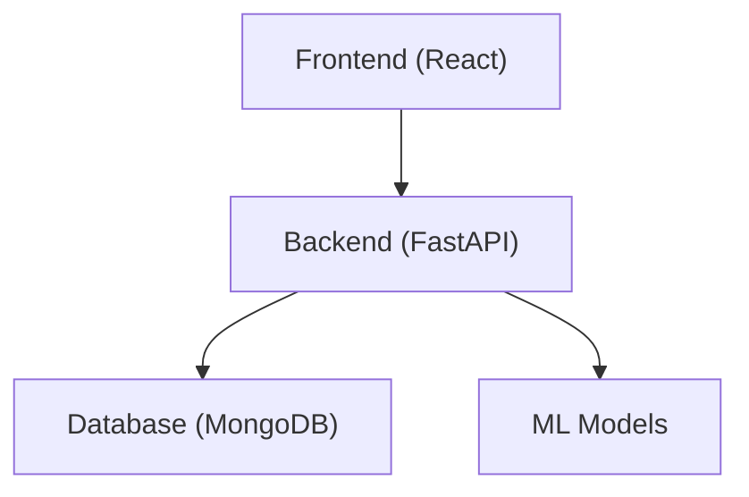
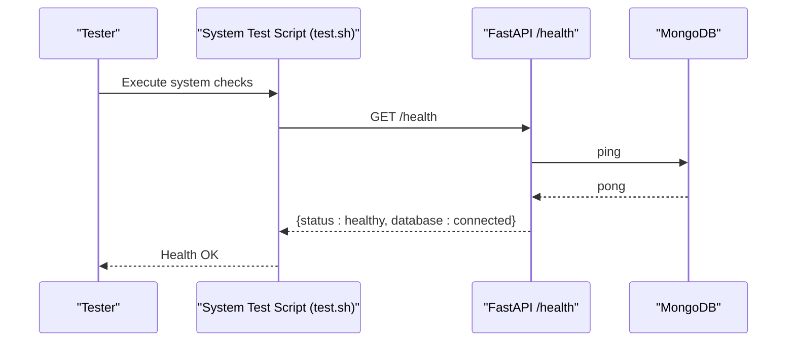
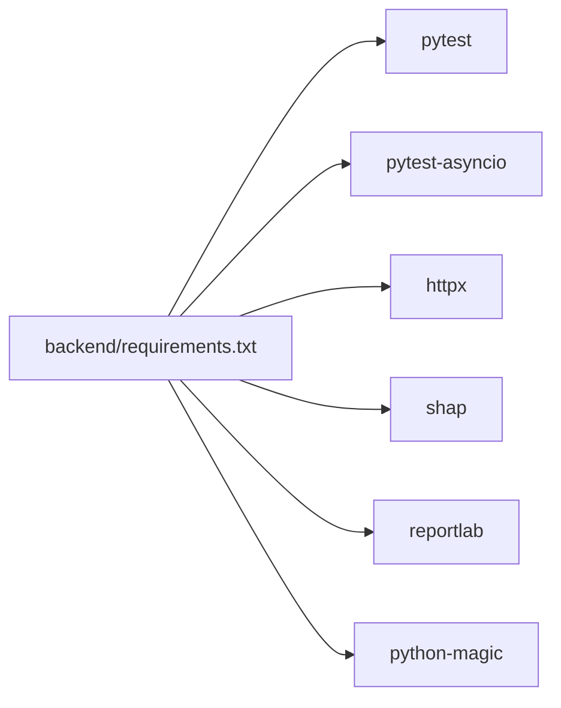

# Testing and Quality Assurance

<cite>
**Referenced Files in This Document**
- [README.md](file://README.md)
- [ARCHITECTURE_EXPLAINED.md](file://ARCHITECTURE_EXPLAINED.md)
- [backend/requirements.txt](file://backend/requirements.txt)
- [test.sh](file://test.sh)
- [test.bat](file://test.bat)
- [backend/app/main.py](file://backend/app/main.py)
- [backend/app/models.py](file://backend/app/models.py)
- [backend/app/config.py](file://backend/app/config.py)
- [backend/app/database.py](file://backend/app/database.py)
</cite>

## Table of Contents
1. [Introduction](#introduction)
2. [Project Structure](#project-structure)
3. [Core Components](#core-components)
4. [Architecture Overview](#architecture-overview)
5. [Detailed Component Analysis](#detailed-component-analysis)
6. [Dependency Analysis](#dependency-analysis)
7. [Performance Considerations](#performance-considerations)
8. [Troubleshooting Guide](#troubleshooting-guide)
9. [Conclusion](#conclusion)
10. [Appendices](#appendices)

## Introduction
This document defines the comprehensive testing and quality assurance strategy for the AI Stress Level Analyzer. It covers unit testing, integration testing, API testing, quality assurance processes, code standards, performance benchmarking, security scanning, code review processes, quality metrics, manual testing, user acceptance testing, regression testing, continuous integration testing, performance and load testing, testing tools, mocking strategies, and test environment setup. The goal is to ensure reliable, secure, and maintainable delivery of the full-stack application with machine learning capabilities.

## Project Structure
The repository follows a clear separation of concerns:
- Backend: FastAPI application with route handlers, models, configuration, database abstraction, and ML model integration.
- ML Model: Training and inference pipeline for stress prediction and multimodal fusion.
- Frontend: React application with TypeScript and Vite.
- Scripts: Cross-platform test runners for backend and system-level checks.

**Diagram sources**
- [backend/app/main.py:1-137](file://backend/app/main.py#L1-L137)
- [backend/app/models.py:1-440](file://backend/app/models.py#L1-L440)
- [backend/app/config.py:1-22](file://backend/app/config.py#L1-L22)
- [backend/app/database.py:1-509](file://backend/app/database.py#L1-L509)
- [backend/requirements.txt:1-22](file://backend/requirements.txt#L1-L22)
- [test.bat:1-46](file://test.bat#L1-L46)
- [test.sh:1-198](file://test.sh#L1-L198)

**Section sources**
- [README.md:698-760](file://README.md#L698-L760)
- [backend/requirements.txt:1-22](file://backend/requirements.txt#L1-L22)
- [test.bat:1-46](file://test.bat#L1-L46)
- [test.sh:1-198](file://test.sh#L1-L198)

## Core Components
- FastAPI application entry and health checks
- Pydantic models for request/response validation
- Environment-driven configuration
- MongoDB abstraction with connection pooling and index management
- ML model integration and auto-retraining safety
- Cross-platform test automation

**Section sources**
- [backend/app/main.py:81-132](file://backend/app/main.py#L81-L132)
- [backend/app/models.py:16-143](file://backend/app/models.py#L16-L143)
- [backend/app/config.py:3-21](file://backend/app/config.py#L3-L21)
- [backend/app/database.py:30-83](file://backend/app/database.py#L30-L83)
- [backend/requirements.txt:16-19](file://backend/requirements.txt#L16-L19)

## Architecture Overview
The system integrates a React frontend, a FastAPI backend, MongoDB, and ML models. Automated tests validate health endpoints, API documentation availability, and basic file presence. The backend’s health endpoint performs a database ping to ensure operational readiness.

**Diagram sources**
- [backend/app/main.py:114-132](file://backend/app/main.py#L114-L132)
- [backend/app/database.py:43-46](file://backend/app/database.py#L43-L46)

**Section sources**
- [README.md:69-86](file://README.md#L69-L86)
- [backend/app/main.py:114-132](file://backend/app/main.py#L114-L132)

## Detailed Component Analysis

### Backend Health and Availability Testing
- Validate health endpoint to confirm database connectivity.
- Confirm root and API docs endpoints are reachable.
- Verify ML model file presence.

**Diagram sources**
- [test.sh:89-107](file://test.sh#L89-L107)
- [backend/app/main.py:114-132](file://backend/app/main.py#L114-L132)
- [backend/app/database.py:43-46](file://backend/app/database.py#L43-L46)

**Section sources**
- [test.sh:89-107](file://test.sh#L89-L107)
- [backend/app/main.py:114-132](file://backend/app/main.py#L114-L132)

### API Testing Strategy
- Unit tests for route handlers and business logic using pytest and httpx.
- Integration tests validating end-to-end flows (authentication, questionnaire submission, chatbot).
- Mock external services (email, SMS, LLM) during tests.

Recommended pytest fixtures and async support are present in dependencies.

**Section sources**
- [backend/requirements.txt:16-19](file://backend/requirements.txt#L16-L19)
- [test.bat:34-41](file://test.bat#L34-L41)

### ML Model Testing
- Validate model loading and inference pipeline.
- Test auto-retraining fallback when model file is missing.
- Verify multimodal fusion logic and feature extraction steps.

**Section sources**
- [ARCHITECTURE_EXPLAINED.md:169-183](file://ARCHITECTURE_EXPLAINED.md#L169-L183)
- [ARCHITECTURE_EXPLAINED.md:406-426](file://ARCHITECTURE_EXPLAINED.md#L406-L426)

### Database Testing
- Validate index creation and performance-related indexes.
- Test admin initialization and database helpers.
- Ensure graceful connection lifecycle and fallback behavior when DB is down.

**Section sources**
- [backend/app/database.py:164-302](file://backend/app/database.py#L164-L302)
- [backend/app/database.py:307-338](file://backend/app/database.py#L307-L338)

### Frontend Testing
- Validate static page availability (home, login, register).
- Confirm build artifacts and service client reachability.

**Section sources**
- [test.sh:114-118](file://test.sh#L114-L118)

### Security and Validation Testing
- Pydantic models enforce strict input validation for all endpoints.
- JWT-based authentication and CORS configuration should be tested for proper enforcement.

**Section sources**
- [backend/app/models.py:16-143](file://backend/app/models.py#L16-L143)
- [backend/app/main.py:32-68](file://backend/app/main.py#L32-L68)

## Dependency Analysis
The backend declares testing and HTTP client libraries that enable robust test coverage.

**Diagram sources**
- [backend/requirements.txt:16-22](file://backend/requirements.txt#L16-L22)

**Section sources**
- [backend/requirements.txt:16-22](file://backend/requirements.txt#L16-L22)

## Performance Considerations
- Database connection pooling and optimized timeouts improve concurrency.
- Indexes are created for critical collections to accelerate queries.
- Health endpoint performs a ping to detect degraded database state.

Recommendations:
- Benchmark inference latency for ML models and API endpoints.
- Monitor database query performance with explain plans.
- Load test endpoints under realistic concurrency to identify bottlenecks.

**Section sources**
- [backend/app/database.py:30-41](file://backend/app/database.py#L30-L41)
- [backend/app/database.py:164-302](file://backend/app/database.py#L164-L302)
- [backend/app/main.py:114-132](file://backend/app/main.py#L114-L132)

## Troubleshooting Guide
Common issues and resolutions:
- MongoDB connectivity failures: verify service status and connection string.
- Backend not running: ensure the server is started and listening on the expected port.
- Frontend not reachable: confirm dev server is running and port matches expectations.
- ML model missing: trigger training or rely on auto-retraining on startup.
- File structure validation: ensure critical backend and frontend files exist.

**Section sources**
- [test.sh:39-82](file://test.sh#L39-L82)
- [test.sh:124-144](file://test.sh#L124-L144)
- [ARCHITECTURE_EXPLAINED.md:180-183](file://ARCHITECTURE_EXPLAINED.md#L180-L183)

## Conclusion
The AI Stress Level Analyzer includes practical system-level tests and foundational components for a robust QA program. To mature the testing and QA process, integrate unit and integration tests with pytest, expand API coverage, implement performance and load testing, establish CI pipelines, and formalize code review and security scanning procedures.

## Appendices

### Testing Strategy Summary
- Unit testing: pytest with httpx for HTTP assertions; pytest-asyncio for async endpoints.
- Integration testing: end-to-end flows with mocked external services.
- API testing: Swagger/OpenAPI docs validation and health checks.
- ML testing: model loading, inference, and multimodal fusion.
- Database testing: index creation, admin initialization, and connection lifecycle.
- Security testing: JWT enforcement, CORS configuration, and input validation.
- Manual testing: user journeys for registration, questionnaire, chatbot, and reports.
- UAT: stakeholder sign-off on functionality and UX.
- Regression testing: automated suite executed on every pull request.
- CI testing: automated backend tests via test.bat/test.sh.
- Performance and load testing: quantify throughput and latency under load.
- Security scanning: SAST/DAST and secrets detection in CI.
- Code review: mandatory peer review with checklist for security and correctness.
- Quality metrics: test coverage, defect density, MTTR, and SLA adherence.

### Test Data Management
- Use synthetic datasets for ML model training and inference tests.
- Maintain minimal, deterministic test fixtures for API endpoints.
- Store test data in version-controlled directories for reproducibility.

### Automated Testing Workflows
- Local: run backend tests via test.bat.
- CI: execute test.sh for system checks and backend pytest.

### Security Scanning Procedures
- Static analysis: linting and type checking.
- Secrets detection: scan for exposed keys in code and configuration.
- Dependency scanning: audit Python dependencies for vulnerabilities.

### Code Review Processes
- Checklist: correctness, security, performance, maintainability, and test coverage.
- Mandatory approvals for critical paths (authentication, database, ML).

### Quality Metrics
- Coverage targets for unit and integration tests.
- API SLAs and error rates.
- Database query performance baselines.
- ML model accuracy and latency targets.