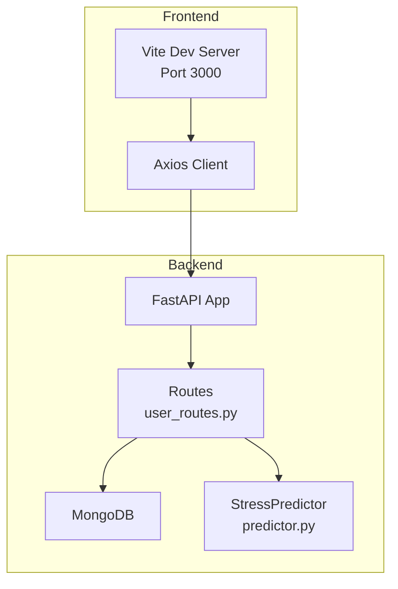
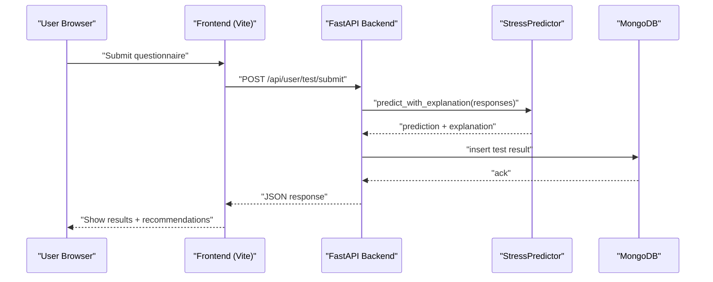
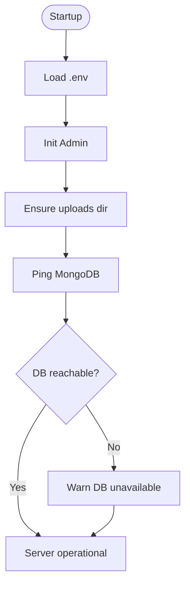
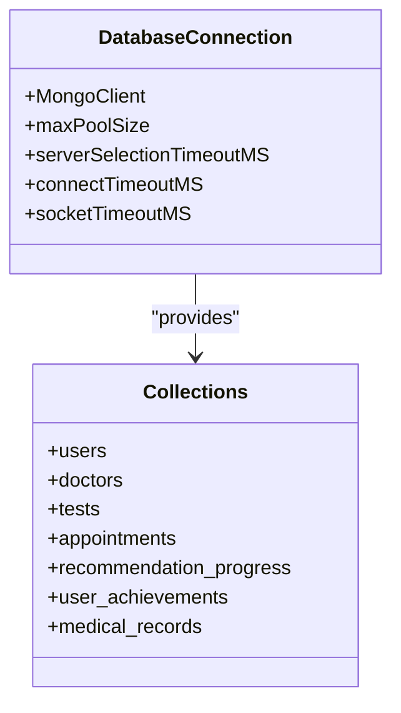
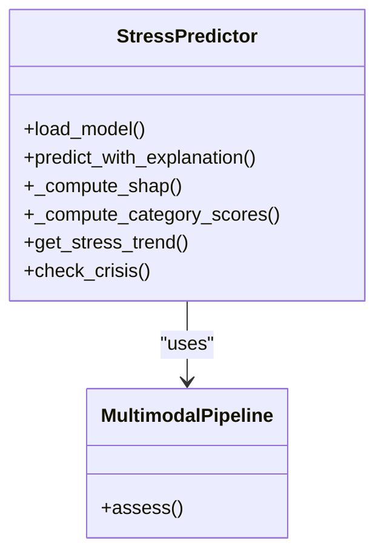
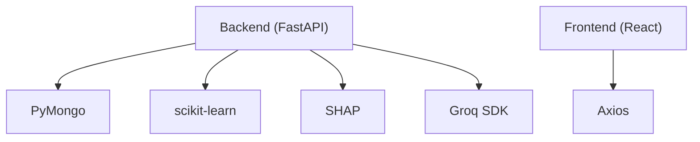

# Troubleshooting and FAQ

<cite>
**Referenced Files in This Document**
- [README.md](file://README.md)
- [ARCHITECTURE_EXPLAINED.md](file://ARCHITECTURE_EXPLAINED.md)
- [backend/app/main.py](file://backend/app/main.py)
- [backend/app/config.py](file://backend/app/config.py)
- [backend/app/database.py](file://backend/app/database.py)
- [backend/app/routes/user_routes.py](file://backend/app/routes/user_routes.py)
- [backend/ml_model/predictor.py](file://backend/ml_model/predictor.py)
- [backend/requirements.txt](file://backend/requirements.txt)
- [frontend/vite.config.ts](file://frontend/vite.config.ts)
- [frontend/package.json](file://frontend/package.json)
</cite>

## Table of Contents
1. [Introduction](#introduction)
2. [Project Structure](#project-structure)
3. [Core Components](#core-components)
4. [Architecture Overview](#architecture-overview)
5. [Detailed Component Analysis](#detailed-component-analysis)
6. [Dependency Analysis](#dependency-analysis)
7. [Performance Considerations](#performance-considerations)
8. [Troubleshooting Guide](#troubleshooting-guide)
9. [FAQ](#faq)
10. [Support and Escalation](#support-and-escalation)
11. [Conclusion](#conclusion)

## Introduction
This document provides comprehensive troubleshooting and Frequently Asked Questions for the AI Stress Level Analyzer. It covers installation issues, runtime errors, performance tuning, debugging techniques for backend and frontend, database connectivity, API integration, and machine learning model problems. It also includes diagnostic tools, monitoring approaches, and escalation procedures.

## Project Structure
The system is a full-stack application with:
- Backend: FastAPI Python server with routes, ML model integration, and MongoDB persistence
- Frontend: React + TypeScript application with Vite dev server and Axios HTTP client
- ML: Random Forest-based stress predictor with SHAP explainability and multimodal fusion

**Diagram sources**
- [backend/app/main.py:52-80](file://backend/app/main.py#L52-L80)
- [backend/app/routes/user_routes.py:1-40](file://backend/app/routes/user_routes.py#L1-L40)
- [backend/ml_model/predictor.py:32-46](file://backend/ml_model/predictor.py#L32-L46)
- [backend/app/database.py:26-46](file://backend/app/database.py#L26-L46)
- [frontend/vite.config.ts:7-18](file://frontend/vite.config.ts#L7-L18)

**Section sources**
- [README.md:69-86](file://README.md#L69-L86)
- [backend/app/main.py:52-80](file://backend/app/main.py#L52-L80)
- [frontend/vite.config.ts:7-18](file://frontend/vite.config.ts#L7-L18)

## Core Components
- FastAPI application entry point and middleware configuration
- MongoDB connection with connection pooling and index creation
- User routes for questionnaire submission, history retrieval, and recommendations
- StressPredictor ML model with SHAP explainability and multimodal fusion
- Frontend proxy configuration and Axios client

**Section sources**
- [backend/app/main.py:1-137](file://backend/app/main.py#L1-L137)
- [backend/app/database.py:1-509](file://backend/app/database.py#L1-L509)
- [backend/app/routes/user_routes.py:1-120](file://backend/app/routes/user_routes.py#L1-L120)
- [backend/ml_model/predictor.py:32-185](file://backend/ml_model/predictor.py#L32-L185)
- [frontend/vite.config.ts:1-19](file://frontend/vite.config.ts#L1-L19)

## Architecture Overview
End-to-end flow from user input to ML prediction and persistence.

**Diagram sources**
- [backend/app/routes/user_routes.py:407-499](file://backend/app/routes/user_routes.py#L407-L499)
- [backend/ml_model/predictor.py:146-185](file://backend/ml_model/predictor.py#L146-L185)
- [backend/app/database.py:106-115](file://backend/app/database.py#L106-L115)

## Detailed Component Analysis

### Backend Startup and Health Checks
- CORS configuration is environment-driven and sanitized
- Database connection uses connection pooling and timeouts
- Health endpoint pings MongoDB to verify connectivity
- Admin initialization occurs on startup

**Diagram sources**
- [backend/app/main.py:81-98](file://backend/app/main.py#L81-L98)
- [backend/app/database.py:31-54](file://backend/app/database.py#L31-L54)

**Section sources**
- [backend/app/main.py:32-68](file://backend/app/main.py#L32-L68)
- [backend/app/main.py:114-132](file://backend/app/main.py#L114-L132)
- [backend/app/database.py:31-54](file://backend/app/database.py#L31-L54)

### Database Connectivity and Indexing
- Connection pooling with maxPoolSize/minPoolSize and timeouts
- Background index creation for optimal query performance
- Graceful degradation when DB is unavailable
- Admin initialization and database stats

**Diagram sources**
- [backend/app/database.py:30-46](file://backend/app/database.py#L30-L46)
- [backend/app/database.py:88-158](file://backend/app/database.py#L88-L158)

**Section sources**
- [backend/app/database.py:164-302](file://backend/app/database.py#L164-L302)
- [backend/app/database.py:307-338](file://backend/app/database.py#L307-L338)

### ML Model Integration and Retraining
- Model loading with integrity checks and auto-retraining
- SHAP-based explainability fallback to feature importance
- Multimodal fusion pipeline for video assessments
- Trend analysis and crisis detection

**Diagram sources**
- [backend/ml_model/predictor.py:32-46](file://backend/ml_model/predictor.py#L32-L46)
- [backend/ml_model/predictor.py:146-185](file://backend/ml_model/predictor.py#L146-L185)
- [backend/app/routes/user_routes.py:319-334](file://backend/app/routes/user_routes.py#L319-L334)

**Section sources**
- [backend/ml_model/predictor.py:81-118](file://backend/ml_model/predictor.py#L81-L118)
- [backend/ml_model/predictor.py:187-256](file://backend/ml_model/predictor.py#L187-L256)
- [backend/app/routes/user_routes.py:308-401](file://backend/app/routes/user_routes.py#L308-L401)

### Frontend Proxy and API Integration
- Vite proxy forwards /api/* to backend on port 8000
- Axios client used by frontend services
- Environment variable for API base URL

**Diagram sources**
- [frontend/vite.config.ts:10-17](file://frontend/vite.config.ts#L10-L17)
- [frontend/package.json:10-16](file://frontend/package.json#L10-L16)

**Section sources**
- [frontend/vite.config.ts:1-19](file://frontend/vite.config.ts#L1-L19)
- [frontend/package.json:1-27](file://frontend/package.json#L1-L27)

## Dependency Analysis
External dependencies and their roles:
- FastAPI and Uvicorn for the backend web server
- PyMongo for MongoDB connectivity with connection pooling
- scikit-learn for ML model training and inference
- SHAP for model explainability
- Groq SDK for AI chatbot integration
- React + Axios for frontend communication

**Diagram sources**
- [backend/requirements.txt:1-22](file://backend/requirements.txt#L1-L22)
- [frontend/package.json:10-16](file://frontend/package.json#L10-L16)

**Section sources**
- [backend/requirements.txt:1-22](file://backend/requirements.txt#L1-L22)
- [frontend/package.json:10-16](file://frontend/package.json#L10-L16)

## Performance Considerations
- Enable connection pooling and proper timeouts for MongoDB
- Create background indexes on frequently queried fields
- Use compound indexes for common query patterns (user_id + timestamp)
- Monitor database stats and adjust pool sizes based on traffic
- Optimize ML model loading and reuse across requests
- Use health checks to detect degraded services early

[No sources needed since this section provides general guidance]

## Troubleshooting Guide

### Installation and Environment Setup
- Ensure Python 3.10+ and Node.js 18+ are installed
- Create and activate a Python virtual environment
- Install backend dependencies using requirements.txt
- Install frontend dependencies using package.json
- Configure environment variables (.env) with required keys

Common issues:
- Missing dependencies: Reinstall using requirements.txt and frontend package manager
- Virtual environment not activated: Activate before installing dependencies
- Node/npm not found: Install Node.js or ensure PATH includes npm

**Section sources**
- [README.md:379-384](file://README.md#L379-L384)
- [README.md:396-416](file://README.md#L396-L416)
- [README.md:421-433](file://README.md#L421-L433)
- [backend/requirements.txt:1-22](file://backend/requirements.txt#L1-L22)
- [frontend/package.json:1-27](file://frontend/package.json#L1-L27)

### Backend Startup and Port Conflicts
- Default backend port is 8000
- If port is in use, change in main.py or run with a different port
- Health endpoint (/health) verifies database connectivity

Symptoms:
- Port already in use error during startup
- Health check returns degraded status

Resolution:
- Modify port in main.py or pass alternate port to Uvicorn
- Verify MongoDB is running and accessible

**Section sources**
- [backend/app/main.py:134-137](file://backend/app/main.py#L134-L137)
- [backend/app/main.py:114-132](file://backend/app/main.py#L114-L132)
- [README.md:677-681](file://README.md#L677-L681)

### Database Connectivity Issues
- MongoDB must be running locally or reachable via provided URI
- Connection pooling and timeouts are configured
- Indexes are created on startup for performance
- Graceful fallback when DB is unavailable

Symptoms:
- Server starts without database connection warning
- Index creation skipped when DB is down
- Health check reports database error

Resolution:
- Start MongoDB service (platform-specific commands)
- Verify MONGODB_URL in .env
- Check firewall and network connectivity
- Confirm database credentials and permissions

**Section sources**
- [backend/app/database.py:31-54](file://backend/app/database.py#L31-L54)
- [backend/app/database.py:164-302](file://backend/app/database.py#L164-L302)
- [backend/app/main.py:114-132](file://backend/app/main.py#L114-L132)
- [README.md:666-675](file://README.md#L666-L675)

### Model Not Found or Corrupted
- StressPredictor auto-reloads model on import
- Integrity checks using SHA256 hashes
- Automatic retraining from CSV if pickle is invalid
- SHAP-compatible model is optional but recommended

Symptoms:
- Model loading errors during startup
- Prediction failures with model not loaded
- Missing SHAP explainability

Resolution:
- Run model training script to regenerate pickle
- Verify stress_model_meta.json integrity
- Ensure training CSV is present
- Check file permissions for model files

**Section sources**
- [backend/ml_model/predictor.py:81-118](file://backend/ml_model/predictor.py#L81-L118)
- [backend/ml_model/predictor.py:187-256](file://backend/ml_model/predictor.py#L187-L256)
- [README.md:683-688](file://README.md#L683-L688)

### Frontend API Connection Problems
- Vite proxy forwards /api/* to backend on port 8000
- ALLOWED_ORIGINS must include frontend URLs
- Check CORS configuration in backend

Symptoms:
- 404/403 errors on API calls
- CORS policy errors in browser console
- Proxy not forwarding requests

Resolution:
- Verify vite.config.ts proxy target matches backend port
- Set ALLOWED_ORIGINS in backend .env
- Restart both frontend and backend servers
- Check network connectivity between frontend and backend

**Section sources**
- [frontend/vite.config.ts:10-17](file://frontend/vite.config.ts#L10-L17)
- [backend/app/main.py:32-50](file://backend/app/main.py#L32-L50)
- [README.md:690-694](file://README.md#L690-L694)

### API Integration and Authentication Errors
- All protected endpoints require Authorization: Bearer <token>
- JWT_SECRET_KEY must be set in .env
- Role-based access control enforced in routes

Symptoms:
- 401 Unauthorized responses
- 403 Forbidden for insufficient privileges
- Token validation failures

Resolution:
- Ensure JWT_SECRET_KEY is configured
- Verify user login and token issuance
- Check role assignment for admin/doctor accounts
- Validate token format and expiration

**Section sources**
- [backend/app/routes/user_routes.py:501-532](file://backend/app/routes/user_routes.py#L501-L532)
- [backend/app/config.py:9-21](file://backend/app/config.py#L9-L21)

### ML Prediction and Explainability Issues
- SHAP computation requires tree-based model
- Fallback to feature importance when SHAP unavailable
- Multimodal pipeline may fall back to verbal scoring
- Trend analysis and crisis detection rely on test history

Symptoms:
- Missing explanation data
- Lower confidence scores
- Inconsistent multimodal results

Resolution:
- Ensure SHAP-compatible model is available
- Verify model integrity and hashes
- Check SHAP library installation
- Validate test history data in database

**Section sources**
- [backend/ml_model/predictor.py:187-256](file://backend/ml_model/predictor.py#L187-L256)
- [backend/app/routes/user_routes.py:319-334](file://backend/app/routes/user_routes.py#L319-L334)

### SMS and Email Notification Failures
- SMS notifications depend on Fast2SMS configuration
- Email notifications require SMTP settings
- Notifications are sent asynchronously

Symptoms:
- Missing notifications for users
- Error logs for failed deliveries

Resolution:
- Configure SMS provider credentials if needed
- Set up SMTP server settings in .env
- Check notification service status
- Review error logs for specific failures

**Section sources**
- [backend/app/routes/user_routes.py:370-381](file://backend/app/routes/user_routes.py#L370-L381)
- [backend/app/routes/user_routes.py:458-470](file://backend/app/routes/user_routes.py#L458-L470)

### Logging and Debugging Techniques
Backend logging:
- Use Python logging module in route handlers
- Health endpoint returns database status
- Import-time warnings for optional features

Frontend debugging:
- Browser developer tools console
- Network tab to inspect API responses
- Vite dev server logs

Diagnostic steps:
- Check backend logs for startup errors
- Verify database connectivity with health endpoint
- Monitor ML model loading and prediction logs
- Inspect CORS configuration and proxy settings

**Section sources**
- [backend/app/main.py:20-29](file://backend/app/main.py#L20-L29)
- [backend/app/main.py:114-132](file://backend/app/main.py#L114-L132)
- [backend/app/routes/user_routes.py:36-39](file://backend/app/routes/user_routes.py#L36-L39)

## FAQ

### System Requirements
- Backend: Python 3.10+, FastAPI, PyMongo, scikit-learn, SHAP, Groq SDK
- Frontend: Node.js 18+, React 18, Vite, Axios
- Database: MongoDB (local or Atlas)

**Section sources**
- [README.md:379-384](file://README.md#L379-L384)
- [backend/requirements.txt:1-22](file://backend/requirements.txt#L1-L22)
- [frontend/package.json:1-27](file://frontend/package.json#L1-L27)

### Configuration Issues
- Environment variables must be set in .env
- ALLOWED_ORIGINS must include frontend URLs
- JWT_SECRET_KEY must be strong and unique
- GROQ_API_KEY is required for AI chatbot

**Section sources**
- [README.md:445-478](file://README.md#L445-L478)
- [backend/app/main.py:32-50](file://backend/app/main.py#L32-L50)
- [backend/app/config.py:9-21](file://backend/app/config.py#L9-L21)

### Usage Scenarios
- Questionnaire-based stress assessment
- Video assessment with multimodal fusion
- AI chatbot for real-time stress detection
- Doctor and admin dashboards for management

**Section sources**
- [README.md:38-66](file://README.md#L38-L66)
- [ARCHITECTURE_EXPLAINED.md:24-35](file://ARCHITECTURE_EXPLAINED.md#L24-L35)

### Model Training and Retraining
- Initial training performed during setup
- Auto-retraining when model file is missing/corrupted
- Manual retraining available via training script
- Model integrity verified with SHA256 hashes

**Section sources**
- [README.md:409-410](file://README.md#L409-L410)
- [backend/ml_model/predictor.py:113-118](file://backend/ml_model/predictor.py#L113-L118)

### Performance Optimization
- Enable MongoDB connection pooling
- Create background indexes on query fields
- Monitor database stats and adjust pool sizes
- Use health checks to detect performance issues
- Optimize ML model loading and caching

**Section sources**
- [backend/app/database.py:30-46](file://backend/app/database.py#L30-L46)
- [backend/app/database.py:164-302](file://backend/app/database.py#L164-L302)
- [backend/app/main.py:114-132](file://backend/app/main.py#L114-L132)

## Support and Escalation
- Community channels: GitHub Discussions/Issues
- Documentation: README and ARCHITECTURE_EXPLAINED
- Support resources: Environment variable templates, troubleshooting sections
- Escalation: For complex issues, gather logs, environment details, and reproduction steps before opening an issue

**Section sources**
- [README.md:696-767](file://README.md#L696-L767)

## Conclusion
This troubleshooting guide provides a comprehensive approach to diagnosing and resolving common issues in the AI Stress Level Analyzer. By following the outlined procedures, enabling proper logging, and leveraging the diagnostic tools and monitoring approaches, most problems can be quickly identified and resolved. For persistent or complex issues, use the support resources and escalation procedures to get timely assistance.